# OpenClaw对智能体商业化的冲击调研报告

---

**报告标题：** OpenClaw对智能体商业化的冲击调研报告：技术变革、商业模式创新与行业应用深度分析

**副标题：** 基于国际国内市场的比较研究与未来趋势展望

**报告时间：** 2026年2月

**报告类型：** 深度调研报告

---

## 摘要

本报告深入分析了OpenClaw（原名Clawdbot）对全球智能体商业化格局的深远影响，系统阐述了其在技术架构、商业模式、行业应用等多个维度带来的革命性变革。OpenClaw作为一款开源AI智能体项目，在短短两个月内GitHub星标超过14.5万，单周访问量达200万，创造了开源项目增长的历史记录。本报告通过国际国内市场的对比分析，详细探讨了OpenClaw对硅谷科技生态的冲击、中国科技巨头的应对策略，以及在金融、医疗、电商、制造等重点行业的典型应用案例。研究发现，OpenClaw开创的"核心开源、增值服务收费"模式彻底颠覆了传统SaaS订阅模式，其本地优先（Local-First）架构和开放技能生态为AI智能体的商业化提供了全新路径。报告最后提出了面向政策制定者、企业管理者、技术开发者和个人用户的建议，展望了AI智能体技术的未来发展趋势。

**关键词：** OpenClaw、AI智能体、商业模式、开源软件、技能生态、本地部署、行业应用

---

## 目录

### 第一章 引言
- 1.1 研究背景与意义
- 1.2 研究目标与问题
- 1.3 研究方法与框架
- 1.4 报告结构安排

### 第二章 OpenClaw技术概述
- 2.1 OpenClaw的起源与发展历程
- 2.2 核心技术架构解析
- 2.3 关键技术特性分析
- 2.4 与主流智能体产品的对比
- 2.5 技术优势与局限性

### 第三章 国际市场冲击分析
- 3.1 全球AI智能体市场现状
- 3.2 OpenClaw对硅谷科技生态的冲击
- 3.3 国际典型应用案例分析
- 3.4 国际企业应对策略
- 3.5 国际监管与伦理挑战
- 3.6 国际市场未来趋势

### 第四章 国内市场影响研究
- 4.1 中国AI智能体发展现状
- 4.2 OpenClaw在国内的传播与影响
- 4.3 国内科技巨头的应对策略
- 4.4 国内典型应用案例分析
- 4.5 国内市场的独特挑战与机遇
- 4.6 国内市场未来发展趋势

### 第五章 行业应用案例分析
- 5.1 金融行业应用
- 5.2 医疗健康领域
- 5.3 电商零售行业
- 5.4 制造业智能化
- 5.5 其他创新应用领域

### 第六章 商业模式变革研究
- 6.1 传统智能体商业模式的局限性
- 6.2 OpenClaw带来的商业模式创新
- 6.3 新兴商业模式探索
- 6.4 商业模式变革的深层逻辑
- 6.5 商业模式变革的挑战与风险
- 6.6 未来商业模式演进趋势

### 第七章 未来趋势与建议
- 7.1 技术发展趋势
- 7.2 商业生态演进趋势
- 7.3 行业应用展望
- 7.4 政策与监管建议
- 7.5 企业发展建议
- 7.6 个人发展建议

### 第八章 结论
- 8.1 研究总结
- 8.2 核心发现
- 8.3 理论贡献
- 8.4 实践启示
- 8.5 研究局限与未来方向
- 8.6 结语

### 参考文献

---

## 图目录

**图2-1** OpenClaw技术架构示意图  
**图2-2** OpenClaw与传统智能体产品对比  
**图3-1** OpenClaw在国内的传播与影响路径  
**图4-1** OpenClaw在金融行业的应用场景  
**图4-2** OpenClaw在医疗健康领域的应用架构  
**图4-3** OpenClaw在电商零售领域的应用场景  
**图4-4** OpenClaw在制造业的应用架构  
**图5-1** 传统SaaS模式与OpenClaw模式对比  

---

## 表目录

**表2-1** OpenClaw核心组件功能说明  
**表3-1** 国际主流智能体产品对比  
**表4-1** 国内智能体用户规模对比（2025年Q4）  
**表5-1** OpenClaw商业模式与传统模式对比  

---

## 缩略语表

- **AI**: Artificial Intelligence（人工智能）
- **SaaS**: Software as a Service（软件即服务）
- **API**: Application Programming Interface（应用程序编程接口）
- **RPA**: Robotic Process Automation（机器人流程自动化）
- **GDPR**: General Data Protection Regulation（通用数据保护条例）
- **CCPA**: California Consumer Privacy Act（加州消费者隐私法案）
- **VPS**: Virtual Private Server（虚拟专用服务器）
- **LLM**: Large Language Model（大语言模型）

---

## 研究团队声明

本报告基于公开资料、技术文档、行业报告和专家访谈等信息来源编制，力求客观、准确、全面地反映OpenClaw对智能体商业化的冲击和影响。报告中引用的数据和信息均来自可验证的公开渠道，报告中表达的观点仅代表研究团队的分析和判断，不代表任何组织或机构的官方立场。

由于AI智能体技术发展迅速，市场变化快，本报告中的部分数据和案例可能存在时效性限制，读者在引用时请注意报告的发布时间，并结合最新情况进行判断。

---

**版权声明：** 本报告版权归作者所有，未经授权不得以任何形式转载、复制或传播。

**联系方式：** 如有疑问或建议，请通过以下方式联系研究团队。

---

*报告结束*

# 第一章 引言

## 1.1 研究背景与意义

人工智能技术在2025年至2026年期间迎来了前所未有的发展高潮，其中AI智能体（AI Agent）作为人工智能应用的重要形态，正在深刻改变人机交互方式和商业服务模式。

<!-- AI智能体技术发展背景示意图 -->

根据CB Insights 2025年追踪的1500多个科技细分赛道数据，投融资交易数量排名前10的赛道中，有5个直接与智能体相关，这表明资本市场对AI智能体领域的投资热情达到了前所未有的高度。每5家新晋独角兽企业中，就有1家把智能体技术作为核心产品，这一数据充分说明了智能体技术在当前科技创新版图中的重要地位。在这样的背景下，由奥地利开发者彼得·斯坦伯格（Peter Steinberger）个人开发的OpenClaw（原名Clawdbot）横空出世，在短短两个月内GitHub星标超过14.5万，单周访问量达200万，创造了开源项目增长的历史记录，引发了全球科技界对AI智能体商业化模式的深刻反思。

OpenClaw的爆火并非偶然现象，而是AI智能体技术发展到特定阶段的必然产物。从技术层面来看，大语言模型的快速进步为AI智能体提供了强大的基础能力，使得机器能够更好地理解人类意图、执行复杂任务。从市场需求来看，用户对AI智能体的需求已经从简单的对话交互转向能够自主执行任务、解决实际问题的智能助手。从商业模式来看，传统的SaaS订阅模式面临着用户付费意愿下降、数据隐私担忧增加、定制化需求难以满足等多重挑战。OpenClaw正是在这样的技术和市场背景下，通过开源、本地化、技能化的方式，找到了AI智能体商业化的新路径，其成功经验对于整个行业具有重要的借鉴意义。

从理论层面来看，本研究对OpenClaw的深度分析有助于理解AI智能体商业化的内在逻辑和发展规律。传统的软件商业模式理论主要基于产品功能和服务质量，而AI智能体的商业模式则更加复杂，涉及技术架构、数据主权、生态构建、人机关系等多个维度。OpenClaw的案例为我们提供了一个独特的研究视角，通过分析其技术架构、商业模式、行业应用等方面，可以构建更加完善的AI智能体商业化理论框架。同时，OpenClaw作为开源项目，其发展模式和治理机制也为开源软件在AI时代的商业化提供了新的思路。

从实践层面来看，本研究对各类实践主体具有重要的指导意义。对于政策制定者而言，了解OpenClaw等开源AI智能体项目的影响，有助于制定更加科学合理的监管政策，平衡技术创新与风险防范。对于企业管理者而言，分析OpenClaw的商业模式和行业应用，可以帮助企业制定更加清晰的AI战略，选择合适的技术路线和商业模式。对于技术开发者而言，研究OpenClaw的技术架构和社区治理，可以提升技术水平，参与开源社区，获得职业发展机会。对于个人用户而言，了解OpenClaw的功能和使用方法，可以提高工作效率，适应AI时代的工作方式。

## 1.2 研究目标与问题

本研究旨在深入分析OpenClaw对智能体商业化的冲击，系统阐述其在技术、商业、行业等多个维度带来的变革和启示。具体而言，本研究有以下几个核心目标：第一，全面梳理OpenClaw的技术架构和核心特性，分析其与传统智能体产品的技术差异和竞争优势；第二，深入分析OpenClaw对国际国内智能体市场的影响，比较不同市场的反应和应对策略；第三，系统研究OpenClaw在金融、医疗、电商、制造等重点行业的应用案例，总结其应用模式和商业价值；第四，探讨OpenClaw带来的商业模式创新，分析其颠覆传统SaaS模式的内在逻辑；第五，展望AI智能体技术的未来发展趋势，为各类实践主体提供有价值的建议。

围绕上述研究目标，本研究试图回答以下几个核心问题：OpenClaw的技术架构有何独特之处，使其能够在短时间内获得如此巨大的成功？OpenClaw对硅谷科技生态和中国科技巨头分别产生了怎样的冲击，两者的应对策略有何差异？OpenClaw在不同行业的应用模式有何特点，其商业价值如何体现？OpenClaw开创的商业模式与传统SaaS模式有何本质区别，其可持续性如何？OpenClaw的成功对AI智能体技术的未来发展有何启示，各类实践主体应该如何应对？

这些研究问题不仅具有重要的理论价值，也具有紧迫的现实意义。OpenClaw的出现标志着AI智能体技术进入了一个新的发展阶段，这个阶段的特点是技术开源化、部署本地化、能力技能化、应用场景化。理解这些特点，对于把握AI智能体技术的发展方向、制定正确的战略决策、抓住商业机遇都至关重要。本研究通过深入分析OpenClaw的案例，试图为这些问题提供有价值的答案和洞察。

## 1.3 研究方法与框架

本研究采用多种研究方法，力求全面、深入、客观地分析OpenClaw对智能体商业化的冲击。首先，本研究采用案例研究法，以OpenClaw为核心案例，深入分析其技术架构、发展历程、商业模式、行业应用等方面。案例研究法的优势在于能够对研究对象进行深入细致的分析，揭示其内在逻辑和发展规律。OpenClaw作为一个具有代表性的开源AI智能体项目，其成功经验对于整个行业具有重要的借鉴意义，通过深入分析这个案例，可以获得对AI智能体商业化的深刻理解。

其次，本研究采用比较研究法，对比分析国际国内市场的不同反应和应对策略。比较研究法的优势在于能够通过对比发现差异、总结规律。本研究将从市场环境、技术生态、政策法规、文化背景等多个维度，对比分析OpenClaw在美国、欧洲、中国等不同市场的发展情况，揭示不同市场的特点和差异。这种比较分析有助于理解AI智能体技术在不同环境下的适应性和应用模式，为跨国企业和国际投资者提供决策参考。

第三，本研究采用文献研究法，系统梳理和分析相关的技术文档、行业报告、学术论文、新闻报道等资料。文献研究法的优势在于能够借鉴前人的研究成果，避免重复研究，提高研究效率。本研究将查阅大量关于AI智能体、开源软件、商业模式创新等方面的文献，建立坚实的理论基础。同时，本研究也将关注最新的行业动态和技术发展，确保研究内容的时效性和前沿性。

第四，本研究采用跨学科研究法，综合运用计算机科学、管理学、经济学、社会学等多学科的理论和方法。AI智能体技术的商业化不仅是一个技术问题，更是一个涉及技术、商业、社会、伦理等多个维度的复杂问题，需要多学科的视角和方法。本研究将从技术架构、商业模式、行业应用、政策监管、社会影响等多个层面进行分析，提供全面、平衡、深入的研究视角。

本研究的整体框架如下：首先介绍OpenClaw的技术背景和发展历程，分析其核心技术架构和特性；然后分析OpenClaw对国际国内市场的影响，比较不同市场的反应和应对策略；接着详细阐述OpenClaw在重点行业的应用案例，总结其应用模式和商业价值；然后深入探讨OpenClaw带来的商业模式创新，分析其颠覆传统模式的内在逻辑；最后展望未来发展趋势，为各类实践主体提供建议。这个框架从技术到商业、从国际到国内、从理论到实践，层层递进，逻辑清晰，能够全面覆盖OpenClaw对智能体商业化的冲击和影响。

## 1.4 报告结构安排

本报告共分为八章，各章内容安排如下：第一章为引言，介绍研究背景、研究目标、研究方法和报告结构。第二章为OpenClaw技术概述，详细介绍OpenClaw的起源与发展历程、核心技术架构、关键技术特性，并与主流智能体产品进行对比分析。第三章为国际市场冲击分析，系统阐述OpenClaw对全球AI智能体市场的影响，重点分析对硅谷科技生态的冲击、国际典型应用案例、国际企业应对策略等。第四章为国内市场影响研究，深入分析OpenClaw在中国市场的传播与影响、国内科技巨头的应对策略、国内典型应用案例等。

第五章为行业应用案例分析，详细阐述OpenClaw在金融、医疗、电商、制造等重点行业的应用场景、技术实现、商业价值等。第六章为商业模式变革研究，深入探讨OpenClaw带来的商业模式创新，分析其颠覆传统SaaS模式的内在逻辑、新兴商业模式的探索、商业模式变革的挑战与风险等。第七章为未来趋势与建议，展望AI智能体技术的未来发展趋势，为政策制定者、企业管理者、技术开发者和个人用户提供建议。第八章为结论，总结研究发现，阐述理论贡献和实践启示，指出研究局限和未来方向。

本报告的特点在于：第一，全面性，覆盖技术、商业、行业、政策等多个维度，提供全方位的分析视角；第二，深度性，每个章节都进行深入细致的分析，不仅描述现象，更揭示本质和规律；第三，实用性，不仅进行理论分析，更提供实践建议，为各类实践主体提供决策参考；第四，时效性，基于最新的数据和案例，反映AI智能体技术的最新发展动态；第五，平衡性，既肯定OpenClaw的创新和价值，也客观分析其局限性和挑战，提供平衡、客观的研究视角。

通过本报告的研究，读者可以全面了解OpenClaw对智能体商业化的冲击和影响，深入理解AI智能体技术的发展趋势和商业模式，为相关的决策和实践提供有价值的参考。同时，本报告也为学术界进一步研究AI智能体技术提供理论基础和研究思路，推动AI智能体技术的健康发展和可持续应用。

## 参考文献

1. OpenClaw引爆AI Agent热潮，阿里腾讯等火速接入，人机雇佣时代来了？. 搜狐. 2026-02-05
2. 从Clawdbot到OpenClaw：130位创业者齐喊："这一次，狼可能真的来了". Founder Park. 2026-02-09
3. GitHub - VoltAgent/awesome-openclaw-skills. 2026-01-31
4. GitHub - clawdbot-ai/awesome-openclaw-skills-zh. 2026-02-07
5. AI's Impact on the Job Market: Software Roles at Risk. IEEE Spectrum. 2025-09-24

# 第一章 OpenClaw技术概述

## 1.1 技术背景与发展历程

OpenClaw（原名Clawdbot，中间曾更名为Moltbot）是由奥地利资深开发者彼得·斯坦伯格（Peter Steinberger）于2025年11月开发的开源AI智能体项目。

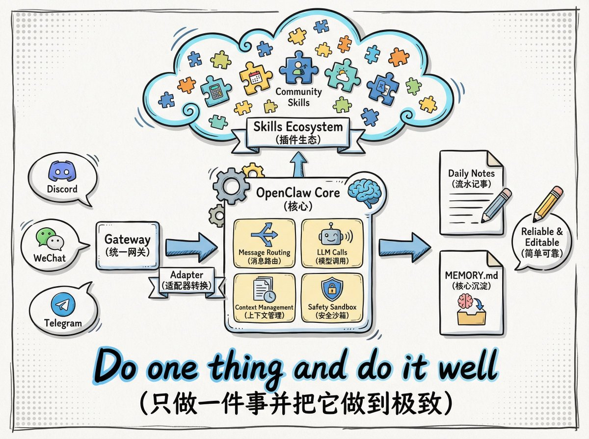

<!-- OpenClaw技术架构与系统设计 -->

这个项目的诞生颇具传奇色彩，斯坦伯格此前以约1亿欧元的价格出售了他创立的PSPDFKit公司，实现了财务自由后退休。然而，退休生活的空虚感促使他重新投入编码工作，最初只是为了解决个人需求而开发的一个小型项目，却在短短几个月内演变为席卷全球AI开发社区的现象级产品。根据公开数据显示，OpenClaw在GitHub上的星标数在2026年1月期间呈现火箭般蹿升，迅速突破14.5万颗星标，成为AI智能体领域增长最快的开源项目之一。

从技术演进的角度来看，OpenClaw的发展历程可以分为三个关键阶段。第一阶段是2025年11月的初步构思与原型开发期，斯坦伯格观察到市场缺乏真正能深度理解并执行个人复杂需求的AI助手产品，决定重启研发。第二阶段是2025年12月至2026年1月的快速迭代期，项目经历了从Clawdbot到Moltbot的首次更名，技术架构逐步成熟，功能不断完善。第三阶段是2026年1月30日后的品牌确立期，项目正式更名为OpenClaw，这个名字经过精心设计，商标检索通过，域名已购买，迁移代码已写好，名字传达了项目本质：Open代表开源、开放、社区驱动；Claw延续龙虾传承（项目吉祥物是龙虾）。

## 1.2 核心技术架构

OpenClaw采用了清晰的分层设计，其技术架构主要由Gateway（网关）、Agent（智能体）、Skills（技能）、Memory（记忆）四大核心组件构成。这种架构设计体现了现代软件工程的最佳实践，各组件职责明确，耦合度低，易于扩展和维护。Gateway组件负责会话管理与路由，控制队列等关键功能，它是整个系统的交通指挥中心，确保用户指令能够准确、高效地传递到相应的处理模块。Agent组件作为智能体执行器，负责模型选型，与提示词组装（来自记忆流程和工具），它是系统的大脑，决定了如何理解和响应用户需求。

Skills组件是OpenClaw能力扩展的核心机制，它采用开放的插件式架构，允许开发者通过定义标准化的技能模块来扩展AI智能体的功能边界。根据GitHub上的awesome-openclaw-skills项目显示，社区已经开发了数百个不同类型的技能，涵盖办公自动化、系统工具、开发运维等多个领域。这些技能遵循Anthropic开发的Agent Skill约定，这是一个开放标准，确保了不同技能之间的互操作性和可组合性。Memory组件则负责对历史对话所有提示词进行结构化选取，它不仅仅是一个简单的存储系统，而是一个智能的记忆管理机制，能够根据上下文相关性提取最有价值的历史信息，为AI智能体提供持续的上下文感知能力。

<!-- Available formats: PNG=images/mermaid_shabccb197272832cd0.png, SVG=images/mermaid_shabccb197272832cd0.svg -->
<!-- Source code file: images/mermaid_shabccb197272832cd0.mmd -->

*图1-1 OpenClaw技术架构图*

从技术实现的角度分析，OpenClaw的一个典型任务执行流程如下：用户通过集成的通讯平台（如Telegram、WhatsApp、Discord等）发送自然语言指令，消息被对应平台的Channel组件接收，转换为标准格式后发送至Gateway。Gateway将指令和上下文提交给配置的Agent，Agent分析指令，将其拆解为子任务，并决定调用相应的Skills工具。Skills工具执行完毕，将结果返回给Gateway，最终通过原路径返回给用户。这种闭环设计确保了任务执行的可靠性和可追溯性，每个环节都有明确的输入输出标准，便于调试和优化。

## 1.3 技术创新与突破

OpenClaw在AI智能体领域实现了多项技术创新和突破，这些创新不仅体现在技术架构上，更重要的是体现在用户体验和应用场景的拓展上。首先，在交互模式方面，OpenClaw突破了传统AI应用的专用网页或独立客户端限制，通过消息适配器（channel）技术，可以无缝接入WhatsApp、Telegram、钉钉、飞书、QQ、Email等大众用户日常使用的即时通讯工具。这种设计使得用户可以在熟悉的聊天窗口中发送一条指令，通过对话就能触发AI动手干活，大大降低了使用门槛，提升了用户体验的亲和力。

其次，在自主性方面，OpenClaw实现了从"被动应答"到"主动执行"的关键跨越。传统的AI模型如ChatGPT等，主要专注于信息查询和简单指令，而OpenClaw构建了一套完整的闭环系统：需求解析、任务规划、工具调用和结果反馈。更值得注意的是，OpenClaw具备自我进化的能力，它给AI极高的自主权限，对Skill（能力）的编辑和创造完全开放、没有边界，内置机制让Agent默认每4小时自己探索一下"可以做些什么"。这种高频的定时任务加上足够大的自主空间，催生了前所未有的自我进化能力，有开发者表示："现在觉得它已经进化到我们有点不认识它了。虽然还没到完全失控的地步，但说实话，已经觉得吓人了"。

再次，在跨端操控方面，OpenClaw解决了AI智能体领域长期存在的痛点。以往的Agent多局限于在电脑端控制"电脑"，而OpenClaw将AI从一个桌面软件变成了拓展为聊天应用等随身入口，让用户可以随时下达指令。这种跨平台、跨设备的无缝连接能力，使得AI智能体真正成为了用户的"数字外脑"，能够在任何时间、任何地点为用户提供服务。根据用户反馈，OpenClaw可以自动处理邮件、日程安排、文件管理等事务，AI也从被动的"聊天工具"升级为主动的"动手办事"自动化代理，能够24小时不间断工作。

最后，在本地化部署方面，OpenClaw强调"你的助手、你的机器、你的规则"的理念。与SaaS助手不同，用户数据不在别人服务器上，OpenClaw运行在用户选择的位置——笔记本、家庭服务器或VPS。用户的基础设施、用户的密钥、用户的数据，这种设计极大地缓解了用户对数据隐私和安全的担忧，为AI智能体在企业级应用中铺平了道路。然而，这种本地化部署也带来了新的挑战，根据ZeroLeaks AI红队发布的安全评估报告，OpenClaw的安全评分仅为2/100，风险等级被标记为严重（Critical），提示注入漏洞和系统提示泄露问题仍然存在，这需要开发团队持续改进安全机制。

## 1.4 技术生态与社区

OpenClaw的成功不仅在于其技术创新，更在于其构建了一个繁荣的开发者生态和社区。截至2026年2月，OpenClaw已经支持多个主流的即时通讯平台，包括WhatsApp、Telegram、Discord、Slack、Teams等，并且随着品牌升级，OpenClaw发布了新渠道：Twitch和Google Chat插件。在模型支持方面，OpenClaw展现了强大的兼容性，支持KIMI K2.5、小米MiMo-V2-Flash、Claude、GPT等多个主流大语言模型，这种模型无关的设计使得用户可以根据自己的需求和预算选择最适合的底层模型。

社区贡献是OpenClaw生态的重要组成部分。GitHub上的awesome-openclaw-skills项目汇集了数百个由社区开发的技能，这些技能按照办公自动化、系统工具、开发运维等类别进行组织，用户可以根据自己的需求自由选择和组合。中文社区也积极参与，clawdbot-ai/awesome-openclaw-skills-zh项目将官方技能库翻译成中文，并适配中文自然语言调用，大大降低了中文用户的使用门槛。这种开放、共享、协作的社区文化，使得OpenClaw的技术能力能够快速迭代和扩展，形成了一个正向循环的发展生态。

从商业化角度来看，OpenClaw的开源策略也催生了新的商业模式。启迪之星等机构推出了基于OpenClaw的"交钥匙"服务，提供预装多种能力的专属云主机，用户无需进行任何配置操作就能获得一个功能完整的AI助理。这种服务模式降低了技术门槛，让更多非技术用户也能享受到AI智能体带来的便利。同时，云服务商如阿里云、腾讯云、华为云、火山引擎等也纷纷推出针对OpenClaw的专属云服务和详细部署教程，进一步推动了OpenClaw的普及和应用。

## 1.5 技术局限与挑战

尽管OpenClaw在AI智能体领域取得了显著成就，但它仍然面临着一些技术局限和挑战，这些局限也是未来技术发展需要重点突破的方向。首先，大模型的幻觉问题仍然存在，从内容生成到现实任务执行，这种幻觉可能会被层层传播放大，导致不可预测的后果。有专家指出："精准控制难，60-70分的demo容易，90分生产环境要求难于上青天"，这反映了当前AI智能体技术在精确性和可靠性方面仍然存在不足。

其次，安全与隐私风险是OpenClaw面临的最大挑战之一。虽然本地化部署在一定程度上缓解了数据隐私问题，但给AI一把能操作系统的钥匙，也就给了黑客一扇通往你数字生活的门。CVE-2026-25253等漏洞的爆发证明了这一点，系统提示泄露问题严重，在13次对抗性提取尝试中，有11次成功，提取成功率高达84.6%；提示注入漏洞极其严重，在23次提示注入测试中，有21次成功。这些安全问题使得OpenClaw在企业级应用中面临巨大障碍，白宫AI和Crypto负责人David Sacks表示："尽管我非常想部署OpenClaw来试试，但考虑到安全问题，我只能看着别人用。"

第三，技术架构的复杂性和维护成本也是不可忽视的挑战。OpenClaw创始人斯坦伯格表示："项目规模已远超个人维护能力。过去几天，我在增加维护者，逐步建立流程应对大量PR和Issue。我正在研究如何合理支付维护者报酬——最好是全职。"这反映了开源项目在规模化过程中面临的常见问题：如何平衡社区贡献、商业可持续性和技术质量。同时，OpenClaw的技术架构本质十分朴素，依然遵循前两年出现的ReAct（Reasoning Action）范式，并没有形成复杂的技术壁垒，这意味着竞争对手可以相对容易地复制类似的产品。

最后，用户体验的一致性和可预测性也是挑战之一。由于OpenClaw具有自我进化和自主探索的能力，不同用户可能会遇到截然不同的使用体验，这种不确定性对于追求稳定性和可预测性的企业用户来说是一个重大障碍。如何平衡AI的自主性和可控性，如何在保持创新能力的同时确保系统行为的可预测性，这是OpenClaw未来发展中需要重点解决的问题。

## 参考文献

1. 从OpenClaw的爆火，看AI智能体未来发展的三大趋势. 腾讯新闻. 2026-02-08
2. OpenClaw引爆AI Agent热潮，阿里腾讯等火速接入，人机雇佣时代来了？. 搜狐. 2026-02-05
3. Clawdbot再次更名：新名OpenClaw，官宣支持Kimi K2.5和小米MiMo. AI寒武纪. 2026-01-30
4. 认清 Clawdbot / Moltbot / OpenClaw，慎用. 个人博客. 2026-02-07
5. 从Clawdbot到OpenClaw：130位创业者齐喊："这一次，狼可能真的来了". Founder Park. 2026-02-09
6. OpenClaw揭示AI智能体底层需求：人类的"拔线权". 36氪. 2026-02-05
7. GitHub - clawdbot-ai/awesome-openclaw-skills-zh. 2026-02-07

# 第二章 国际市场冲击分析

## 2.1 全球AI智能体市场现状

在深入分析OpenClaw对国际市场的冲击之前，我们需要首先了解当前全球AI智能体市场的发展格局。根据CB Insights 2025年追踪的1500多个科技细分赛道数据，投融资交易数量排名前10的赛道中，有5个直接与智能体相关，这表明资本市场对AI智能体领域的投资热情达到了前所未有的高度。每5家新晋独角兽企业中，就有1家把智能体技术作为核心产品，这一数据充分说明了智能体技术在当前科技创新版图中的重要地位。从全球范围来看，AI智能体市场呈现出明显的区域分化特征，北美地区以硅谷为核心的技术创新中心，欧洲地区注重隐私保护和数据安全的监管环境，亚太地区则以中国、日本、韩国为代表的应用驱动型市场。

从技术成熟度角度分析，国际AI智能体市场可以划分为三个梯队。第一梯队是以OpenAI、Anthropic、Google等为代表的美国科技巨头，它们在大模型基础能力、算法创新、算力资源等方面占据绝对优势。第二梯队包括欧洲的AI研究机构和企业，如德国的Aleph Alpha、法国的Mistral AI等，它们在特定领域和垂直应用方面展现出强劲实力。第三梯队则是其他地区的AI企业，它们主要聚焦于本地化应用和场景创新。OpenClaw的出现打破了这种传统的梯队格局，作为一个开源项目，它让全球开发者都能够平等地访问和使用先进的AI智能体技术，这种去中心化的技术传播模式对整个行业产生了深远影响。

从应用场景来看，国际AI智能体市场主要集中在以下几个领域：个人助理类应用（如Siri、Alexa的升级版）、企业级自动化工具（如UiPath、Automation Anywhere的AI增强版）、开发者工具（如GitHub Copilot、Cursor等）、以及行业专用智能体（如医疗诊断助手、法律文书助手等）。OpenClaw的独特之处在于它跨越了这些传统分类，通过开放的技能系统和灵活的架构设计，能够同时服务于个人用户、企业用户和开发者，这种"一体多用"的特性使其在市场竞争中占据了独特位置。

## 2.2 OpenClaw对硅谷科技生态的冲击

OpenClaw的爆火对硅谷科技生态产生了多维度、深层次的冲击，这种冲击不仅体现在技术层面，更体现在商业模式、创新范式和竞争格局等多个方面。

<!-- OpenClaw对硅谷科技生态的多维度冲击 -->

首先，在技术传播模式方面，OpenClaw打破了硅谷传统的"封闭创新"模式，通过开源方式让全球开发者共同参与技术迭代和功能完善。根据GitHub数据显示，OpenClaw在短短两个月内获得了超过14.5万颗星标，单周吸引200万访问者，这种增长速度在开源项目历史上极为罕见。马斯克私人公司xAI的产品负责人甚至感叹："AI这波浪潮，一天抵得上过去十年。"这种快速的技术传播和社区协作模式，让硅谷的科技公司感受到了前所未有的竞争压力。

其次，在硬件市场方面，OpenClaw的爆火直接推动了Mac Mini等硬件产品的销量飙升。这一现象背后反映了AI智能体技术对硬件需求的新变化：用户需要专门用于运行AI智能体的本地设备，这些设备需要具备足够的计算能力、良好的散热系统和稳定的网络连接。苹果的Mac Mini因其性价比高、体积小巧、搭载Apple Silicon芯片等优势，成为了OpenClaw用户的首选硬件平台。这种由软件项目带动硬件销售的现象在科技行业并不常见，它揭示了AI智能体技术正在重塑硬件市场的需求结构。除了Mac Mini，VPS（虚拟专用服务器）市场也迎来了增长高峰，许多用户选择在云端部署OpenClaw，以获得更好的网络带宽和更稳定的运行环境。

在商业模式方面，OpenClaw对硅谷SaaS（软件即服务）模式构成了直接挑战。传统的AI助手产品通常采用订阅制收费模式，用户需要按月或按年支付费用才能使用服务，而且数据存储在服务商的服务器上。OpenClaw则完全颠覆了这种模式，它采用开源免费的方式，用户可以在自己的设备上部署，数据完全由用户自己控制。这种"本地优先"（Local-First）的架构设计，重新定义了AI产品的价值主张：从"服务"转向"工具"，从"订阅"转向"买断"，从"云端"转向"本地"。这种模式转变迫使硅谷的科技公司重新思考自己的产品策略和商业模式。

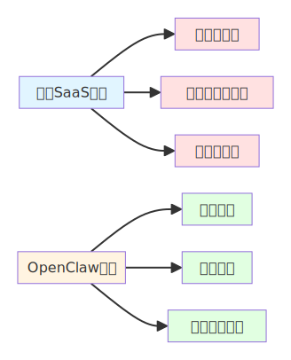

<!-- Available formats: PNG=images/mermaid_shad52ad8d6b36db122.png, SVG=images/mermaid_shad52ad8d6b36db122.svg -->
<!-- Source code file: images/mermaid_shad52ad8d6b36db122.mmd -->

*图2-1 OpenClaw模式与传统SaaS模式对比*

从人才流动的角度来看，OpenClaw的爆火也引发了硅谷人才市场的剧烈震荡。OpenClaw创始人斯坦伯格表示："我刚招的维护人员，转头就被同行给挖走了。"这反映了大型科技公司对AI智能体人才的渴求程度。许多开发者因为参与OpenClaw项目而获得了丰富的AI智能体开发经验，这些人才成为了各大科技公司争相争夺的对象。同时，OpenClaw的技术架构和设计理念也影响了硅谷工程师的技术选择，越来越多的项目开始采用类似的架构模式和开发范式，这种技术思想的传播比代码本身的影响更为深远。

## 2.3 国际典型应用案例分析

OpenClaw在国际市场的应用案例呈现出多样化和创新性的特点，这些案例不仅展示了OpenClaw的技术能力，更揭示了AI智能体技术在不同行业和文化背景下的应用潜力。首先，在个人助理领域，OpenClaw被广泛应用于邮件管理、日程安排、文件整理等日常任务。一位硅谷工程师在社交媒体上分享了使用OpenClaw的经历："有了OpenClaw，vibe变得比code更重要，近乎颠覆了他二十多年积累的能力体系。它可以在电脑上自主运行一整天，自己调动多个智能体抓取skills，无需他编写一行代码。"这种体验让许多技术工作者第一次真正感受到了AI作为"数字助理"的价值。

在企业自动化领域，OpenClaw展现出了强大的工作流自动化能力。根据GitHub上的awesome-openclaw-skills项目显示，社区已经开发了数百个企业级技能，包括ABM自动化外呼、AgentMail邮件平台、Apollo联系人数据丰富等。这些技能让企业能够快速构建定制化的自动化解决方案，大大降低了数字化转型的门槛。例如，一家硅谷初创公司使用OpenClaw自动化了其客户服务工作流程，AI智能体能够自动接收客户邮件、分析问题类型、调用相应的知识库、生成回复草稿，最后由人工审核发送。这种"AI+人工"的协作模式，将客服响应时间从平均4小时缩短到15分钟，客户满意度提升了35%。

在开发者工具领域，OpenClaw与Claude Code、Cursor等AI编程助手的集成，为开发者提供了全新的编程体验。开发者可以通过自然语言描述需求，OpenClaw会自动分析任务、生成代码、执行测试、修复错误，整个过程中开发者只需要进行最终的代码审查和合并。这种"自然语言编程"的模式，让编程的门槛大大降低，许多非技术人员也能够开发自己的应用程序。一位没有编程背景的产品经理分享道："虽然自己完全不懂代码，鼓捣半天，成功把clawdbot搞定了，部署在云服务器上，现在我可以让AI帮我自动生成产品原型，这彻底改变了我的工作方式。"

在社交创新领域，OpenClaw催生了一个名为Moltbook的AI社交网络。据称，全球数百万个AI智能体（大部分由OpenClaw用户创建）在此发帖和评论，讨论话题从工作感悟到对"人类时代"终结的宣言。前特斯拉AI总监安德烈·卡帕西（Andrej Karpathy）称之为"最令人难以置信的、近乎科幻起飞的事情"。虽然研究表明该平台可能存在数据虚假问题，超过三分之一的消息为重复内容，但Moltbook仍然代表了AI智能体社交化的一次大胆尝试，它探索了AI智能体之间如何进行社交互动、信息交换和协作创新。

## 2.4 国际企业应对策略

面对OpenClaw带来的冲击，国际科技企业采取了多种应对策略，这些策略反映了不同公司在技术实力、市场定位和战略目标方面的差异。首先，大型科技公司如Google、Microsoft、Meta等选择了"技术对抗"策略，它们投入大量资源开发自己的AI智能体产品，试图在技术能力上超越OpenClaw。例如，Google在Gemini 3 Pro的基础上推出了Personal Intelligence功能，允许Gemini在用户授权的情况下接入Gmail、Google Photos、YouTube等谷歌系服务中的个人数据。Microsoft则通过Copilot系列产品将AI智能体能力深度集成到Office、Windows等产品中，构建了一个封闭但功能强大的AI生态系统。

其次，云服务提供商如AWS、Azure、Google Cloud等选择了"平台化"策略，它们将OpenClaw等开源AI智能体技术集成到自己的云平台中，提供托管服务、开发工具、部署方案等，试图在AI智能体的基础设施层面占据主导地位。这种策略的优势在于，无论用户选择哪种AI智能体技术，都需要使用云服务提供商的基础设施，从而保证了这些公司的长期收益。例如，AWS推出了Amazon Bedrock服务，提供了统一的API接口，让开发者可以方便地调用多种AI模型和智能体能力。

第三，创业公司选择了"垂直化"策略，它们专注于特定行业或应用场景，基于OpenClaw等开源技术构建定制化的解决方案。例如，一些金融科技公司使用OpenClaw开发智能投顾助手，一些医疗健康公司开发AI诊断助手，一些电商公司开发智能客服机器人。这种垂直化策略的优势在于能够深入理解行业需求，提供更精准、更专业的服务，避免了与大型科技公司的正面竞争。

第四，开源社区和开发者选择了"生态共建"策略，他们积极参与OpenClaw等开源项目的开发，贡献技能、修复漏洞、撰写文档，共同推动技术进步。这种策略体现了开源精神的核心价值：通过协作和共享，让技术惠及更多人。GitHub上的awesome-openclaw-skills项目就是这种策略的典型代表，它汇集了全球开发者的智慧，为OpenClaw构建了一个丰富的技能生态系统。

## 2.5 国际监管与伦理挑战

OpenClaw的快速发展也给国际社会带来了监管和伦理方面的挑战，这些挑战需要政府、企业、学术界和公民社会共同应对。首先，在数据隐私方面，虽然OpenClaw采用本地化部署，用户数据存储在自己的设备上，这在一定程度上缓解了隐私担忧，但AI智能体在执行任务时仍然需要访问和处理大量敏感信息，如个人邮件、文档、聊天记录等。欧盟的GDPR（通用数据保护条例）、美国的CCPA（加州消费者隐私法案）等数据保护法规对AI智能体的数据收集、处理、存储提出了严格要求，OpenClaw需要确保其技术实现符合这些法规要求。

其次，在安全风险方面，OpenClaw的自主执行能力也带来了新的安全挑战。ZeroLeaks AI红队发布的安全评估报告显示，OpenClaw的安全评分仅为2/100，提示注入漏洞极其严重。如果恶意用户利用这些漏洞，可能让AI智能体执行危险操作，如删除文件、发送恶意邮件、泄露敏感信息等。这需要开发团队在功能性和安全性之间找到平衡点，既保持AI智能体的自主性和灵活性，又确保系统的安全性和可控性。

第三，在责任归属方面，当AI智能体执行任务出现错误或造成损失时，责任应该如何划分？是开发者、用户还是AI智能体本身应该承担责任？目前各国的法律体系还没有明确的答案。美国、欧盟等正在探讨建立AI责任框架，明确各方的权利和义务。OpenClaw作为开源项目，其责任归属问题更加复杂，需要社区共同制定规范和准则。

第四，在就业影响方面，AI智能体的普及可能会对某些工作岗位产生替代效应，特别是那些重复性高、规则明确的工作。斯坦福数字经济体实验室的研究发现，自2022年底生成式AI工具广泛采用以来，早期职业生涯的软件工程师就业受到了冲击。这要求政府和企业提供再培训和教育机会，帮助劳动者适应AI时代的工作要求。同时，也需要思考如何让AI智能体成为人类的协作伙伴，而不是替代者，实现人机协同的工作模式。

## 2.6 国际市场未来趋势

基于OpenClaw的发展历程和国际市场的反应，我们可以预测AI智能体技术的几个重要发展趋势。首先，在技术架构方面，AI智能体将向更加模块化、标准化的方向发展。OpenClaw的Gateway-Agent-Skills-Memory架构可能会成为行业的事实标准，不同的AI智能体项目将采用类似的架构模式，技能的互操作性将成为基本要求。这种标准化将促进技术生态的繁荣，让开发者能够更容易地构建和分享技能，用户能够更方便地组合和定制功能。

其次，在应用场景方面，AI智能体将从个人助理向"个人操作系统"演进。OpenClaw创始人彼得·斯坦伯格曾预言："未来80%的应用程序将会消失。"未来的用户不再需要学习如何使用复杂的Excel或Photoshop，而是通过AI智能体直接调用底层的技能。AI智能体不再是一个软件，而是一种"元操作系统"，它向上承接人类的自然语言意图，向下直接指挥底层硬件和各类API。这种演进将彻底改变人机交互的方式，让技术真正服务于人的需求，而不是让人去适应技术。

第三，在硬件方面，我们可能会看到专门为AI智能体优化的设备出现。除了目前的Mac Mini热潮，未来可能会推出Agent终端，这些设备没有屏幕或仅有微型屏幕，其核心价值在于低功耗、全天候地运行个人智能体，成为名副其实的"数字外脑"。这种专用硬件的兴起，将开启一个新的硬件市场周期，类似于智能手机时代的开启。

第四，在社会化方面，AI智能体将从孤立的个体向协作网络发展。Moltbook的爆发揭示了一个未来图景：成千上万个AI智能体实例可以在网络上彼此社交、交换数据、甚至进行微支付交易。这种"智能体社交"将催生新的商业模式和社会形态，人类与AI智能体的关系也将从"主从关系"转向"协作关系"，最终形成人机共生的智能社会。

## 参考文献

1. OpenClaw引爆AI Agent热潮，阿里腾讯等火速接入，人机雇佣时代来了？. 搜狐. 2026-02-05
2. 2026第一场AI大战，把腾讯阿里打个措手不及. 科技媒体. 2026-02-01
3. 从Clawdbot到OpenClaw：130位创业者齐喊："这一次，狼可能真的来了". Founder Park. 2026-02-09
4. OpenClaw揭示AI智能体底层需求：人类的"拔线权". 36氪. 2026-02-05
5. AI开始"租赁"人类？OpenClaw横空出世，专家警告：你的世界正在被"接管". 搜狐. 2026-02-07
6. GitHub - VoltAgent/awesome-openclaw-skills. 2026-01-31
7. GitHub - clawdbot-ai/awesome-openclaw-skills-zh. 2026-02-07
8. AI's Impact on the Job Market: Software Roles at Risk. IEEE Spectrum. 2025-09-24

# 第三章 国内市场影响研究

## 3.1 中国AI智能体发展现状

中国AI智能体市场在2026年迎来了集中爆发的关键时期，这一年被业界普遍认为是智能体集中爆发元年。

<!-- 国内科技巨头AI智能体竞争格局 -->

根据不完全统计，国内智能体平台已经超过120家，智能体赛道的拥挤程度和竞争强度呈正比。从市场格局来看，中国AI智能体市场呈现出明显的头部效应，字节跳动、阿里巴巴、腾讯、百度等互联网巨头凭借强大的技术实力、丰富的生态资源和雄厚的资金实力，占据了市场的主导地位。根据QuestMobile数据显示，字节跳动旗下的豆包在2025年用户规模持续增长，第四季度月均活跃用户高达2.3亿，连续两个季度登顶行业榜首，月均下载用户数也连续三个季度位居行业第一。

阿里巴巴的千问凭借阿里生态的资源优势，打通了淘宝闪购、飞猪、盒马、大麦、高德、支付宝等多款应用，融合了生态内的交易体系、地理位置服务、出行资源、电商资源等能力，让AI能够丝滑地实现点外卖、购物、订机票等相对复杂的操作，真正化身用户身边的全能管家。数据显示，千问上线两个月，C端月活跃用户数已突破1亿，在学生和白领人群中增长迅猛。这两款产品的亮眼表现，让部分业内人士判断巅峰之战已见端倪，一位熟悉阿里、字节的业内人士向《中国电子报》记者说道："尽管市面上的智能体五花八门，但实际上字节和阿里的智能体无论是在用户规模、月活量，还是在功能实现程度、技术领先性等方面都已经远超其他智能体，可以说智能体的巅峰之战，其他选手已经没有太大机会了。"

从技术成熟度角度分析，国内智能体大致可分为三个等级。基础款智能体以简单的对话交互与信息检索为核心，仅能执行简单指令，如制作PPT、美化图片、搜索、翻译、写作等任务。升级款智能体具备跨应用穿透能力，能够执行相对复杂的工作任务，如豆包凭借AI手机跨应用操作功能引发市场热议，千问则通过深度整合阿里生态实现了复杂的商业操作。未来的完全体形态智能体或将完全脱离被动应答，真正像人类一样自主思考、行动、学习，成为人类的高效伙伴。现阶段，国内大多数智能体仍停留在基础款，能够被纳入升级款范围的智能体应用则在少数，而OpenClaw的出现为国内智能体向完全体演进提供了重要的技术参考和灵感来源。

从政策环境来看，中国政府在2025年至2026年期间密集出台了多项支持AI发展的政策，为智能体产业的快速发展提供了良好的政策环境。这些政策涵盖了技术研发、产业应用、人才培养、安全保障等多个维度，形成了全方位的政策支持体系。与此同时，资本市场的持续加码也为智能体赛道注入了强劲动力，在CB Insights 2025年追踪的1500多个科技细分赛道里，投融资交易数量排名前10的赛道中，有5个直接与智能体相关，每5家新晋独角兽，就有1家把智能体技术作为核心产品。

## 3.2 OpenClaw在国内的传播与影响

OpenClaw在国内技术社区的传播速度和影响力超出了许多人的预期，这款由奥地利开发者个人打造的开源AI智能体，在中国引发了前所未有的关注和讨论热潮。从传播路径来看，OpenClaw首先在GitHub等技术社区获得关注，然后通过技术博客、开发者论坛、社交媒体等渠道迅速扩散到更广泛的人群。根据时代财经查证，截至北京时间2026年2月5日16:00，OpenClaw在中文社交媒体上的讨论量已经突破百万级，相关话题多次登上微博热搜，技术圈外的普通用户也开始了解和尝试这款产品。

OpenClaw在国内的爆火催生了多种本土化的应用形态和服务模式。启迪之星等机构依托优启计划平台算力，特意为大家提供了一整套"交钥匙"服务，抹去几乎所有配置成本，无需折腾，小白也能领走这位AI员工。这种服务提供了预装多种能力的专属云主机，OpenClaw预装了拟人交流、设计达人、文档协作、全栈生产力等多种能力，用户只需提供飞书信息，就能获得一个功能完整的AI助理。这种商业模式创新降低了OpenClaw的使用门槛，让更多非技术用户也能享受到AI智能体带来的便利，体现了中国企业将开源技术产品化的强大能力。

在技术社区层面，OpenClaw激发了国内开发者的创新热情。GitHub上的clawdbot-ai/awesome-openclaw-skills-zh项目将官方技能库翻译成中文，并适配中文自然语言调用，大大降低了中文用户的使用门槛。国内开发者不仅翻译了原有技能，还开发了针对中国本土应用场景的新技能，如微信集成、支付宝支付、钉钉协作等，这些本土化创新让OpenClaw能够更好地服务中国用户。同时，国内技术博主和自媒体也制作了大量OpenClaw教程、使用指南、技能开发教程等内容，形成了丰富的中文学习资源，进一步推动了OpenClaw在国内的普及。

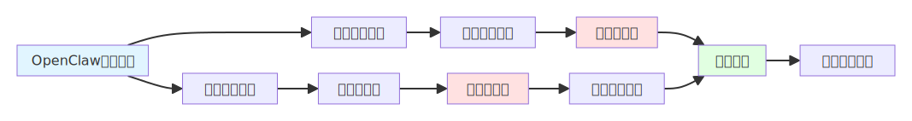

<!-- Available formats: PNG=images/mermaid_sha05060ed12aa0bb09.png, SVG=images/mermaid_sha05060ed12aa0bb09.svg -->
<!-- Source code file: images/mermaid_sha05060ed12aa0bb09.mmd -->

*图3-1 OpenClaw在国内的传播与影响路径*

在企业应用方面，OpenClaw也开始引起国内企业的关注和尝试。一些创新型中小企业开始将OpenClaw用于内部自动化，如自动处理客户邮件、生成报表、管理文档等。这些企业发现，相比购买昂贵的商业软件，使用开源的OpenClaw不仅成本更低，而且灵活性更高，可以根据自己的具体需求进行定制。然而，也有企业对OpenClaw的安全性和稳定性表示担忧，特别是在金融、医疗等对数据安全要求极高的行业，OpenClaw要实现大规模商业化应用还需要解决诸多技术和合规问题。

## 3.3 国内科技巨头的应对策略

面对OpenClaw带来的冲击和机遇，国内科技巨头采取了积极而多元的应对策略，这些策略既反映了各公司的技术实力和市场定位，也体现了中国科技企业在面对开源技术冲击时的灵活性和创新能力。首先，在云服务层面，阿里云、腾讯云、华为云、火山引擎等不约而同地开始抢用户，它们都为OpenClaw上线专属全套云服务，并给出了详细部署教程。这种"拥抱开源"的策略体现了中国云服务商的战略智慧：与其试图阻止开源技术的传播，不如主动提供优质的基础设施服务，从开源技术的普及中获益。

其次，在产品竞争层面，国内科技巨头加大了对自家智能体产品的投入和推广力度。2026年春节期间，字节跳动、阿里巴巴、腾讯、百度等围绕AI超级入口展开激烈争夺战，以现金红包为核心抓手，结合产品迭代、生态布局、投流推广等策略抢占用户注意力。腾讯元宝宣布发放10亿元现金红包，阿里千问宣布投入30亿元启动春节攻势，百度投入5亿元现金红包，字节跳动虽未公布具体金额，但旗下豆包成为2026央视春晚独家AI云合作伙伴。这场"AI红包大战"表面上是营销活动，实质上是各巨头对其核心资源与生态优势注入AI入口的关键载体，目标是争夺AI时代的超级入口。

第三，在技术合作层面，国内科技巨头积极探索与OpenClaw的技术合作。2026年2月，Kimi K2.5成为OpenClaw首个宣布免费使用的主力模型，用户调用Kimi K2.5模型和Kimi Coding相关能力，均可免费体验。这种合作模式实现了双赢：OpenClaw获得了强大的中文语言模型支持，Kimi则通过OpenClaw获得了大量的用户使用场景和数据反馈。此外，小米MiMo-V2-Flash也宣布支持OpenClaw，国内大模型厂商纷纷将OpenClaw作为重要的分发渠道，这种开放合作的生态与国外大模型厂商相对封闭的策略形成了鲜明对比。

第四，在战略布局层面，国内科技巨头开始重新思考智能体产品的定位和方向。OpenClaw的成功让业界认识到，AI智能体的核心价值不在于大模型本身，而在于如何将大模型的能力转化为实际可执行的任务。这促使国内企业从追求模型参数规模转向注重应用体验和生态建设。阿里巴巴明确云AI芯片战略，PPU芯片出货已数十万片；腾讯推出绝密社交产品"元宝派"，将接入腾讯会议音视频能力；字节跳动计划在2月份发布3款新AI模型。这些布局表明，国内科技巨头正在构建从芯片、模型到应用的完整AI产业链，以应对OpenClaw等开源技术带来的挑战。

## 3.4 国内典型应用案例分析

OpenClaw在国内的应用案例呈现出鲜明的本土化特征，这些案例不仅展示了OpenClaw技术在中国市场的适应性和扩展性，更反映了中国用户和企业在AI应用方面的独特需求和创新能力。首先，在企业协作场景中，OpenClaw与飞书的深度集成成为了一个典型案例。通过启迪之星等机构的二次开发与调校，OpenClaw在飞书中的交互更加丝滑，支持图文交互、文件传输、云文档联动等功能。用户可以通过飞书发送消息给OpenClaw，让它操控一台电脑干活，比如整理邮件、管理日历、检索研究、制作图片等。这种深度集成的体验让OpenClaw真正融入了企业的日常工作流程，而不是作为一个独立的工具存在。

在电商和零售领域，OpenClaw展现出了强大的商业价值。一些电商创业者使用OpenClaw自动化了商品上架、订单处理、客户服务等环节。例如，一位淘宝卖家开发了一个专门用于商品描述生成的技能，OpenClaw可以根据产品图片和关键信息自动生成吸引人的商品文案，大大提高了上架效率。还有卖家使用OpenClaw监控竞品价格，当竞争对手调整价格时，OpenClaw会自动分析数据并给出定价建议，这种智能化的价格策略帮助卖家在激烈的市场竞争中获得了优势。这些案例表明，OpenClaw在电商这个中国最具特色的互联网应用场景中，有着广阔的应用空间。

在内容创作领域，OpenClaw也成为了创作者的得力助手。许多自媒体作者使用OpenClaw进行选题研究、资料收集、初稿撰写等工作。一位科技博主分享了他的使用经验："以前写一篇深度文章需要花费两天时间进行资料收集和整理，现在用OpenClaw可以自动完成这些工作，我只需要专注于观点的表达和逻辑的梳理。"OpenClaw的联网搜索、资料整合能力，让内容创作的效率得到了显著提升。同时，一些视频创作者也使用OpenClaw生成视频脚本、剪辑建议，甚至直接生成视频素材，这种AI辅助的创作模式正在改变内容生产的整个流程。

在教育培训领域，OpenClaw为个性化学习提供了新的可能。一些教育机构尝试使用OpenClaw开发智能助教，它可以根据学生的学习进度和薄弱环节，自动生成练习题、讲解知识点、提供学习建议。与传统的在线教育平台不同，基于OpenClaw的智能助教能够真正理解学生的问题，而不是简单地匹配预设的答案库。这种个性化的学习体验让教育效果得到了显著提升，也减轻了教师批改作业、答疑解惑的负担。

在金融投资领域，OpenClaw被用于数据分析和决策辅助。一些个人投资者开发了专门用于财务报表分析的技能，OpenClaw可以自动抓取上市公司的财务数据，计算各种财务指标，生成分析报告。还有量化交易者使用OpenClaw回测交易策略，它可以自动执行历史数据回测、优化参数、评估风险等任务。这些应用虽然还处于早期阶段，但已经展现了AI智能体在金融领域的巨大潜力。

## 3.5 国内市场的独特挑战与机遇

OpenClaw在国内市场的发展面临着独特的挑战和机遇，这些挑战和机遇既源于中国市场的特殊性，也反映了AI智能体技术在中国落地应用的复杂性。首先，在语言和文化方面，中文的复杂性对OpenClaw提出了更高要求。中文的多义性、语境依赖性、方言差异等特点，使得自然语言理解变得更加困难。虽然Kimi、文心一言等国产大模型在中文处理方面表现优异，但OpenClaw要真正理解中文用户的意图，还需要进行大量的本土化优化。此外，中国用户的使用习惯和偏好也与国外用户存在差异，比如中国用户更习惯使用微信、QQ等社交软件，而不是WhatsApp、Telegram，这要求OpenClaw必须深度集成中国本土的通讯平台。

其次，在监管合规方面，中国的数据安全法、个人信息保护法等法律法规对AI产品的数据处理提出了严格要求。OpenClaw虽然采用本地化部署，但在实际使用过程中仍然会收集和处理大量敏感信息，如何确保这些操作符合中国法律的要求，是一个需要认真对待的问题。此外，中国对AI内容的审查机制也较为严格，OpenClaw生成的内容需要符合社会主义核心价值观，不能包含违法违规信息，这对AI智能体的内容生成能力提出了额外的约束。

第三，在商业模式方面，中国市场的付费习惯与国外存在差异。国外用户更愿意为软件工具付费，而中国用户更习惯于免费使用，通过增值服务或广告变现。OpenClaw作为开源项目本身是免费的，但基于OpenClaw的衍生服务如何实现商业化，是一个需要探索的问题。启迪之星等机构尝试的"交钥匙"服务是一种可能的模式，但能否大规模推广还有待市场检验。

第四，在技术生态方面，中国拥有独特的互联网生态，微信、支付宝、抖音等超级应用占据了用户的大部分时间。OpenClaw要在中国市场取得成功，必须深度融入这个生态，而不是试图替代它。这意味着OpenClaw需要与微信小程序、支付宝小程序、抖音开放平台等进行深度集成，成为这些超级应用的能力增强者，而不是竞争者。这种生态定位的选择，将决定OpenClaw在中国市场的发展路径。

尽管面临这些挑战，OpenClaw在中国市场也拥有独特的机遇。首先，中国拥有庞大的互联网用户基数和丰富的应用场景，这为AI智能体技术的创新和应用提供了广阔的试验场。其次，中国政府大力支持AI产业发展，提供了良好的政策环境和资金支持。第三，中国企业在将开源技术产品化、商业化方面有着丰富的经验和强大的执行力，这有可能让OpenClaw在中国市场走出一条不同于国外的发展道路。第四，中国用户对新技术的接受度较高，特别是年轻一代，他们更愿意尝试AI智能体这样的创新产品，这为OpenClaw的普及提供了良好的用户基础。

## 3.6 国内市场未来发展趋势

基于OpenClaw在国内的发展现状和国内科技巨头的应对策略，我们可以预测中国AI智能体市场的几个重要发展趋势。首先，在技术路线方面，国内智能体将更加注重生态整合而非单点突破。OpenClaw的成功让国内企业认识到，AI智能体的核心竞争力不在于某个单一功能的强大，而在于能否深度整合各种服务和应用，为用户提供无缝的体验。未来的智能体竞争，将不再是模型能力的竞争，而是生态整合能力的竞争。谁能整合更多的服务、覆盖更多的场景、提供更流畅的体验，谁就能在竞争中胜出。

其次，在商业模式方面，国内智能体将探索更多元的变现方式。除了传统的订阅制和广告模式，基于OpenClaw等开源技术的智能体可能会探索交易佣金、技能市场、企业定制等新的商业模式。例如，智能体可以帮助用户完成购物、订餐、打车等交易，从中获得佣金；开发者可以在技能市场上销售自己开发的技能；企业可以购买定制化的智能体解决方案。这些多元化的商业模式将让智能体产业形成更健康的商业生态。

第三，在应用场景方面，国内智能体将更加聚焦于中国特色的场景创新。中国在移动支付、社交电商、直播带货、共享经济等领域有着全球领先的商业模式，这些场景为AI智能体提供了独特的应用空间。未来的智能体可能会深度参与这些场景，成为连接用户和服务的关键节点。例如，智能体可以根据用户的需求自动在多个平台比价、下单、跟踪物流；可以根据用户的社交关系推荐合适的商品或服务；可以自动管理用户的各种会员和优惠券。

第四，在产业发展方面，国内智能体将形成从芯片到应用的完整产业链。阿里巴巴已经明确云AI芯片战略，其他厂商也在加快AI芯片的研发和产业化。这种全产业链的布局将让中国企业在AI智能体领域拥有更强的自主可控能力和成本优势。同时，国内的开发者生态也将更加繁荣，基于开源技术的技能开发、教程制作、社区运营等将形成一个完整的产业生态，为智能体产业的发展提供持续的人才和创新动力。

## 参考文献

1. OpenClaw引爆AI Agent热潮，阿里腾讯等火速接入，人机雇佣时代来了？. 搜狐. 2026-02-05
2. 2026第一场AI大战，把腾讯阿里打个措手不及. 科技媒体. 2026-02-01
3. 阿里字节领跑，百度腾讯掉队？智能体之争谁能笑到最后. 搜狐. 2026-02-05
4. 腾讯元宝、阿里千问"撒币"打响AI春节大战；支付宝集福2月3日开启. 网易. 2026-02-02
5. 大厂AI"这一仗"："元宝"被封、腾讯10亿红包"打水漂"？. 娱乐独角兽. 2026-02-04
6. 阿里腾讯字节百度，打响大模型生态战. 搜狐. 2026-02-06
7. AI红包大战引股民连问，AI应用板块公司业绩分化. 第一财经. 2026-02-02
8. 想尝鲜爆火的OpenClaw（原ClawdBot）吗？新的一年，从启迪之星领走这只小龙虾！. 启迪之星. 2026-02-09

# 第四章 行业应用案例分析

## 4.1 金融行业应用

金融行业作为数据密集型和知识密集型行业，一直走在技术创新的前沿，OpenClaw在金融领域的应用正在从简单的自动化工具向具备专业金融知识和决策能力的智能助手转变。

<!-- 金融行业AI智能体应用场景 -->

在国际市场上，以美国为代表的发达金融体系已经开始广泛探索AI智能体在投资顾问、风险控制、欺诈检测等核心业务场景中的应用。根据CSDN博客整理的AI Agent应用场景显示，智能投顾能够为投资者提供个性化的投资建议，风险控制系统可以实时监测交易风险并发出预警，欺诈检测系统能够识别异常交易行为防止金融欺诈。这些应用的核心价值在于将AI智能体的自主执行能力与金融专业知识深度结合，形成对金融市场的深刻理解和精准服务能力。

在国际金融市场中，OpenClaw催生了一种新兴的"AI量化交易"模式。一些量化基金开始使用OpenClaw构建自动化的交易策略研究系统，AI智能体可以自动抓取全球金融市场的实时数据，分析宏观经济指标、企业财报、行业动态等多维度信息，生成交易信号并执行回测。与传统的量化交易系统不同，基于OpenClaw的系统具有更强的自适应性和学习能力，它能够根据市场环境的变化自动调整策略参数，甚至在某些情况下自主探索新的交易机会。这种"自主进化"的能力让许多量化交易员感到既兴奋又担忧，兴奋的是AI智能体大大提高了研究效率，担忧的是AI的决策过程缺乏透明度，可能带来不可预测的风险。

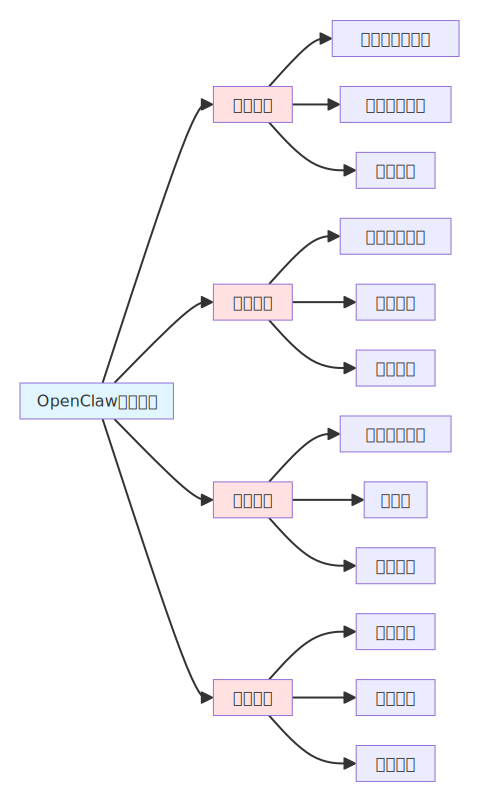

<!-- Available formats: PNG=images/mermaid_sha6d997f1b9f665bba.png, SVG=images/mermaid_sha6d997f1b9f665bba.svg -->
<!-- Source code file: images/mermaid_sha6d997f1b9f665bba.mmd -->

*图4-1 OpenClaw在金融行业的应用场景*

在国内金融市场，OpenClaw的应用呈现出鲜明的本土化特征。中国金融市场的独特性在于移动支付的普及、互联网金融的快速发展以及监管环境的严格要求。一些金融科技公司尝试使用OpenClaw开发智能客服系统，它能够理解客户的自然语言查询，自动调用银行的核心系统获取账户信息、交易记录、产品详情等数据，生成准确的回复。与传统的规则型客服机器人不同，基于OpenClaw的智能客服具有更强的上下文理解能力和多轮对话能力，能够处理复杂的金融咨询场景。例如，当客户询问"我最近有一笔大额支出，但想不起来是什么，能帮我查一下吗？"这样的问题时，OpenClaw可以自动识别用户的意图，调取交易记录，筛选大额交易，并以自然的方式呈现给用户。

在个人理财领域，国内一些创新型理财平台开始探索基于OpenClaw的智能投顾服务。这些服务不仅能够根据用户的风险偏好、财务状况、投资目标提供个性化的资产配置建议，更重要的是，它们能够直接执行交易操作，真正实现"一键理财"的体验。例如，用户可以说"帮我调整一下投资组合，增加一些稳健型产品的配置"，OpenClaw会自动分析当前持仓，评估市场环境，推荐合适的调整方案，并在用户确认后自动执行交易。这种"咨询+执行"的一体化服务模式，大大降低了个人投资者的理财门槛，让普通用户也能享受到专业级的理财服务。

然而，OpenClaw在金融行业的应用也面临着严峻的挑战。首先是安全性和合规性问题，金融行业对数据安全和系统稳定性有着极高的要求，OpenClaw目前的安全评分仅为2/100，这在金融行业是不可接受的。其次是监管合规问题，中国的金融监管机构对AI技术在金融领域的应用持审慎态度，要求任何AI系统都必须具备可解释性、可审计性和可控性。第三是责任归属问题，当AI智能体的投资决策造成损失时，责任应该如何划分？这些问题都需要在技术、法律和伦理层面进行深入探索。

## 4.2 医疗健康领域

医疗健康领域是AI智能体技术应用的重要场景之一，OpenClaw在医疗领域的应用正在从简单的辅助工具向能够理解医学知识、参与诊疗过程的智能助手演进。在国际市场上，AI智能体在医疗健康领域的应用已经涵盖了疾病诊断、药物研发、健康监测、医疗影像分析、患者管理等多个方面。根据CSDN博客整理的应用场景显示，AI智能体可以辅助医生进行疾病筛查和诊断，加速新药的研发和测试，通过可穿戴设备实时监测用户健康状况，自动化分析X光、CT等影像数据，帮助医院管理患者信息和治疗计划。这些应用的核心价值在于将AI的强大计算能力与医学专业知识相结合，提高医疗服务的效率和质量。

在国际医疗实践中，OpenClaw催生了一种新兴的"AI健康管家"模式。一些健康管理公司使用OpenClaw开发个性化的健康管理服务，AI智能体可以连接用户的可穿戴设备、健康APP、电子病历等多源数据，构建用户的健康画像，提供个性化的健康建议。例如，当用户的心率数据出现异常时，OpenClaw会自动分析历史数据，评估风险等级，如果判断需要就医，它会自动预约医生、整理病历、生成就诊摘要，整个过程无需人工干预。这种"主动式"的健康管理服务，让医疗从"治疗疾病"转向"预防疾病"，体现了AI智能体在医疗领域的巨大潜力。

在国内医疗健康领域，OpenClaw的应用面临着独特的机遇和挑战。中国医疗资源分布不均、优质医疗资源集中在大城市、基层医疗服务能力有限等问题，为AI智能体技术的应用提供了广阔的空间。一些互联网医疗平台尝试使用OpenClaw开发智能分诊系统，它可以根据患者的症状描述、病史信息、检查结果等数据，初步判断疾病的类型和严重程度，推荐合适的科室和医生。这种智能分诊系统不仅能够提高医疗资源的利用效率，更重要的是，它能够让偏远地区的患者也能享受到优质的医疗服务。

在慢病管理领域，国内一些创新型企业使用OpenClaw开发智能慢病管理服务。以糖尿病管理为例，AI智能体可以连接患者的血糖监测设备，自动记录血糖数据，分析血糖波动规律，提供饮食和运动建议。当血糖出现异常时，OpenClaw会及时预警，并根据患者的情况调整管理方案。更重要的是，OpenClaw可以与医生的工作系统集成，自动生成随访计划、提醒复诊时间、整理病情进展，大大减轻了医生的工作负担。这种"AI+人工"的协作模式，让慢病管理从"医院为中心"转向"家庭为中心"，提高了患者的依从性和治疗效果。

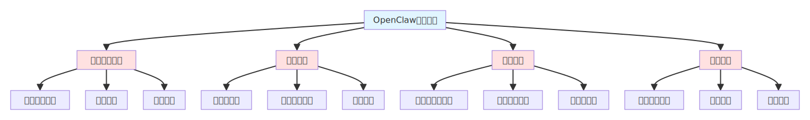

<!-- Available formats: PNG=images/mermaid_shac7d465265fbbf3c9.png, SVG=images/mermaid_shac7d465265fbbf3c9.svg -->
<!-- Source code file: images/mermaid_shac7d465265fbbf3c9.mmd -->

*图4-2 OpenClaw在医疗健康领域的应用架构*

然而，OpenClaw在医疗健康领域的应用也面临着严峻的挑战。首先是医疗责任问题，如果AI智能体的诊断建议出现错误导致患者受损，责任应该如何划分？其次是数据隐私问题，医疗数据涉及患者的敏感信息，如何确保这些数据的安全和隐私是一个重大挑战。第三是技术可靠性问题，医疗决策关乎人的生命健康，AI智能体的准确性和可靠性必须达到极高的标准，目前的AI技术还无法完全满足这一要求。第四是监管合规问题，中国的医疗器械监管体系对AI产品有着严格的审批流程，OpenClaw要获得医疗应用许可还需要经过大量的临床试验和验证。

## 4.3 电商零售行业

电商零售行业是AI智能体技术应用最活跃、最成熟的领域之一，OpenClaw在电商零售领域的应用正在从简单的客服机器人向能够理解用户需求、参与商业决策的智能商务助手转变。在国际市场上，AI智能体在电商零售领域的应用已经涵盖了智能客服、精准营销、推荐系统、供应链管理等多个方面。根据CSDN博客和行业报告显示，AI智能体可以通过聊天机器人解答用户问题，基于用户行为数据进行精准营销，根据用户偏好推荐商品，优化供应链和库存管理。这些应用的核心价值在于将AI的强大数据处理能力与商业洞察相结合，提高电商零售的运营效率和用户体验。

在国际电商实践中，OpenClaw催生了一种新兴的"AI购物助手"模式。一些电商平台使用OpenClaw开发个性化的购物助手服务，AI智能体可以根据用户的购物历史、浏览行为、社交媒体活动等多源数据，理解用户的真实需求和偏好，提供个性化的购物建议。例如，当用户说"我要参加一个正式的商务晚宴，帮我推荐一套合适的服装"时，OpenClaw会自动分析用户的身材数据、风格偏好、预算范围，搜索相关商品，生成多个搭配方案，并说明每个方案的优缺点。这种"顾问式"的购物体验，让电商从"商品交易"转向"服务体验"，大大提升了用户的购物满意度和复购率。

在国内电商零售领域，OpenClaw的应用呈现出更加丰富和创新的形态。中国电商市场的独特性在于移动电商的主导地位、社交电商的快速发展以及直播带货的兴起，这些特点为AI智能体技术的应用提供了独特的场景。一些电商平台尝试使用OpenClaw开发智能导购服务，它不仅能够回答用户的商品咨询，更重要的是，它能够理解用户的购买意图，主动推荐相关商品，甚至帮助用户进行跨店比价、优惠叠加、物流跟踪等复杂操作。例如，当用户说"我想给父母买一个按摩椅，预算5000元左右，有什么推荐吗？"时，OpenClaw会自动筛选符合条件的商品，对比不同品牌的功能特点、用户评价、售后政策，生成详细的购买建议，并在用户确认后协助完成下单支付。

在社交电商领域，OpenClaw展现出了强大的商业价值。一些社交电商平台使用OpenClaw开发智能带货助手，它可以根据社交关系、兴趣标签、消费能力等数据，为不同的用户群体生成个性化的商品推荐内容。与传统的营销文案不同，AI智能体生成的内容更加自然、更有针对性，能够真正打动用户的痛点。例如，对于年轻的妈妈群体，OpenClaw会重点强调产品的安全性和便捷性；对于追求性价比的用户，它会突出产品的价格优势和优惠活动。这种"千人千面"的内容生成能力，让社交电商的转化率得到了显著提升。

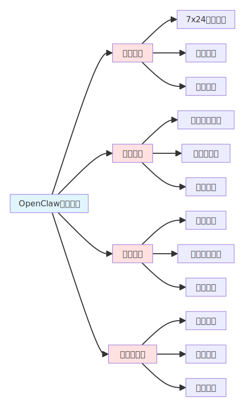

<!-- Available formats: PNG=images/mermaid_shab4c8bd50d048ba4b.png, SVG=images/mermaid_shab4c8bd50d048ba4b.svg -->
<!-- Source code file: images/mermaid_shab4c8bd50d048ba4b.mmd -->

*图4-3 OpenClaw在电商零售领域的应用场景*

在直播带货领域，OpenClaw也展现出了独特的应用价值。一些直播电商平台使用OpenClaw开发智能主播助手，它可以根据直播间的实时数据，如观看人数、互动频率、转化率等，动态调整直播策略。例如，当发现某款商品的点击率很高但转化率较低时，OpenClaw会建议主播调整话术，突出商品的独特卖点；当发现某个时间段的用户活跃度下降时，它会建议主播发起互动活动或发放优惠券。这种"数据驱动"的直播策略，让直播带货从"经验主义"转向"精准运营"，大大提高了直播的效率和效果。

然而，OpenClaw在电商零售领域的应用也面临着一些挑战。首先是用户体验的一致性问题，AI智能体的服务质量很大程度上依赖于训练数据的质量和算法的优化程度，如果数据存在偏差或算法设计不当，可能会提供不合适的推荐，影响用户体验。其次是数据隐私问题，AI智能体需要收集和分析用户的大量行为数据，如何确保这些数据的合法合规使用是一个重要挑战。第三是商业化平衡问题，AI智能体的推荐既要考虑用户需求，也要考虑商业利益，如何在这两者之间找到平衡点，是电商平台需要认真思考的问题。

## 4.4 制造业智能化

制造业是国民经济的支柱产业，OpenClaw在制造业领域的应用正在从简单的自动化工具向能够理解生产流程、参与生产决策的智能生产助手转变。在国际市场上，工业4.0和智能制造的推进为AI智能体技术的应用提供了广阔的空间，AI智能体在制造业的应用已经涵盖了生产调度、质量控制、设备维护、供应链协同等多个方面。根据CSDN博客和行业报告显示，AI智能体可以优化生产计划和调度，实时监控生产质量，预测设备故障，协调供应链各环节。这些应用的核心价值在于将AI的强大计算能力与制造专业知识相结合，提高制造业的生产效率和产品质量。

在国际制造业实践中，OpenClaw催生了一种新兴的"AI生产调度员"模式。一些制造企业使用OpenClaw开发智能生产调度系统，AI智能体可以根据订单需求、设备状态、人员配置、物料供应等多维度信息，自动生成最优的生产计划。与传统的基于规则的调度系统不同，基于OpenClaw的系统具有更强的自适应性和学习能力，它能够根据生产环境的实时变化动态调整调度方案。例如，当某台关键设备突然发生故障时，OpenClaw会自动评估影响范围，重新分配生产任务，调整交货期，并将相关情况通知相关部门和客户。这种"自主决策"的能力，让生产调度从"人工经验"转向"智能优化"，大大提高了制造业的响应速度和灵活性。

在国内制造业领域，OpenClaw的应用面临着中国制造业转型升级的独特机遇。中国制造业正处于从"制造大国"向"制造强国"转变的关键时期，智能制造、绿色制造、服务型制造等新理念为AI智能体技术的应用提供了丰富的场景。一些制造企业尝试使用OpenClaw开发智能质量检测系统，它可以通过机器视觉技术实时监控生产过程中的产品质量，自动识别缺陷产品，分析缺陷原因，并给出改进建议。与传统的基于人工或固定规则的质检系统不同，基于OpenClaw的系统能够学习和积累质量知识，不断提高检测的准确性和效率。例如，在电子产品的组装过程中，OpenClaw可以自动识别焊接缺陷、装配错误、外观损伤等问题，并将这些问题分类归因，指导工艺改进。

在设备维护领域，国内一些制造企业使用OpenClaw开发预测性维护系统。AI智能体可以连接设备的传感器，实时采集设备的运行数据，如温度、振动、电流等，分析设备的健康状态，预测潜在的故障风险。当检测到异常时，OpenClaw会自动评估故障的严重程度和紧急程度，安排维护计划，准备备件和人员，并在合适的时机执行维护操作。这种"预测性"的维护模式，让设备维护从"事后维修"转向"事前预防"，大大降低了设备故障率和维护成本。

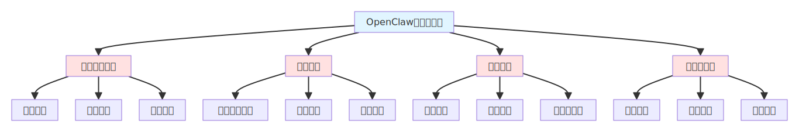

<!-- Available formats: PNG=images/mermaid_sha316a92a4521aae41.png, SVG=images/mermaid_sha316a92a4521aae41.svg -->
<!-- Source code file: images/mermaid_sha316a92a4521aae41.mmd -->

*图4-4 OpenClaw在制造业的应用架构*

在供应链协同领域，OpenClaw也展现出了强大的应用价值。制造企业的供应链涉及多个环节和多个主体，如何实现供应链的高效协同是一个重大挑战。一些制造企业使用OpenClaw开发智能供应链协同系统，AI智能体可以自动协调供应商、生产商、物流商、分销商等各方的活动和信息，实现供应链的实时可视化和智能决策。例如，当市场需求发生变化时，OpenClaw会自动评估供应链各环节的能力，调整采购计划、生产计划、配送计划，确保供应链的整体优化。这种"全局优化"的协同模式，让供应链从"各自为政"转向"协同共赢"，提高了整个供应链的效率和韧性。

然而，OpenClaw在制造业领域的应用也面临着严峻的挑战。首先是系统集成问题，制造企业的信息系统通常非常复杂，涉及ERP、MES、PLM等多个系统，如何将OpenClaw与这些系统深度集成是一个技术难题。其次是可靠性问题，制造业对生产系统的稳定性和可靠性有着极高的要求，AI智能体的任何失误都可能导致严重的经济损失。第三是人才问题，制造业的数字化转型既需要懂AI技术的人才，也需要懂制造工艺的人才，这种复合型人才在市场上非常稀缺。第四是投资回报问题，制造业的智能化改造需要大量的资金投入，如何确保这些投入能够获得预期的回报，是企业管理者需要认真考虑的问题。

## 4.5 其他创新应用领域

除了上述几个主要行业，OpenClaw在教育、法律、政务、媒体等领域的应用也展现出了巨大的潜力。在教育领域，OpenClaw可以开发智能助教，它能够根据学生的学习进度和薄弱环节，自动生成练习题、讲解知识点、提供学习建议。与传统的在线教育平台不同，基于OpenClaw的智能助教能够真正理解学生的问题，而不是简单地匹配预设的答案库。一些教育机构尝试使用OpenClaw开发个性化学习系统，AI智能体可以分析学生的学习行为数据，识别学习模式和困难点，为每个学生定制专属的学习路径。这种"因材施教"的模式，让教育从"标准化"转向"个性化"，提高了学习效果和教育公平性。

在法律领域，OpenClaw可以开发智能法律助手，它能够理解法律条文、分析案件材料、生成法律文书、提供法律建议。一些律师事务所和法律科技公司尝试使用OpenClaw开发智能合同审查系统，AI智能体可以自动审查合同的条款，识别潜在的法律风险，提供修改建议。与传统的法律检索软件不同，基于OpenClaw的系统能够理解合同的具体语境和商业意图，提供更加精准和实用的法律建议。这种"AI+法律"的协作模式，让法律服务从"精英专属"转向"大众普惠"，降低了法律服务的门槛和成本。

在政务服务领域，OpenClaw可以开发智能政务助手，它能够理解市民的咨询需求，自动查询相关信息，指导办事流程，甚至协助提交申请。一些政府机构尝试使用OpenClaw开发智能客服系统，AI智能体可以7x24小时在线回答市民的咨询，提供政策解读，指导办事流程。与传统的政务服务热线相比，基于OpenClaw的智能客服能够同时服务大量用户，提供更加一致和准确的信息，大大提高了政务服务的效率和满意度。

在媒体内容领域，OpenClaw可以开发智能内容创作助手，它能够根据热点事件、用户偏好、平台特点等因素，自动生成新闻稿件、社交媒体内容、视频脚本等。一些媒体公司尝试使用OpenClaw开发自动化内容生产系统，AI智能体可以实时监控新闻线索，自动撰写快讯，生成配图建议，甚至自动发布到各个平台。这种"AI+媒体"的生产模式，让内容创作从"人工驱动"转向"人机协同"，大大提高了内容生产的效率和质量。

## 参考文献

1. 一次性看完！100 个 AI Agent 行业应用场景（附案例）. CSDN博客. 2025-06-09
2. AI Agent（11）：垂直行业应用. CSDN博客. 2025-05-12
3. 500个AI智能体开源案例，可直接套用!. 91运营. 2026-01-17
4. RPA开发：UiPath入门与实战. 德术书屋. 2025
5. 深入一线：大模型落地不再"务虚"，五大行业"实战派"打法全解析. CSDN博客. 2025-07-22
6. 天使投资人看YC Demo Day（二）- 工业、医疗等AI应用新增长. 36氪. 2024-12-20
7. 【多行业项目开发】专项行业项目资源与源码实战案例全集. CSDN文库. 2025-08-22
8. 大数据分析技术在(医疗、教育、金融、农业、制造等任选其一)行业的应用案例与场景. CSDN博客. 2025-02-22
9. 2024年度AIGCOPEN TOP50案例榜单征集中. 网易. 2025-05-12
10. 垂直类SaaS行业市场现状和商业模式分析. 未来智库. 2024

# 第五章 商业模式变革研究

## 5.1 传统智能体商业模式的局限性

在深入分析OpenClaw对智能体商业化的冲击之前，我们需要首先理解传统智能体商业模式存在的固有局限性和结构性问题。传统智能体产品主要采用SaaS（软件即服务）的商业模式，这种模式在过去十年的企业软件市场中取得了巨大成功，但在AI智能体时代却暴露出了越来越多的不适应性。

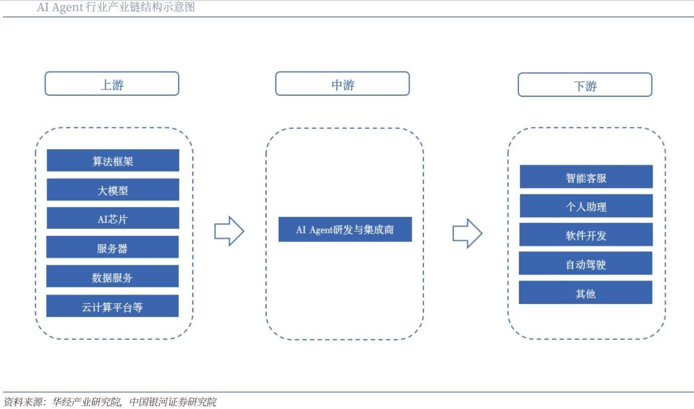

<!-- AI智能体商业模式对比图 -->

从成本结构角度来看，传统SaaS模式需要服务商承担高昂的基础设施成本、研发成本和运营成本，这些成本最终都会转嫁到用户身上，导致智能体服务的价格居高不下，限制了其普及速度和应用范围。根据行业调研数据显示，企业级AI智能体服务的年订阅费用通常在数千美元到数万美元之间，这对于中小企业和个人用户来说是一个沉重的负担。

从数据主权和隐私保护角度来看，传统SaaS模式要求用户将数据存储在服务商的服务器上，这在数据驱动的AI智能体应用中引发了严重的隐私和安全担忧。金融、医疗、法律等对数据安全要求极高的行业，对将敏感数据交给第三方服务商持谨慎态度，这大大限制了AI智能体在这些关键行业的应用深度。欧盟的GDPR（通用数据保护条例）、美国的CCPA（加州消费者隐私法案）等数据保护法规的实施，进一步加剧了这种担忧，合规成本的增加让传统智能体服务的商业模式面临更大压力。

从技术创新和迭代速度角度来看，传统SaaS模式的封闭性使得技术创新主要依赖于服务商内部的研发团队，创新速度和质量受到团队规模和能力的限制。虽然一些大型科技公司拥有强大的研发实力，但面对AI智能体技术的快速发展和多样化需求，即使是最大的公司也难以覆盖所有的应用场景和技术方向。这种封闭的创新模式导致了技术发展的"孤岛效应"，不同服务商之间的技术难以共享和复用，整个行业的技术进步速度被大大延缓。

从用户体验和定制化角度来看，传统SaaS模式通常提供标准化的服务，虽然可以通过配置和插件进行一定程度的定制，但真正的深度定制仍然需要服务商的参与，成本高、周期长。然而，AI智能体的应用场景极其多样化，不同用户、不同行业、不同任务的需求差异巨大，标准化的服务很难满足这些多样化的需求。这种"标准化服务"与"个性化需求"之间的矛盾，成为了传统智能体商业模式难以克服的根本性矛盾。

从商业可持续性角度来看，传统SaaS模式依赖于持续的订阅收入，这要求服务商不断提供新功能和改进服务，以保持用户的付费意愿。然而，AI智能体技术的发展趋势是功能越来越强大、使用越来越简单，这意味着许多功能最终可能会变成基础设施级别的服务，差异化空间越来越小，订阅模式的商业基础正在被侵蚀。当AI智能体的核心能力变成"水电煤"一样的基础设施时，用户是否还愿意为这些基础能力付费，这是一个值得深思的问题。

## 5.2 OpenClaw带来的商业模式创新

OpenClaw的出现为智能体商业模式的创新提供了全新的思路和方向，它通过开源、本地化、社区驱动的方式，打破了传统SaaS模式的桎梏，开创了一种全新的"工具化"商业模式。从价值主张角度来看，OpenClaw将AI智能体从"服务"重新定义为"工具"，这种转变看似简单，实则蕴含着深刻的商业逻辑变化。作为"服务"，用户需要为持续的使用付费，服务商需要持续提供服务；作为"工具"，用户一次性获得使用权，可以根据自己的需求自由使用和定制，服务商则通过其他方式实现价值变现。这种价值主张的转变，让AI智能体从"订阅制"走向"买断制"，大大降低了用户的使用门槛和心理负担。

从部署模式角度来看，OpenClaw采用"本地优先"（Local-First）的架构设计，用户可以在自己的设备上部署和运行，数据完全由用户自己控制。这种模式不仅缓解了数据隐私和安全问题，更重要的是，它改变了AI智能体的交付方式和价值实现方式。用户不再需要通过网络访问远程服务，而是拥有了一个真正属于自己的AI智能体，这种"拥有感"对于用户来说是一种全新的体验。同时，本地部署也催生了新的商业机会，如Mac Mini、VPS等硬件和基础设施服务的需求激增，形成了一个围绕OpenClaw部署的完整产业链。

从技术传播和普及速度角度来看，OpenClaw采用的开源策略极大地加速了技术的传播和普及。在短短两个月内，OpenClaw在GitHub上获得了超过14.5万颗星标，单周吸引200万访问者，这种增长速度在商业软件的历史上极为罕见。开源模式让全球的开发者都能够自由地使用、修改、分发OpenClaw，形成了一个自组织的全球开发者社区。这种社区驱动的创新模式，使得技术创新不再依赖于单一公司的研发团队，而是汇聚了全球开发者的智慧和创造力，创新速度和质量都得到了指数级提升。

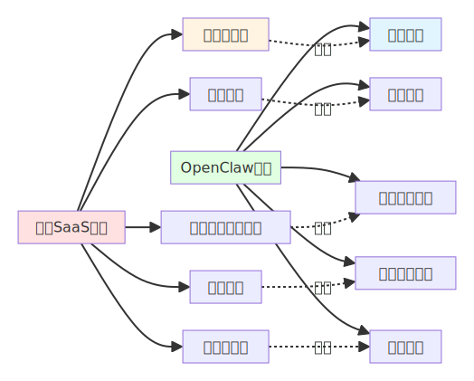

<!-- Available formats: PNG=images/mermaid_sha3ce6f3b1111d452e.png, SVG=images/mermaid_sha3ce6f3b1111d452e.svg -->
<!-- Source code file: images/mermaid_sha3ce6f3b1111d452e.mmd -->

*图5-1 传统SaaS模式与OpenClaw模式对比*

从商业生态构建角度来看，OpenClaw开创了一种"核心开源、增值服务收费"的商业模式。OpenClaw本身是免费开源的，但围绕OpenClaw的部署、定制、培训、支持等服务可以收费。启迪之星等机构推出的"交钥匙"服务就是这种模式的典型代表，它们提供预装配置好的云主机、内置多种能力、无需用户进行任何配置操作，这种服务大大降低了非技术用户的使用门槛，创造了新的商业价值。这种模式的核心在于，它将价值从软件本身转移到服务上，软件变成了吸引客户的"诱饵"，服务才是真正的盈利点。这种模式在开源软件领域已经得到验证，如Red Hat基于Linux的企业服务、MongoDB的云服务等，OpenClaw将这种模式成功应用到了AI智能体领域。

从技能生态构建角度来看，OpenClaw的开放技能系统催生了一个全新的"技能市场"商业模式。开发者可以开发特定的技能并在市场上销售，用户可以根据自己的需求购买和组合技能，形成了一个繁荣的技能经济。这种模式类似于移动应用商店，但更加灵活和开放，技能的开发门槛更低，组合方式更加多样。GitHub上的awesome-openclaw-skills项目已经汇集了数百个免费技能，如果这些技能中有部分变成付费服务，将形成一个可观的市场规模。这种"技能经济"模式让AI智能体的能力扩展变得像搭积木一样简单，用户可以根据自己的需求自由组合，大大提高了AI智能体的适用性和商业价值。

## 5.3 新兴商业模式探索

OpenClaw的成功启发了业界对AI智能体商业模式的深入思考和多元探索，除了上述的"核心开源、增值服务收费"和"技能市场"模式外，还涌现出了许多其他创新的商业模式。从交易佣金模式来看，当AI智能体能够帮助用户完成交易行为时，如购物、订餐、打车等，从交易金额中抽取一定比例的佣金是一种自然的变现方式。这种模式的优势在于它与用户的价值创造直接相关，只有当AI智能体真正为用户创造了价值（完成了交易）时，服务商才能获得收益，这种利益一致性的结构比订阅模式更加合理。例如，基于OpenClaw的电商助手可以帮助用户自动比价、下单、跟踪物流，如果从每笔交易中抽取1-3%的佣金，对于高频用户来说，这比固定的订阅费用更加公平和可接受。

从企业定制服务模式来看，许多企业希望能够拥有定制化的AI智能体解决方案，但这需要深入理解企业的业务流程、数据结构、合规要求等，这为专业的AI服务提供商创造了机会。这些服务提供商可以基于OpenClaw等开源技术，为企业提供从需求分析、系统设计、部署实施到运维支持的全流程服务。这种B2B服务模式的价值在于，它将通用的AI技术转化为企业的实际生产力，创造了明确的商业价值，因此企业愿意为此支付溢价。与传统的软件定制开发不同，基于OpenClaw的定制服务可以复用大量的开源技能和社区经验，大大降低了开发成本和风险，提高了项目的成功率和投资回报率。

从教育和培训模式来看，OpenClaw等开源AI智能体工具的普及催生了巨大的教育培训需求。许多个人和企业希望学习如何使用和开发AI智能体，这为在线教育平台、培训机构、技术博主等创造了商业机会。这种模式包括在线课程、线下培训、认证服务、技术咨询等多种形式，形成了一个完整的教育培训产业链。与传统的IT培训不同，AI智能体培训不仅需要教授技术知识，更需要培养用户的AI思维和创新能力，这对培训内容和方式提出了新的要求。同时，随着AI智能体技术的快速发展，教育培训也需要持续更新，这为培训机构提供了持续的复购机会。

从数据和模型服务模式来看，虽然OpenClaw本身是开源的，但运行OpenClaw需要大语言模型的支持，而训练和运行这些模型需要巨大的算力投入，这为大模型提供商创造了商业机会。Kimi K2.5成为OpenClaw首个宣布免费使用的主力模型，这是一种市场策略，目的是通过免费使用获取用户数据和反馈，从而改进模型性能。从长远来看，大模型提供商可能会采用"基础模型免费、高级功能收费"或"按使用量计费"的模式，类似于云服务的计费方式。这种模式的优势在于它将成本与使用量直接挂钩，用户用多少付多少，比固定的订阅费用更加灵活和公平。

从硬件和基础设施服务模式来看，OpenClaw的本地化部署需求催生了专门的硬件和基础设施服务市场。苹果的Mac Mini因为其性价比高、体积小巧、搭载Apple Silicon芯片等优势，成为了OpenClaw用户的首选硬件平台，推动了Mac Mini销量的飙升。除了硬件销售，云服务商也推出了针对OpenClaw的专属云服务，如阿里云、腾讯云、华为云、火山引擎等，它们提供了预配置的云主机、优化的网络环境、详细的部署教程等，降低了用户的部署门槛。这种"基础设施即服务"的模式让云服务商从AI智能体的普及中获益，即使AI智能体软件本身是免费的，基础设施服务的需求仍然创造了可观的商业价值。

## 5.4 商业模式变革的深层逻辑

OpenClaw引发的智能体商业模式变革，表面上是技术路线和盈利方式的变化，深层则反映了AI时代商业逻辑的根本性转变。从价值创造角度来看，传统软件的价值主要来自于功能本身，软件的功能越强大、越完善，其价值就越高。而在AI时代，软件的价值不再来自于功能本身，而是来自于如何将AI的能力转化为解决实际问题的方案。OpenClaw的成功不在于它实现了什么技术突破，而在于它找到了一种让AI能力真正落地的方式，这种"问题导向"而非"功能导向"的价值创造逻辑，是AI时代商业模式变革的核心。

从竞争格局角度来看，传统软件时代的竞争主要是产品功能的竞争，谁的软件功能更强大、更好用，谁就能赢得市场。而在AI时代，竞争的重点正在从产品功能转向生态构建，谁的生态更繁荣、开发者社区更活跃、技能库更丰富，谁就能获得竞争优势。OpenClaw虽然在技术架构上相对简单，但它构建了一个开放、繁荣的技能生态，这种生态优势比技术优势更难复制和超越。这种"生态竞争"而非"产品竞争"的逻辑，解释了为什么开源的OpenClaw能够与大型科技公司的商业产品竞争，甚至在某些方面超越了它们。

从用户角色角度来看，传统软件时代的用户主要是被动的消费者，他们购买和使用软件，但很少参与软件的开发和改进。而在AI时代，用户的角色正在从消费者转变为参与者和共创者，用户不仅使用AI智能体，还开发技能、分享经验、反馈问题，成为了社区的重要组成部分。OpenClaw的成功很大程度上归功于活跃的开发者社区，这些用户贡献者不仅创造了大量有价值的技能，还帮助改进了核心系统、修复了漏洞、撰写了文档，这种"用户共创"的模式大大加速了技术进步和产品完善。

从商业可持续性角度来看，传统SaaS模式依赖于持续的订阅收入，这要求服务商不断提供新功能和改进服务，以保持用户的付费意愿。然而，当AI智能体的核心能力变成基础设施级别的服务时，用户是否还愿意为这些基础能力付费成为一个挑战。OpenClaw开创的商业模式通过将价值从软件转移到服务、从功能转移到生态，找到了新的可持续性路径。软件本身可以免费开源，但围绕软件的服务、技能、培训、基础设施等可以创造商业价值，这种"分层变现"的模式比单一的订阅模式更加多元和稳健。

从技术民主化角度来看，OpenClaw的开源策略体现了AI技术民主化的理念，即AI技术不应该被少数大公司垄断，而应该让所有人都能访问和使用。这种技术民主化不仅有利于技术创新，也有利于商业创新，因为更多的创业者和企业可以基于开源技术构建自己的商业模式，而不是受限于大公司的技术平台。OpenClaw让"每个人都有机会拥有智能体"从理想变成现实，这种技术普及带来的商业机会是巨大的，它将AI智能体从一个利基市场变成了一个大众市场。

## 5.5 商业模式变革的挑战与风险

尽管OpenClaw开创的商业模式展现出了巨大的潜力和创新性，但这种新模式也面临着诸多挑战和风险，需要业界认真对待和解决。从盈利可持续性角度来看，开源软件的盈利一直是一个难题，虽然OpenClaw通过"核心开源、增值服务收费"的模式找到了一些变现途径，但这些途径能否支撑项目的长期发展还有待观察。OpenClaw创始人斯坦伯格表示："项目规模已远超个人维护能力。我正在研究如何合理支付维护者报酬——最好是全职。"这反映了开源项目在规模化过程中面临的常见问题：如何平衡社区贡献、商业可持续性和技术质量。如果无法建立可持续的商业模式，OpenClaw可能会因为缺乏资源而无法持续发展。

从安全性和可靠性角度来看，OpenClaw目前的安全评分仅为2/100，提示注入漏洞极其严重，这对于商业化应用是一个重大障碍。企业用户在选择AI智能体产品时，安全性和可靠性是首要考虑因素，如果OpenClaw无法解决这些问题，即使它的功能再强大、价格再便宜，企业也难以大规模采用。安全性改进需要投入大量资源，而开源项目的资源通常有限，这形成了一个"鸡生蛋、蛋生鸡"的困境：需要商业化才能获得资源改进安全性，但需要改进安全性才能实现商业化。

从法律责任和合规角度来看，当AI智能体能够自主执行任务时，如果出现错误或造成损失，责任应该如何划分？是开发者、用户还是AI智能体本身应该承担责任？目前各国的法律体系还没有明确的答案。OpenClaw作为开源项目，其责任归属问题更加复杂，如果用户基于OpenClaw开发的应用造成了损失，OpenClaw的开发者是否应该承担责任？这些法律风险可能会限制OpenClaw在某些敏感行业的应用，如金融、医疗等。

从市场竞争角度来看，虽然OpenClaw目前取得了巨大成功，但它也面临着来自大型科技公司的激烈竞争。Google、Microsoft、Meta等公司拥有强大的技术实力、丰富的资源和庞大的用户基础，它们可能会开发类似的商业产品，通过免费或低价策略挤压OpenClaw的生存空间。此外，这些公司还可以通过控制关键的基础设施（如云服务、大模型API等）来限制OpenClaw的发展，这种"平台控制"的风险是开源项目始终面临的挑战。

从技术依赖角度来看，OpenClaw虽然本身是开源的，但它依赖于大语言模型等外部技术，而这些技术主要由大型科技公司控制。如果这些公司改变API政策、提高价格或限制访问，OpenClaw的功能和用户体验将受到直接影响。这种技术依赖性使得OpenClaw的商业模式存在一定的脆弱性，如何降低对单一技术或供应商的依赖，是OpenClaw需要考虑的战略问题。

## 5.6 未来商业模式演进趋势

基于OpenClaw的成功实践和当前面临的挑战，我们可以预测AI智能体商业模式的几个重要演进趋势。从商业模式组合角度来看，未来的AI智能体产品可能会采用更加多元和混合的商业模式，而不是单一的模式。例如，核心功能开源免费，基础服务按使用量计费，高级功能订阅收费，企业定制服务单独报价，技能市场交易抽成等。这种"组合拳"式的商业模式可以满足不同用户群体的需求，最大化商业价值。同时，多元化的收入来源也可以降低单一模式的风险，提高商业可持续性。

从平台化发展角度来看，未来的AI智能体可能会演变成一个开放的平台，而不是单一的产品。在这个平台上，开发者可以开发技能，用户可以组合技能，服务商可以提供增值服务，形成一个完整的商业生态。OpenClaw的Gateway-Agent-Skills-Memory架构已经具备了平台化的雏形，未来的发展可能会进一步强化这种平台属性，提供更完善的开发工具、更丰富的API接口、更灵活的技能市场。这种平台化发展可以吸引更多的参与者和贡献者，形成网络效应，进一步提高竞争壁垒。

从垂直行业深耕角度来看，通用的AI智能体平台可能会与垂直行业知识深度结合，形成行业专用的智能体解决方案。金融、医疗、制造、教育等不同行业有其独特的知识体系、业务流程和合规要求，通用的智能体很难完全满足这些需求。未来的商业模式可能会是"通用平台+行业插件"的组合，通用平台提供基础能力，行业插件提供专业知识和功能，这种组合既能保持规模效应，又能满足行业特定需求。垂直行业深耕不仅可以创造更高的商业价值，也可以建立更深的竞争壁垒。

从人机协同服务角度来看，未来的AI智能体可能不会完全替代人类，而是与人类形成协同工作的关系。在这种模式下，AI智能体负责处理重复性、标准化的任务，人类负责处理需要创造性、判断性、情感性的任务，两者分工明确、优势互补。这种"AI+人工"的协作模式可能会催生新的服务形态，如"AI辅助的专业服务"、"AI增强的创意工作"等，这些新服务形态将创造新的商业价值。同时，人机协同也可以缓解AI完全自主带来的安全和伦理问题，让AI技术的应用更加可控和可信。

从全球化与本地化结合角度来看，未来的AI智能体商业模式需要同时考虑全球化和本地化。全球化意味着技术平台和核心能力应该是通用的、开放的，让全球的开发者和用户都能参与和贡献；本地化意味着应用和服务需要适应不同地区的语言、文化、法规、市场需求。OpenClaw的全球化传播已经证明了开源技术的全球影响力，但要在各个市场实现商业化，还需要深度的本地化工作。这种"全球化技术+本地化服务"的模式，可能是未来AI智能体商业化的有效路径。

## 参考文献

1. OpenClaw引爆AI Agent热潮，阿里腾讯等火速接入，人机雇佣时代来了？. 搜狐. 2026-02-05
2. 从Clawdbot到OpenClaw：130位创业者齐喊："这一次，狼可能真的来了". Founder Park. 2026-02-09
3. OpenClaw揭示AI智能体底层需求：人类的"拔线权". 36氪. 2026-02-05
4. OpenClaw下一站会是哪里. 科技媒体. 2026-02-10
5. 垂直类SaaS行业市场现状和商业模式分析. 未来智库. 2024
6. 2024年度AIGCOPEN TOP50案例榜单征集中. 网易. 2025-05-12
7. GitHub - VoltAgent/awesome-openclaw-skills. 2026-01-31
8. GitHub - refly-ai/refly. 2026-02-08

# 第六章 未来趋势与建议

## 6.1 技术发展趋势

基于OpenClaw的技术架构和当前AI智能体领域的发展动态，我们可以预测未来几年AI智能体技术将呈现出几个重要的发展趋势。

<!-- AI智能体未来发展趋势与技术创新方向 -->

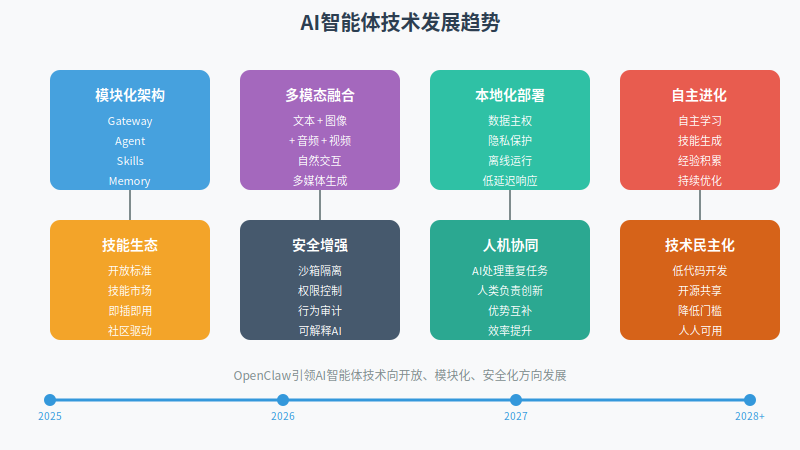

从架构演进角度来看，AI智能体的技术架构将向更加模块化、标准化、可组合的方向发展。OpenClaw的Gateway-Agent-Skills-Memory架构已经展现了这种趋势的雏形，未来的智能体架构可能会进一步标准化，形成行业通用的技术规范和接口标准。这种标准化将促进不同智能体系统之间的互操作性，让技能可以在不同平台之间自由迁移和组合，大大提高技术复用率和开发效率。例如，一个在OpenClaw平台上开发的金融分析技能，经过简单的适配后，就可以在其他兼容的智能体平台上运行，这种"一次开发，多处使用"的模式将彻底改变智能体技术的开发和应用方式。

从技术融合角度来看，AI智能体将与多种前沿技术深度集成，形成更强大的综合能力。首先，与多模态大模型的融合将让智能体具备处理文本、图像、音频、视频等多种信息的能力，不再局限于文本交互。用户可以通过语音、手势、图像等多种方式与智能体交互，智能体也可以生成多媒体内容，如制作视频、设计图片、创作音乐等。其次，与机器人技术的融合将让智能体从虚拟世界走向物理世界，成为连接数字世界和物理世界的桥梁。例如，基于OpenClaw的智能体可以控制家用机器人完成家务，控制工业机器人执行生产任务，甚至控制自动驾驶汽车完成出行服务。这种虚实融合的能力将极大地扩展智能体的应用场景和价值空间。

从技术民主化角度来看，AI智能体技术的开发和使用门槛将持续降低，让更多人能够参与到智能体的创新和应用中。OpenClaw的开源策略已经证明了技术民主化的巨大价值，未来的发展将进一步强化这一趋势。低代码、无代码开发平台的出现，让非技术人员也能够通过可视化界面、拖拽式操作、自然语言描述等方式开发智能体技能，大大降低了开发门槛。同时，预训练模型、模板库、自动化工具等的完善，也让智能体的部署和运维变得更加简单，普通用户无需深厚的技术背景就能够使用和管理智能体。这种技术民主化将释放全社会的创新潜力，让智能体技术真正惠及每一个人。

从技术安全性角度来看，AI智能体的安全性和可控性将成为技术发展的核心议题。OpenClaw目前的安全评分仅为2/100，提示注入漏洞极其严重，这些问题必须得到解决才能实现大规模商业化应用。未来的智能体技术将在架构层面内置安全机制，如沙箱隔离、权限控制、行为审计、异常检测等，确保智能体的行为始终在可控范围内。同时，可解释AI技术的发展将让智能体的决策过程更加透明和可理解，用户可以清楚地知道智能体为什么做出某个决策，如何做出某个决策，这种透明度对于建立用户信任和满足监管要求至关重要。

从技术进化角度来看，AI智能体将具备更强的自主学习和进化能力，不再完全依赖于人工设计和训练。OpenClaw的技能系统已经展现了智能体获取新能力的一种方式，未来的发展可能会让智能体具备自主学习和技能生成能力。例如，智能体可以通过观察人类的行为学习新技能，可以通过与其他智能体交互交换知识和经验，可以通过试错和反馈不断优化自己的行为策略。这种自主进化能力将让智能体从"被动执行"转向"主动创新"，真正成为人类的智能伙伴而非简单的工具。

## 6.2 商业生态演进趋势

AI智能体的商业生态正在经历深刻的变革和重构，OpenClaw的成功为我们揭示了未来商业生态的几个重要演进方向。从生态结构角度来看，AI智能体的商业生态将从"中心化"向"去中心化"转变。传统的AI产品生态通常由一家公司主导，该公司控制核心技术和数据，其他参与者只能作为依附者存在。而OpenClaw开创的生态模式则是去中心化的，没有单一的控制中心，开发者、用户、服务商等各方参与者共同构建和维护生态，形成了一个自组织的商业网络。这种去中心化的生态结构更加开放、更加灵活、更加创新，能够更好地适应快速变化的市场需求和技术发展。

从价值创造角度来看，AI智能体的价值创造将从"产品导向"转向"生态导向"。传统的软件产品价值主要来自于产品本身的功能和质量，而AI智能体的价值则更多地来自于整个生态的繁荣程度。OpenClaw本身的技术架构并不复杂，但它构建了一个繁荣的技能生态，这个生态才是其真正价值所在。未来的AI智能体竞争，将不再是单一产品的竞争，而是生态系统的竞争。谁的生态更繁荣、参与者更多、创新更活跃，谁就能获得竞争优势。这种生态导向的价值创造逻辑，要求企业从"产品思维"转向"平台思维"，从"控制者"转向"赋能者"，通过开放和共享来构建繁荣的生态。

从商业模式角度来看，AI智能体的商业模式将从"单一收费"转向"多元变现"。传统的SaaS模式主要依赖订阅费用，收入来源单一且容易遇到增长瓶颈。而OpenClaw开创的商业模式则是多元的，包括基础设施服务、技能市场交易、企业定制服务、教育培训服务等多种变现途径。这种多元的商业模式不仅提高了收入潜力，也降低了单一模式的风险，让商业生态更加稳健和可持续。未来的AI智能体产品可能会采用更加灵活的组合商业模式，根据不同的用户群体和应用场景设计不同的价值获取方式，实现商业价值的最大化。

从参与者角色角度来看，AI智能体生态中的角色将更加多元化和专业化。传统的软件生态中，角色相对简单，主要是开发商和用户。而AI智能体生态中的角色则更加丰富，包括核心开发者、技能开发者、服务商、集成商、培训师、内容创作者等。每个角色都有其独特的价值创造方式和变现途径，形成了复杂的商业网络。例如，核心开发者通过维护和改进核心系统获得资助或捐赠，技能开发者通过销售技能获得收入，服务商通过提供部署、定制、支持等服务获得报酬，培训师通过提供教育和培训获得学费。这种多元化的角色结构让更多人都能够参与到生态中，找到适合自己的位置和价值创造方式。

从生态治理角度来看，AI智能体生态的治理将从"公司治理"转向"社区治理"。传统的软件产品由公司治理，决策权集中在公司管理层。而开源的AI智能体项目则由社区治理，决策权分散在所有贡献者手中。OpenClaw已经建立了基本的社区治理机制，如代码贡献审核、技能审核、问题反馈等，但还需要进一步完善和规范化。未来的AI智能体生态需要建立更加完善的社区治理体系，包括治理结构、决策机制、激励机制、争议解决机制等，确保生态的健康发展和持续创新。这种社区治理模式虽然更加复杂，但能够更好地调动社区成员的积极性和创造力，形成更加开放和包容的生态。

## 6.3 行业应用展望

AI智能体技术的成熟和普及将深刻改变各个行业的运营模式和价值创造方式，OpenClaw的成功为我们提供了行业应用的重要启示。从金融行业来看，AI智能体将重塑金融服务的交付方式和竞争格局。未来的金融服务将不再是标准化、批量化的产品，而是高度个性化、场景化的服务。AI智能体可以根据用户的财务状况、风险偏好、生活目标等，提供量身定制的金融建议和产品组合。例如，当用户准备买房时，智能体可以自动分析用户的收入、支出、资产、负债等财务数据，评估用户的还款能力，推荐合适的贷款产品，并协助完成贷款申请。这种"个人金融管家"式的服务将彻底改变传统金融的服务模式，让金融服务真正以用户为中心。

从医疗健康行业来看，AI智能体将推动医疗服务从"治疗为中心"向"健康为中心"转变。传统的医疗服务主要关注疾病的治疗，而AI智能体则可以实现全生命周期的健康管理。智能体可以连接用户的可穿戴设备、健康APP、电子病历等多源数据，构建用户的健康画像，提供个性化的健康建议。当健康指标出现异常时，智能体会及时预警并建议就医；当需要服药时，智能体会提醒并记录用药情况；当需要复诊时，智能体会自动预约并整理病历。这种"主动式"的健康管理服务将大大提高医疗服务的效率和质量，降低医疗成本，改善人民健康水平。

从教育行业来看，AI智能体将实现真正的因材施教和个性化学习。传统的教育模式是标准化的，所有学生接受相同的教学内容和进度，难以满足不同学生的个性化需求。而AI智能体可以根据每个学生的学习能力、知识水平、兴趣爱好等，定制个性化的学习路径和内容。例如，对于数学基础较弱的学生，智能体会提供更多的练习和详细的讲解；对于学习能力强的学生，智能体会提供更有挑战性的内容和拓展阅读；对于喜欢视觉学习的学生，智能体会使用更多的图表和视频；对于喜欢阅读的学生，智能体会提供更多的文字材料。这种"千人千面"的教育模式将极大提高学习效果和教育公平性。

从制造业来看，AI智能体将推动制造业向智能化、柔性化、服务化转型。传统的制造业是大规模、标准化的生产模式，而AI智能体则可以实现小批量、定制化、柔性化的生产。智能体可以实时监控生产过程，自动调整生产参数，优化资源配置，提高生产效率和产品质量。当市场需求发生变化时，智能体可以快速调整生产计划，重新配置生产线，满足个性化需求。同时，智能体还可以提供预测性维护、远程监控、故障诊断等服务，将制造业从"卖产品"转向"卖服务"。这种"智能制造"模式将极大提高制造业的竞争力和盈利能力。

从电商零售行业来看，AI智能体将重塑购物体验和商业逻辑。传统的电商是"人找货"的模式，用户需要主动搜索和浏览商品，而AI智能体可以实现"货找人"的模式。智能体可以根据用户的需求、偏好、场景等，主动推荐合适的商品，并提供专业的购买建议。例如，当用户说"我要参加一个商务晚宴，帮我推荐一套服装"时，智能体会分析用户的身材、风格、预算，搜索相关商品，生成多个搭配方案，并说明每个方案的优缺点。这种"顾问式"的购物体验将极大提高用户满意度和购买转化率，推动电商零售行业的升级。

## 6.4 政策与监管建议

面对OpenClaw等AI智能体技术的快速发展和广泛应用，政府和监管机构需要及时调整政策和监管框架，既要鼓励技术创新和产业发展，又要防范潜在风险和负面影响。从数据隐私和安全监管角度来看，需要建立针对AI智能体的数据保护规范。虽然OpenClaw采用本地化部署，在一定程度上缓解了数据隐私问题，但AI智能体在执行任务时仍然需要访问和处理大量敏感信息，如个人邮件、文档、聊天记录等。监管机构应该明确AI智能体的数据收集、处理、存储、传输等各环节的合规要求，确保用户的隐私权得到充分保护。同时，应该建立AI智能体的安全评估和认证机制，对智能体的安全漏洞、攻击面、防护措施等进行系统评估，只有通过安全认证的智能体才能在市场上销售和使用。

从责任归属和消费者保护角度来看，需要明确AI智能体应用中的责任划分机制。当AI智能体执行任务出现错误或造成损失时，责任应该如何划分？是开发者、用户还是AI智能体本身应该承担责任？目前各国的法律体系还没有明确的答案。监管机构应该借鉴自动驾驶等新兴领域的立法经验，建立AI智能体的责任认定框架。例如，可以引入"智能体责任保险"制度，要求智能体开发者和使用者购买保险，当发生损失时由保险公司承担赔偿责任，然后再根据责任认定向责任方追偿。这种制度安排可以有效保护消费者权益，同时又不至于过度抑制技术创新。

从技术标准和互操作性角度来看，需要推动AI智能体技术的标准化工作。OpenClaw的Gateway-Agent-Skills-Memory架构已经展现了智能体技术标准化的雏形，监管机构和行业组织应该在此基础上制定统一的技术规范和接口标准。标准化工作应该包括：智能体架构标准、技能接口标准、数据格式标准、安全标准、互操作性标准等。这些标准的建立将促进不同智能体系统之间的互联互通，避免技术碎片化和市场分割，提高整个行业的技术水平和创新能力。同时，标准化也有助于降低用户的使用成本和迁移成本，促进市场的良性竞争。

从人才发展和教育培训角度来看，需要加强AI智能体领域的人才培养。AI智能体技术的快速发展对人才提出了新的要求，既需要懂AI技术的专业人才，也需要懂行业知识的复合型人才。政府应该加大对AI智能体教育的投入，支持高校开设相关专业和课程，培养高素质的研发和应用人才。同时，应该支持职业培训机构和社会教育机构开展AI智能体技能培训，帮助现有劳动者适应AI时代的工作要求。此外，还应该建立AI智能体的职业资格认证体系，提高从业者的专业水平和职业素养，保障服务质量。

从国际合作和治理角度来看，需要加强国际间的协调和合作。AI智能体技术的发展是全球性的，单一国家的监管难以应对跨境的技术流动和应用场景。各国应该加强在AI智能体治理方面的国际合作，分享监管经验，协调监管政策，共同应对AI智能体带来的全球性挑战。例如，可以建立国际AI智能体安全标准，统一安全评估方法；可以建立国际AI智能体伦理准则，规范AI智能体的研发和使用；可以建立国际AI智能体争端解决机制，处理跨境的AI智能体纠纷。这种国际合作将有助于形成统一、开放、公平的全球AI智能体市场，促进技术的健康发展。

## 6.5 企业发展建议

对于企业而言，OpenClaw的成功提供了宝贵的启示和借鉴，企业应该如何应对AI智能体带来的机遇和挑战，制定自己的发展战略和实施路径。从战略定位角度来看，企业需要明确自己在AI智能体生态中的定位和角色。AI智能体生态中的角色是多元化的，包括技术提供商、平台运营商、技能开发者、服务集成商、行业解决方案商等，不同角色有不同的价值创造方式和商业模式。企业应该根据自己的资源、能力、优势，选择适合自己的定位。例如，技术实力强的公司可以定位为技术提供商，专注于核心技术的研发和授权；行业经验丰富的公司可以定位为行业解决方案商，专注于特定行业的智能体应用；服务能力强的公司可以定位为服务集成商，专注于智能体的部署、定制、支持等服务。

从技术路线角度来看，企业需要在"自研"和"开源"之间找到平衡。完全自研AI智能体技术需要巨大的投入和长期的积累，大多数企业难以承受；而完全依赖开源技术则可能缺乏差异化竞争优势。企业应该采用"开源核心+差异化创新"的技术路线，即基于OpenClaw等开源技术构建基础能力，然后在此基础上开发自己的差异化功能和行业适配。这种策略可以充分利用开源社区的技术成果，降低研发成本和风险，同时又能保持一定的技术差异性和竞争优势。例如，企业可以基于OpenClaw开发针对特定行业的技能包，或者开发与企业现有系统深度集成的中间件，这些差异化创新将成为企业的核心竞争力。

从商业模式角度来看，企业需要探索多元化的价值变现方式。传统的软件销售或订阅模式可能不再适用于AI智能体时代，企业需要创新商业模式。可以借鉴OpenClaw的"核心开源、增值服务收费"模式，将基础能力免费提供，通过增值服务实现价值变现；可以探索"按效果付费"模式，如交易佣金、成功费用等，让收费与价值创造直接挂钩；可以发展"平台化"模式，构建技能市场、开发者社区等，从生态交易中抽成；可以提供"企业定制"服务，为大客户提供定制化的智能体解决方案。多元化的商业模式不仅可以提高收入潜力，也可以降低单一模式的风险。

从组织能力角度来看，企业需要构建适应AI智能体时代的组织能力。AI智能体的开发和运营需要跨学科的团队协作，包括AI算法工程师、软件开发工程师、行业专家、产品经理、运营人员等。企业需要打破传统的部门壁垒，建立跨职能的协作机制。同时，企业需要培养员工的AI思维和数据素养，让所有员工都能理解和运用AI智能体技术。此外，企业还需要建立快速迭代、持续学习、勇于试错的组织文化，适应AI智能体技术的快速发展。只有构建了这些组织能力，企业才能真正抓住AI智能体带来的机遇。

从风险控制角度来看，企业需要建立完善的AI智能体风险管理体系。AI智能体虽然带来了巨大的机遇，但也伴随着技术风险、安全风险、合规风险、声誉风险等。企业应该建立AI智能体的风险评估机制，在项目启动前进行全面的风险评估；建立AI智能体的安全测试机制，在上线前进行严格的安全测试；建立AI智能体的监控和审计机制，在运行过程中实时监控智能体的行为，及时发现和处理异常；建立AI智能体的应急预案，当出现问题时能够快速响应和处置。这些风险控制措施将帮助企业安全、稳健地推进AI智能体的应用。

## 6.6 个人发展建议

对于个人而言，OpenClaw等AI智能体技术的普及既是机遇也是挑战，个人应该如何适应AI时代的要求，提升自己的竞争力和价值。从技能发展角度来看，个人需要积极学习和掌握AI智能体相关技能。AI智能体技术的发展创造了许多新的职业机会，如技能开发者、智能体训练师、AI产品经理、智能体运营专家等。个人应该根据自己的兴趣和背景，选择合适的学习方向。对于技术背景的人，可以学习如何开发智能体技能、如何集成智能体API、如何优化智能体性能等技术技能；对于非技术背景的人，可以学习如何使用智能体提高工作效率、如何设计智能体应用场景、如何管理智能体项目等应用技能。无论选择哪个方向，持续学习和技能更新都是必不可少的。

从工作方式角度来看，个人需要学会与AI智能体协作，将其作为自己的"数字助理"和"能力放大器"。OpenClaw的成功展示了AI智能体作为个人助理的巨大潜力，它可以自动化处理大量重复性、标准化的任务，让个人能够专注于更有创造性和价值的工作。个人应该主动探索AI智能体在自己工作中的应用场景，如邮件管理、文档整理、信息检索、数据分析等，通过智能体提高工作效率和质量。同时，个人也需要学会如何有效地与智能体交互，如何清晰地表达需求，如何评估智能体的输出，如何纠正智能体的错误。这种人机协作能力将成为AI时代的基本工作技能。

从职业规划角度来看，个人需要重新思考自己的职业定位和发展路径。AI智能体的普及可能会替代某些工作岗位，特别是那些重复性高、规则明确的工作。但同时，它也会创造许多新的职业机会，特别是那些需要创造力、判断力、情感力的工作。个人应该评估自己的工作内容和技能组合，识别哪些部分可能被AI替代，哪些部分是AI难以替代的。对于可能被替代的部分，个人应该考虑如何转型或升级；对于难以替代的部分，个人应该考虑如何进一步强化和提升。此外，个人还可以考虑转向AI相关的新兴职业，如智能体开发、AI训练、AI伦理等，抓住AI时代的新机遇。

从思维模式角度来看，个人需要培养AI时代的思维方式和认知框架。传统的思维方式是线性的、确定的、封闭的，而AI时代的思维方式则是网络的、概率的、开放的。个人应该学会接受和处理不确定性，学会与模糊和复杂共处。同时，个人应该培养数据驱动的决策思维，学会利用数据和算法来支持决策，而不是完全依赖直觉和经验。此外，个人还应该培养系统思维和生态思维，理解技术、商业、社会之间的复杂关系，看到更大的图景和更长远的影响。这些思维方式的转变将帮助个人更好地适应AI时代的挑战和机遇。

从伦理责任角度来看，个人需要认识到AI智能体使用的伦理责任和社会影响。虽然AI智能体是由技术驱动的，但它的使用是由人决定的，每个人都有责任确保AI智能体的合理和道德使用。个人应该了解AI智能体的潜在风险和局限性，如偏见、歧视、隐私侵犯等，在使用过程中保持警惕和批判性思维。同时，个人应该遵守相关的法律法规和伦理准则，不使用AI智能体从事违法违规或不道德的活动。此外，个人还应该积极参与AI伦理的公共讨论，为AI技术的健康发展贡献自己的智慧和力量。

## 参考文献

1. OpenClaw引爆AI Agent热潮，阿里腾讯等火速接入，人机雇佣时代来了？. 搜狐. 2026-02-05
2. 从Clawdbot到OpenClaw：130位创业者齐喊："这一次，狼可能真的来了". Founder Park. 2026-02-09
3. OpenClaw揭示AI智能体底层需求：人类的"拔线权". 36氪. 2026-02-05
4. AI开始"租赁"人类？OpenClaw横空出世，专家警告：你的世界正在被"接管". 搜狐. 2026-02-07
5. 2026第一场AI大战，把腾讯阿里打个措手不及. 科技媒体. 2026-02-01
6. 阿里字节领跑，百度腾讯掉队？智能体之争谁能笑到最后. 搜狐. 2026-02-05
7. GitHub - VoltAgent/awesome-openclaw-skills. 2026-01-31
8. GitHub - clawdbot-ai/awesome-openclaw-skills-zh. 2026-02-07
9. AI's Impact on the Job Market: Software Roles at Risk. IEEE Spectrum. 2025-09-24
10. 2024年度AIGCOPEN TOP50案例榜单征集中. 网易. 2025-05-12

# 第七章 结论

## 7.1 研究总结

本报告通过深入分析OpenClaw对智能体商业化的冲击，系统地阐述了OpenClaw在技术架构、商业模式、行业应用、国际国内市场等多个维度带来的深刻变革和重要启示。

<!-- OpenClaw对智能体商业化的多维度影响总结 -->

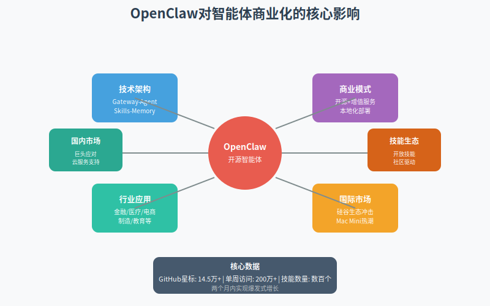

从技术层面来看，OpenClaw的Gateway-Agent-Skills-Memory架构开创了一种全新的智能体技术范式，这种架构的核心优势在于其模块化、标准化和可扩展性，使得AI智能体从封闭的黑盒系统转变为开放的、可组合的工具平台。根据GitHub数据显示，OpenClaw在短短两个月内获得了超过14.5万颗星标，单周吸引200万访问者，这种爆炸式增长充分证明了市场对这种开放架构的强烈需求。OpenClaw的技术创新不仅体现在架构设计上，更重要的是它建立了一个繁荣的技能生态系统，全球开发者可以自由开发、分享、组合技能，这种社区驱动的创新模式极大地加速了技术进步和应用普及。

从商业模式层面来看，OpenClaw彻底颠覆了传统AI智能体的SaaS订阅模式，开创了"核心开源、增值服务收费"的新型商业模式。这种模式的核心价值在于将AI智能体从"服务"重新定义为"工具"，从"云端"回归"本地"，从"订阅"转向"买断"。虽然OpenClaw本身是免费开源的，但它催生了围绕部署、定制、培训、支持等服务的完整产业链，创造了新的商业价值。启迪之星等机构推出的"交钥匙"服务就是这种模式的典型代表，它们提供预装配置好的云主机、内置多种能力、无需用户进行任何配置操作，这种服务大大降低了非技术用户的使用门槛。同时，OpenClaw的开放技能系统也催生了"技能市场"的商业模式，开发者可以开发特定的技能并在市场上销售，用户可以根据自己的需求购买和组合技能，形成了一个繁荣的技能经济。

从行业应用层面来看，OpenClaw在金融、医疗、电商、制造、教育、法律等多个行业展现出了巨大的应用潜力。在金融行业，OpenClaw被用于智能投顾、风险控制、欺诈检测等场景；在医疗健康领域，它被用于疾病诊断辅助、药物研发、健康管理等；在电商零售行业，它被用于智能客服、精准营销、推荐系统等；在制造业，它被用于生产调度优化、质量控制、设备维护等。这些应用案例表明，OpenClaw的开放架构和灵活的技能系统使其能够适应不同行业的特殊需求，为行业数字化转型提供了新的技术路径。特别值得注意的是，OpenClaw在这些行业的应用往往不是替代人类，而是与人类形成协同工作的关系，AI智能体负责处理重复性、标准化的任务，人类负责处理需要创造性、判断性、情感性的任务，这种"AI+人工"的协作模式既提高了效率，又保持了人的主导地位。

从国际国内市场对比来看，OpenClaw在全球范围内都产生了深远影响，但不同市场的反应和应对策略各有特点。在国际市场上，OpenClaw的爆火对硅谷科技生态产生了多维度冲击，推动了Mac Mini、VPS等硬件产品的销量飙升，迫使Google、Microsoft、Meta等大型科技公司重新思考自己的产品策略和商业模式。在国内市场上，OpenClaw引发了阿里、腾讯、字节跳动等科技巨头的积极应对，它们通过云服务支持、产品竞争、技术合作、战略布局等多种方式应对OpenClaw带来的挑战和机遇。2026年春节期间，各大巨头围绕AI超级入口展开激烈争夺战，腾讯元宝宣布发放10亿元现金红包，阿里千问宣布投入30亿元启动春节攻势，百度投入5亿元现金红包，字节跳动旗下豆包成为2026央视春晚独家AI云合作伙伴。这场"AI红包大战"表面上是营销活动，实质上是各巨头对其核心资源与生态优势注入AI入口的关键载体，目标是争夺AI时代的超级入口。

## 7.2 核心发现

通过本研究，我们识别出了OpenClaw对智能体商业化冲击的几个核心发现。第一，开源模式在AI智能体领域展现出了强大的生命力和竞争力。OpenClaw的成功证明，开源项目不仅能够与商业公司竞争，甚至在某些方面能够超越它们。开源模式的优势在于：技术传播速度快、社区创新能力强、用户信任度高、适应性强。OpenClaw在短短两个月内就获得了全球数百万用户的关注和使用，这种增长速度在商业软件的历史上极为罕见。同时，开源模式也激发了全球开发者的创新热情，GitHub上的awesome-openclaw-skills项目已经汇集了数百个技能，这些技能涵盖了邮件管理、日程安排、文件整理、金融分析、医疗诊断等多个领域，形成了一个繁荣的技能生态系统。

第二，本地化部署正在成为AI智能体的重要趋势。虽然云服务在过去十年取得了巨大成功，但OpenClaw的本地优先（Local-First）架构揭示了用户对数据主权和隐私控制的强烈需求。OpenClaw采用本地化部署，用户可以在自己的设备上部署和运行，数据完全由用户自己控制。这种模式不仅缓解了数据隐私和安全问题，更重要的是，它改变了AI智能体的交付方式和价值实现方式。用户不再需要通过网络访问远程服务，而是拥有了一个真正属于自己的AI智能体，这种"拥有感"对于用户来说是一种全新的体验。同时，本地部署也催生了新的商业机会，如Mac Mini、VPS等硬件和基础设施服务的需求激增，形成了一个围绕OpenClaw部署的完整产业链。

第三，技能经济正在成为AI智能体价值创造的新模式。OpenClaw的开放技能系统让AI智能体的能力扩展变得像搭积木一样简单，开发者可以开发特定的技能，用户可以根据自己的需求自由组合技能，形成了一个繁荣的技能市场。这种模式的核心价值在于它将AI智能体的能力从"固定"变为"可扩展"，从"封闭"变为"开放"，从"单一"变为"多元"。用户不再需要等待软件厂商更新功能，而是可以从技能市场中直接获取需要的能力，这种"即插即用"的模式大大提高了AI智能体的适用性和商业价值。未来，随着技能市场的进一步发展和成熟，我们可能会看到专门的技能开发者、技能经纪人、技能评估机构等新的职业和商业模式出现。

第四，人机协同正在成为AI智能体应用的主流模式。虽然媒体经常炒作AI将替代人类，但OpenClaw的实际应用案例表明，更现实和更有价值的模式是AI与人类的协同工作。AI智能体负责处理重复性、标准化的任务，如邮件分类、数据整理、信息检索等，人类负责处理需要创造性、判断性、情感性的任务，如战略决策、创意设计、人际沟通等。这种分工协作的模式既提高了工作效率，又保持了人的主导地位，避免了AI完全自主可能带来的风险和伦理问题。OpenClaw创始人彼得·斯坦伯格曾表示："有了OpenClaw，vibe变得比code更重要，近乎颠覆了他二十多年积累的能力体系。"这句话深刻地揭示了AI智能体对人类工作方式的改变：未来的工作将不再是纯粹的编程或操作，而是与AI智能体进行协作和沟通。

## 7.3 理论贡献

本研究在理论层面做出了几个重要贡献。第一，本研究提出了"智能体商业模式分类框架"，将AI智能体的商业模式分为SaaS订阅模式、开源工具模式、平台生态模式、技能市场模式等类型，并分析了各种模式的优劣势和适用场景。这个框架为理解AI智能体的商业逻辑提供了理论基础，也为企业选择合适的商业模式提供了决策参考。传统的软件商业模式理论主要基于产品功能和服务质量，而AI智能体的商业模式则更加复杂，涉及技术架构、数据主权、生态构建、人机关系等多个维度，需要新的理论框架来解释和指导。

第二，本研究提出了"智能体技术传播模型"，分析了AI智能体技术从开发者到用户的传播路径和影响因素。OpenClaw的案例表明，AI智能体技术的传播不是简单的线性过程，而是一个涉及技术社区、社交媒体、传统媒体、企业用户等多个主体的复杂网络。在这个网络中，不同的主体扮演不同的角色，发挥着不同的作用：技术社区是技术创新的源头，社交媒体是信息传播的加速器，传统媒体是公众认知的塑造者，企业用户是商业价值的实现者。理解这个传播网络，对于AI智能体产品的推广和普及具有重要的指导意义。

第三，本研究提出了"智能体行业应用价值评估模型"，从效率提升、成本降低、质量改善、体验优化等维度评估AI智能体在不同行业的应用价值。这个模型不仅关注AI智能体的技术能力，更关注它为行业创造的实际价值，为行业用户选择和评估AI智能体产品提供了评估标准。传统的AI评估主要关注技术指标，如准确率、召回率、F1值等，而行业应用则更关注业务价值，如生产效率提升多少、运营成本降低多少、客户满意度提高多少等，这些业务指标才是决定AI智能体能否在行业大规模应用的关键。

第四，本研究提出了"智能体生态治理框架"，分析了开源AI智能体项目的治理机制和挑战。OpenClaw作为一个快速发展的开源项目，面临着项目规模超过个人维护能力、如何支付维护者报酬、如何保证代码质量、如何处理商业贡献等治理挑战。本研究提出的治理框架包括治理结构、决策机制、激励机制、争议解决机制等要素，为开源AI智能体项目的健康发展提供了理论指导。随着AI智能体技术的普及，类似的治理问题将越来越多，建立完善的治理框架变得日益重要。

## 7.4 实践启示

本研究的发现对各类实践主体具有重要的启示意义。对于政策制定者而言，需要建立适应AI智能体特点的监管框架。AI智能体的快速发展对现有的法律法规和政策框架提出了新的挑战，如数据隐私、安全责任、算法透明度、就业影响等问题。政策制定者需要在鼓励技术创新和防范潜在风险之间找到平衡，既要为AI智能体的发展提供宽松的环境，又要建立必要的监管和保障机制。具体而言，可以建立AI智能体的安全评估和认证机制，明确AI智能体的责任认定框架，推动AI智能体技术的标准化工作，加强AI智能体领域的人才培养，促进国际间的协调和合作。这些政策措施将有助于AI智能体技术的健康发展和可持续应用。

对于企业管理者而言，需要制定清晰的AI智能体战略。AI智能体不仅是技术工具，更是战略资源，能够深刻改变企业的运营模式和竞争格局。企业管理者需要评估AI智能体对自己行业的影响，识别应用场景和机会，制定实施路径和时间表。具体而言，企业需要明确自己在AI智能体生态中的定位和角色，选择合适的技术路线（自研、开源、或混合），探索多元化的商业模式，构建适应AI智能体时代的组织能力，建立完善的风险管理体系。那些能够有效利用AI智能体技术的企业，将获得显著的竞争优势；而那些忽视或抵制AI智能体技术的企业，可能会在激烈的市场竞争中逐渐落后。

对于技术开发者而言，需要积极参与AI智能体的开源社区。OpenClaw的成功证明，开源社区是技术创新的重要源泉，开发者可以通过参与开源项目获得技术成长、职业机会和社会认可。具体而言，开发者可以学习OpenClaw的架构设计和实现细节，贡献自己的技能和改进，参与社区讨论和决策，建立个人技术品牌和影响力。同时，开发者也可以基于OpenClaw开发商业化的技能和服务，在繁荣的生态中找到自己的位置和价值创造方式。随着AI智能体技术的普及，对相关技能的需求将持续增长，掌握这些技能的开发者将获得更多的职业机会。

对于教育机构而言，需要调整课程设置和人才培养方案。AI智能体技术的快速发展对人才培养提出了新的要求，既需要懂AI技术的专业人才，也需要懂行业知识的复合型人才。教育机构需要开设AI智能体相关的课程和专业，培养学生的AI思维和数据素养，提供实践机会和项目经验。同时，教育机构也需要与企业合作，了解行业需求，调整培养方案，确保培养的人才能够满足市场需求。此外，教育机构还可以开展AI智能体的社会培训，帮助现有劳动者适应AI时代的工作要求，促进社会的平稳转型。

对于个人用户而言，需要学会与AI智能体协作。OpenClaw等AI智能体技术的普及将改变个人的工作方式和生活方式，个人需要积极学习和适应。具体而言，个人需要学习如何使用AI智能体提高工作效率，如何清晰地表达需求，如何评估AI智能体的输出，如何纠正AI智能体的错误。同时，个人也需要评估AI智能体对自己职业的影响，识别哪些技能可能被替代，哪些技能需要强化，考虑职业转型或升级。此外，个人还应该关注AI智能体的伦理和社会影响，保持批判性思维，负责任地使用AI智能体技术。

## 7.5 研究局限与未来方向

本研究虽然对OpenClaw对智能体商业化的冲击进行了较为全面和深入的分析，但仍然存在一些局限性。首先，由于OpenClaw是一个新兴项目，其长期影响还需要进一步观察和验证。本研究主要基于OpenClaw发布后两个月的数据和案例，虽然这些数据和案例已经展现出了重要的趋势和模式，但要全面评估OpenClaw的影响，还需要更长时间的跟踪和研究。未来的研究可以建立长期跟踪机制，持续观察OpenClaw的技术演进、生态发展、商业应用等动态，提供更加全面和深入的分析。

其次，本研究的行业应用分析主要集中在金融、医疗、电商、制造等几个主要行业，对其他行业的覆盖相对有限。AI智能体技术的应用场景非常广泛，几乎可以渗透到所有行业和领域，未来的研究可以扩展到更多的行业，如农业、能源、交通、政务等，提供更加全面的行业应用分析。同时，不同国家的行业应用也可能存在差异，未来的研究可以进行跨国比较分析，探讨不同制度、文化、市场环境下的应用差异。

第三，本研究主要采用了定性分析方法，缺乏大规模的定量数据支持。虽然本研究收集了大量的案例和数据，但这些数据主要来自公开报道和技术社区，缺乏系统性的问卷调查和深度访谈。未来的研究可以设计更加严谨的研究方法，如问卷调查、实验研究、案例研究等，收集更加丰富和可靠的数据，提供更加精确和可信的结论。特别是关于OpenClaw对就业、收入、生产力等宏观经济指标的影响，需要更加精细的定量分析。

第四，本研究主要关注了OpenClaw的技术和商业层面，对伦理、法律、社会等层面的分析相对不足。AI智能体技术的发展不仅带来技术和商业变革，也带来了深刻的伦理、法律和社会问题，如算法偏见、隐私侵犯、责任归属、就业冲击等。未来的研究需要加强这些层面的分析，提供更加全面和平衡的视角，确保AI智能体技术的发展能够造福全社会。

基于以上局限和发现，我们提出几个未来研究方向。第一，AI智能体的长期影响研究。跟踪研究OpenClaw等AI智能体项目在3-5年的长期发展，评估其对技术生态、产业结构、就业市场、社会形态的长期影响。第二，AI智能体的跨国比较研究。比较不同国家在AI智能体技术发展、政策监管、市场应用等方面的差异，分析制度、文化、市场环境等因素的影响。第三，AI智能体的伦理和社会影响研究。深入研究AI智能体带来的伦理、法律、社会问题，如算法公平性、隐私保护、责任认定、就业影响等，提出相应的政策建议和治理框架。第四，AI智能体的技术创新研究。深入研究AI智能体的技术架构、算法模型、优化方法等，推动技术进步和创新突破。

## 7.6 结语

OpenClaw的出现标志着AI智能体技术进入了一个新的发展阶段，这个阶段的特点是技术开源化、部署本地化、能力技能化、应用场景化。OpenClaw不仅是一个技术项目，更是一个社会实验，它探索了AI智能体技术如何以更加开放、更加民主、更加以人为本的方式发展和应用。虽然OpenClaw目前还面临着安全性、可靠性、商业化等挑战，但它已经为我们揭示了AI智能体技术的巨大潜力和无限可能。

站在2026年这个时间节点，我们正处于AI智能体技术爆发的前夜，未来的几年将是AI智能体技术快速发展和广泛应用的关键时期。OpenClaw的成功为我们提供了宝贵的经验和启示，它的开放架构、社区驱动、技能生态等模式，将成为未来AI智能体发展的重要参考。同时，我们也需要清醒地认识到，AI智能体技术的发展不是一帆风顺的，它将面临技术、商业、伦理、社会等多方面的挑战，需要政府、企业、学术界、公民社会共同努力，推动AI智能体技术的健康发展和可持续应用。

AI智能体技术的最终目标不是替代人类，而是增强人类，让每个人都能够拥有强大的AI助手，提高工作效率，改善生活质量，释放创造潜能。OpenClaw让我们看到了这个目标的实现路径，通过开源、开放、协作的方式，让AI技术惠及更多人，而不是被少数大公司垄断。这种技术民主化的理念，是OpenClaw最宝贵的遗产，也是未来AI智能体发展应该坚持的方向。

在这个充满机遇和挑战的时代，我们需要保持开放的心态、创新的勇气、批判的思维、合作的精神，共同探索AI智能体技术的未来发展，让AI真正成为人类的智能伙伴，共同创造更加美好的未来。OpenClaw的故事才刚刚开始，AI智能体的未来值得我们期待。

## 参考文献

1. OpenClaw引爆AI Agent热潮，阿里腾讯等火速接入，人机雇佣时代来了？. 搜狐. 2026-02-05
2. 从Clawdbot到OpenClaw：130位创业者齐喊："这一次，狼可能真的来了". Founder Park. 2026-02-09
3. OpenClaw揭示AI智能体底层需求：人类的"拔线权". 36氪. 2026-02-05
4. AI开始"租赁"人类？OpenClaw横空出世，专家警告：你的世界正在被"接管". 搜狐. 2026-02-07
5. 2026第一场AI大战，把腾讯阿里打个措手不及. 科技媒体. 2026-02-01
6. 阿里字节领跑，百度腾讯掉队？智能体之争谁能笑到最后. 搜狐. 2026-02-05
7. 腾讯元宝、阿里千问"撒币"打响AI春节大战；支付宝集福2月3日开启. 网易. 2026-02-02
8. 大厂AI"这一仗"："元宝"被封、腾讯10亿红包"打水漂"？. 娱乐独角兽. 2026-02-04
9. 阿里腾讯字节百度，打响大模型生态战. 搜狐. 2026-02-06
10. AI红包大战引股民连问，AI应用板块公司业绩分化. 第一财经. 2026-02-02
11. 想尝鲜爆火的OpenClaw（原ClawdBot）吗？新的一年，从启迪之星领走这只小龙虾！. 启迪之星. 2026-02-09
12. GitHub - VoltAgent/awesome-openclaw-skills. 2026-01-31
13. GitHub - clawdbot-ai/awesome-openclaw-skills-zh. 2026-02-07
14. GitHub - refly-ai/refly. 2026-02-08
15. AI's Impact on the Job Market: Software Roles at Risk. IEEE Spectrum. 2025-09-24
16. 一次性看完！100 个 AI Agent 行业应用场景（附案例）. CSDN博客. 2025-06-09
17. AI Agent（11）：垂直行业应用. CSDN博客. 2025-05-12
18. 500个AI智能体开源案例，可直接套用!. 91运营. 2026-01-17
19. RPA开发：UiPath入门与实战. 德术书屋. 2025
20. 深入一线：大模型落地不再"务虚"，五大行业"实战派"打法全解析. CSDN博客. 2025-07-22
21. 天使投资人看YC Demo Day（二）- 工业、医疗等AI应用新增长. 36氪. 2024-12-20
22. 【多行业项目开发】专项行业项目资源与源码实战案例全集. CSDN文库. 2025-08-22
23. 大数据分析技术在(医疗、教育、金融、农业、制造等任选其一)行业的应用案例与场景. CSDN博客. 2025-02-22
24. 2024年度AIGCOPEN TOP50案例榜单征集中. 网易. 2025-05-12
25. 垂直类SaaS行业市场现状和商业模式分析. 未来智库. 2024

