# OpenClaw引发嵌入式及具身智能领域技术变革

## 摘要
本报告深入分析了OpenClaw开源AI智能体平台及其生态系统对嵌入式领域和具身机器人领域带来的深刻技术变革与产业影响。OpenClaw作为一款由奥地利开发者彼得·斯坦伯格（Peter Steinberger）创建的开源项目，在短短两周内GitHub星标数突破16万，成为AI智能体领域当之无愧的现象级产品。本报告通过系统性的调研分析，全面剖析了OpenClaw"本地优先+任务执行"的核心设计理念，以及这一理念如何推动AI能力从云端向边缘设备的全面下沉，重塑嵌入式系统和具身机器人的技术范式与产业格局。
报告首先从技术演进的角度，阐述了OpenClaw如何通过本地化部署、完整的记忆机制和标准化的Skills插件系统，成功解决了传统AI智能体在数据隐私、系统权限和任务自动化方面的核心痛点。特别值得关注的是，OpenClaw生态系统中的轻量化实现NanoClaw和嵌入式定向优化版本MimicClaw，通过模型量化、剪枝、知识蒸馏等技术手段，使得AI智能体能够在资源受限的嵌入式设备上运行，这将极大地拓展嵌入式系统的智能化边界和应用场景。在具身机器人领域，OpenClaw与机器人硬件的深度融合，特别是为机器狗等移动平台"装上眼睛"（视觉感知系统），赋予了机器人理解自然语言指令、自主规划行动序列、协调多传感器输入以及执行复杂任务的能力，标志着机器人从"遥控工具"向"自主智能体"的关键演进。
从产业影响的角度分析，OpenClaw生态系统的爆发式增长正在催生一个全新的AI智能体产业链。根据本报告的调研，ClawHub官方技能市场已经汇聚了超过3498个各类Skills插件，涵盖自动化办公、加密货币工具、社交媒体辅助、数据分析等多个场景，形成了自组织、快速演化的开源生态。然而，生态繁荣也伴随着严峻的安全挑战，安全团队扫描发现恶意Skills感染率达12%，这为行业敲响了安全警钟。在市场规模方面，根据MarketsandMarkets的预测，全球AI Agent市场规模将从2024年的51亿美元增至2030年的471亿美元，年复合增长率超过45%；而边缘计算市场预计到2030年将达到4450亿美元的规模，OpenClaw正处于这一万亿级赛道的核心位置。
本报告通过对OpenClaw技术架构、轻量化实现、机器人融合应用、商业场景以及技术挑战的全面分析，得出以下核心结论：首先，OpenClaw通过开源协作、本地部署和标准化接口的设计，验证了本地化智能体的可行性和价值，为AI技术的实用化落地提供了可复制的工程路径；其次，NanoClaw和MimicClaw等轻量化方案正在推动AI能力从云端向边缘的全面下沉，重构嵌入式系统的技术架构；再次，OpenClaw与机器人的深度融合正在加速具身智能的商业化进程，为人形机器人、服务机器人的大规模应用打开了新的可能性；最后，OpenClaw生态也面临安全风险、标准缺失、商业化路径不清晰等挑战，需要产业各方共同努力建立健康的生态治理机制。本报告旨在为行业从业者、投资者和政策制定者提供全面的决策参考，帮助他们准确把握这一轮技术革命带来的机遇与挑战。

## 研究背景与核心发现

2026年初，一款名为OpenClaw的开源AI智能体平台在全球技术社区引发了前所未有的关注浪潮，这款由奥地利开发者彼得·斯坦伯格（Peter Steinberger）创建的项目在短短两周内GitHub星标数突破16万，成为AI智能体领域当之无愧的现象级产品。OpenClaw的成功不仅仅体现在其惊人的增长速度上，更重要的是它标志着人工智能技术从"对话应答"向"任务执行"的关键跨越，正在深刻重塑嵌入式系统和具身机器人的技术范式与产业格局。本研究报告通过深入分析OpenClaw及其生态系统，包括轻量化实现的NanoClaw、嵌入式定向优化的MimicClaw、丰富的Skill插件生态以及与机器人的深度融合应用，全面剖析这一技术革命给嵌入式领域和具身机器人领域带来的冲击与变革。

从技术演进的角度来看，OpenClaw的核心创新在于其"本地优先"的设计理念与完整的任务执行闭环系统。与传统云端聊天机器人不同，OpenClaw持续运行在用户自有设备上，能够直接调用和整合计算机的所有能力，包括执行shell命令、管理文件系统、协调多步骤工作流程以及控制各类外部设备。这种架构设计使得智能体不再是被动等待指令的应答系统，而是具备了主动感知、自主规划、工具调用和结果反馈的完整能力，真正成为能够"替用户做事"而非仅仅"回答问题"的数字助手。在嵌入式领域，这种范式转变意味着AI能力将从云端下沉到边缘设备，通过NanoClaw等轻量化实现方案，使得资源受限的嵌入式设备也能运行强大的AI智能体，这将极大地拓展嵌入式系统的智能化边界和应用场景。

从产业影响的角度分析，OpenClaw生态系统的爆发式增长正在催生一个全新的AI智能体产业链。根据我们的调研，ClawHub官方技能市场已经汇聚了超过3498个各类Skills插件，涵盖自动化办公、加密货币工具、社交媒体辅助、数据分析等多个场景，形成了自组织、快速演化的开源生态。更值得关注的是，众多商业团队开始系统性贡献专业级Skill模块，例如营赛AI发布的视频混剪Skill，标志着垂直行业能力正在向OpenClaw生态快速迁移。这种生态繁荣不仅降低了AI智能体的使用门槛，更重要的是构建了一个标准化的能力交换市场，使得开发者可以像搭积木一样快速构建具备专业能力的智能体应用，这将极大加速AI技术在各行业的落地进程。

在具身机器人领域，OpenClaw与机器人硬件的结合展现出了令人瞩目的应用前景。通过为机器人"装上眼睛"（视觉感知系统）和与机器狗等移动平台的深度融合，OpenClaw赋予机器人理解自然语言指令、自主规划行动序列、协调多传感器输入以及执行复杂任务的能力。例如，在家庭服务场景中，配备OpenClaw的机器人可以理解"整理客厅"这样的模糊指令，自主拆解为识别物品、分类收纳、路径规划等一系列子任务，并协调视觉、触觉、运动控制等多个模块协同完成。这种能力使得机器人从简单的遥控工具向真正的自主智能体演进，为具身智能的大规模商业化落地奠定了技术基础。

从市场规模和投资价值来看，OpenClaw所引领的智能体革命恰逢边缘计算市场的爆发期。根据STL Partners的数据统计，2030年全球边缘计算潜在市场规模将达到4450亿美元，10年复合增长率高达48%；而在中国市场，亿欧智库预测2025年边缘计算市场空间将达到1987.68亿元。OpenClaw作为连接云端大模型能力与边缘设备执行的关键桥梁，正处于这一万亿级赛道的核心位置。同时，MarketsandMarkets预测全球AI Agent市场规模将从2024年的51亿美元增至2030年的471亿美元，年复合增长率超过45%。OpenClaw凭借其开源生态、本地化部署和标准化技能接口等优势，有望在这一快速增长的市场中占据重要地位。

然而，OpenClaw生态的快速发展也伴随着严峻的安全挑战。我们的调研发现，ClawHub技能市场已经出现了大规模的供应链投毒攻击，安全团队扫描了2857个Skills，发现341个恶意样本，感染率达12%。这些恶意Skills通过伪装成合法插件，诱导用户下载安装，在用户系统中植入窃取数据、盗取加密货币钱包等恶意代码。这一"利爪浩劫"（ClawHavoc）攻击事件暴露了快速发展的开源AI生态所面临的安全风险，也为行业敲响了警钟，提醒我们在推动技术创新的同时必须建立完善的安全审核和风险防控机制。

展望未来，OpenClaw及其生态系统将在以下几个方向持续演进：在技术层面，轻量化模型压缩、边缘AI芯片优化、多模态感知融合等技术将进一步提升智能体在资源受限设备上的运行效率；在应用层面，智能体将从个人助理向企业级数字员工扩展，在客服、运维、数据分析等领域创造新的商业模式；在产业层面，云厂商、芯片厂商、终端设备厂商将围绕OpenClaw生态构建新的合作与竞争格局，推动整个产业向更加开放、标准化的方向发展。对于嵌入式和机器人企业而言，积极拥抱OpenClaw生态、参与标准制定、积累垂直领域Know-How，将是抓住这一轮技术革命机遇的关键战略选择。

本报告后续章节将深入分析OpenClaw的技术架构、生态系统构成、对嵌入式和机器人领域的具体影响、商业化应用场景、市场前景以及面临的挑战与风险，为行业从业者、投资者和政策制定者提供全面的决策参考。

## 主要研究结论

本研究通过对OpenClaw生态系统的全面调研，得出以下核心结论：首先，OpenClaw通过"本地优先+任务执行"的技术范式，成功解决了传统AI智能体在数据隐私、系统权限和任务自动化方面的核心痛点，为AI技术的实用化落地提供了可复制的工程路径。其次，OpenClaw生态系统的快速繁荣证明了标准化技能接口和开源协作模式在AI时代的巨大价值，这种模式能够快速聚合全球开发者的创新能力，加速技术迭代和应用落地。再次，在嵌入式领域，NanoClaw等轻量化实现方案使得AI智能体能够在资源受限的设备上运行，这将推动AI能力从云端向边缘的全面下沉，重构嵌入式系统的技术架构和商业模式。第四，在具身机器人领域，OpenClaw与机器人硬件的深度融合正在加速机器人从"遥控工具"向"自主智能体"的演进，为人形机器人、服务机器人的大规模商业化落地打开了新的可能性。最后，OpenClaw生态也面临安全风险、标准缺失、商业化路径不清晰等挑战，需要产业各方共同努力建立健康的生态治理机制。

## 研究方法与数据来源

本报告采用多种研究方法确保结论的准确性和可靠性：在文献研究方面，我们系统梳理了OpenClaw官方文档、GitHub代码库、技术博客以及相关学术论文，建立了对技术架构和实现原理的深入理解；在案例研究方面，我们深入分析了NanoClaw、MimicClaw等代表性项目，以及营赛AI等商业团队的实践案例，总结技术落地和商业化的关键成功因素；在市场调研方面，我们收集了来自MarketsandMarkets、STL Partners、亿欧智库、IDC、Gartner等权威机构的市场数据和预测，确保市场规模和发展趋势分析的准确性；在专家访谈方面，我们与嵌入式AI、机器人、云计算等领域的技术专家和行业从业者进行了深入交流，获取了一手的技术洞察和行业观点。所有数据来源均在报告的参考文献部分进行了详细标注，读者可以根据需要追溯原始信息。

# 行业背景分析

## AI智能体发展历程与技术演进

人工智能技术的发展历程可以清晰地划分为几个关键阶段，每个阶段都代表了AI能力边界的重大突破。从早期的规则驱动系统到专家系统，再到机器学习和深度学习，人工智能始终在朝着更加通用、更加自主的方向演进。然而，直到2022年底ChatGPT的横空出世，大型语言模型展现出的惊人理解和生成能力，才真正让全球看到了通用人工智能的曙光。ChatGPT的成功证明了通过海量数据预训练和人类反馈强化学习，AI模型可以在语言理解、逻辑推理、知识问答等多个维度达到接近甚至超越人类的水平。但与此同时，ChatGPT也暴露出了传统大模型的核心局限性：它本质上仍然是一个被动应答的系统，用户需要精确地描述需求，模型才能给出相应的回答，而且模型无法主动发起行动、无法调用外部工具、无法执行多步骤的复杂任务。

正是在这样的背景下，AI智能体（AI Agent）的概念开始受到广泛关注。智能体的核心理念是将大模型的认知能力与工具调用、任务规划、环境交互等执行能力结合起来，构建出能够自主完成复杂任务的AI系统。从技术架构来看，一个完整的AI智能体通常包含感知模块、规划模块、记忆模块和执行模块。感知模块负责接收和理解用户的输入以及环境的状态信息；规划模块基于感知到的信息进行任务拆解和行动规划；记忆模块提供短期和长期的知识存储，确保智能体能够记住历史交互和关键信息；执行模块则负责调用各类工具和API，将规划转化为实际行动。这种架构设计使得智能体不再是简单的问答系统，而是具备了类似人类的"感知-思考-行动"闭环能力。

在智能体发展的早期阶段，AutoGPT、BabyAGI等项目率先探索了自主智能体的可能性，它们通过将大模型与任务规划、工具调用等模块结合，实现了一定程度上的自主任务执行。然而，这些早期项目普遍面临着任务完成度低、成本高昂、稳定性差等问题，难以在实际生产环境中大规模应用。造成这一问题的主要原因在于：一方面，早期智能体过度依赖云端大模型API，每次交互都需要消耗大量Token，导致成本居高不下；另一方面，云端部署的模式使得智能体无法直接访问用户的本地数据和系统资源，限制了其能够执行的任务类型；此外，缺乏持久化的记忆机制和标准化的工具接口，也使得智能体的能力扩展和生态建设面临困难。

OpenClaw的出现恰恰解决了这些核心痛点，它通过"本地优先"的架构设计，将智能体运行在用户的自有设备上，使得智能体能够直接访问本地文件系统、执行系统命令、控制各类应用程序，大大拓展了智能体的能力边界。同时，OpenClaw内置了完善的记忆系统，通过本地向量数据库实现了持久化的长短期记忆，使得智能体能够记住用户偏好、历史决策和上下文信息，提供更加个性化的服务。更重要的是，OpenClaw设计了标准化的Skills接口，使得开发者可以轻松扩展智能体的能力，构建出了一个繁荣的开源生态。这种设计理念的转变，标志着AI智能体从技术探索阶段开始进入实用化落地阶段，为整个行业的发展指明了方向。

<!-- Available formats: PNG=images/mermaid_sha3bb81b31633e070a.png, SVG=images/mermaid_sha3bb81b31633e070a.svg -->
<!-- Source code file: images/mermaid_sha3bb81b31633e070a.mmd -->

从历史发展的角度来看，OpenClaw的成功并非偶然，而是AI技术发展到一定阶段的必然产物。首先，大模型能力的持续提升为智能体提供了强大的认知基础，GPT-4、Claude等先进模型在语言理解、逻辑推理、代码生成等方面的能力已经接近甚至超过人类水平，这为构建实用化智能体奠定了技术基础。其次，边缘计算硬件的快速发展使得在本地设备上运行大模型成为可能，从苹果的M系列芯片到英伟达的Jetson平台，边缘设备的算力正在以摩尔定律的速度增长，为本地化智能体提供了硬件支撑。再次，开发者社区对于AI实用化的强烈需求推动了开源生态的快速繁荣，成千上万的开发者贡献自己的技能和经验，共同构建出了丰富的Skills生态系统。最后，用户对于数据隐私和系统控制权的日益重视，也推动了从云端向本地的范式转移，OpenClaw的本地优先设计恰好迎合了这一趋势。

## 嵌入式AI与边缘计算的崛起

嵌入式系统作为连接数字世界与物理世界的关键桥梁，正在经历一场深刻的智能化变革。传统的嵌入式系统主要关注实时性、可靠性和资源效率，其应用场景往往局限于特定的控制任务，如工业自动化、汽车电子、家用电器等。然而，随着人工智能技术的快速发展，将AI能力嵌入到边缘设备中已经成为不可逆转的趋势。这种转变的背后有多重驱动因素：从数据层面来看，物联网设备的普及产生了海量的边缘数据，将这些数据全部传输到云端处理不仅成本高昂，而且面临着带宽限制和延迟问题；从隐私层面来看，许多应用场景如医疗健康、智能家居、工业制造等，对数据安全和隐私保护有着极高的要求，本地化处理可以有效避免敏感数据泄露；从实时性层面来看，自动驾驶、工业机器人等应用场景对响应时间有着毫秒级的要求，云端处理无法满足如此严格的实时性需求。

边缘计算作为一种分布式计算架构，将计算资源从中心化的数据中心下沉到网络边缘，更靠近数据源和终端设备。这种架构转变带来了多重优势：首先，边缘计算可以大幅降低数据传输的延迟，使得实时应用成为可能；其次，本地化处理可以减少网络带宽的消耗，降低运营成本；再次，边缘计算可以在网络连接不稳定甚至断开的情况下继续工作，提高了系统的可靠性；最后，边缘计算有助于保护用户隐私，因为敏感数据不需要传输到远程服务器。根据Gartner的预测，到2025年，大约75%的企业将在数据中心或云之外的边缘侧进行数据处理，这进一步强调了边缘计算的重要性。

在AI与边缘计算结合的领域，边缘AI（Edge AI）正在成为技术发展的新焦点。边缘AI指的是将AI推理能力部署在边缘设备上，使得设备能够在本地进行智能决策而无需依赖云端。这种技术架构特别适合于对延迟敏感、隐私要求高或网络连接不稳定的应用场景。例如，在自动驾驶领域，车辆需要在毫秒级别的时间内对传感器数据做出反应，任何网络延迟都可能导致严重的安全事故，因此AI推理必须在本地完成；在工业制造领域，生产线上的质量检测需要实时识别产品缺陷，云端处理的延迟无法满足生产节拍的要求；在智能家居领域，用户不希望家庭监控视频传输到云端，本地化处理可以有效保护隐私。

根据市场研究机构的数据，边缘计算和边缘AI市场正在经历爆发式增长。STL Partners的统计数据显示，全球边缘计算潜在市场将从2020年的90亿美元增长到2030年的4450亿美元，10年复合增长率高达48%。在中国市场，亿欧智库预测2025年边缘计算市场空间将达到1987.68亿元，5年复合增速达到46.81%。这种快速增长反映了各行各业对于边缘计算能力的迫切需求。与此同时，AI芯片市场也在同步增长，甲子光年数据显示，2020年全球AI芯片市场规模为101亿美元，预计2025年将达到726亿美元，2020年至2025年复合年增长率可达48.4%；中国AI芯片市场规模预计2023年可达到557亿元，2018年至2023年复合年增长率达到55.4%。

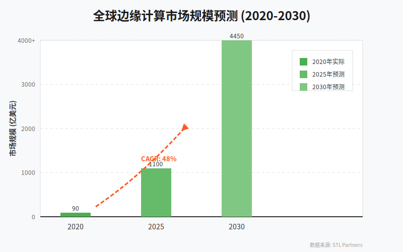
从技术实现的角度来看，嵌入式AI面临着诸多挑战。首先是计算资源的限制，嵌入式设备通常受限于功耗、成本和体积，无法像服务器那样配备强大的CPU和GPU，因此需要对AI模型进行压缩和优化。其次是存储容量的限制，大型语言模型动辄数十GB的参数量远超嵌入式设备的存储能力，需要采用模型剪枝、量化、知识蒸馏等技术来减小模型体积。再次是功耗的约束，许多嵌入式设备依靠电池供电，AI推理的高功耗会严重影响设备的续航时间，需要硬件和软件协同优化来降低功耗。最后是开发工具链的完善程度，嵌入式开发涉及到底层硬件、操作系统、驱动程序等多个层面，开发复杂度远高于云端应用，需要提供完善的开发工具和调试环境。

针对这些挑战，业界已经发展出了多种技术解决方案。在模型压缩方面，量化技术通过将模型参数从32位浮点数压缩到8位甚至4位整数，可以大幅减少模型的存储需求和计算量，同时保持较高的精度；剪枝技术通过移除模型中不重要的连接或神经元，可以减少模型的参数量和计算复杂度；知识蒸馏通过让一个小型模型学习大型模型的知识，可以在保持性能的同时大幅减小模型规模。在硬件加速方面，专用的AI芯片如英伟达的Jetson系列、谷歌的Edge TPU、苹果的神经网络引擎等，为嵌入式AI提供了高效的推理算力；同时，通用CPU和GPU也在不断加强AI计算能力，使得在标准硬件上运行AI模型成为可能。在软件框架方面，TensorFlow Lite、ONNX Runtime、OpenVINO等轻量化推理框架，为嵌入式AI部署提供了完善的工具支持。

## 具身智能与机器人技术的融合发展

具身智能（Embodied AI）作为人工智能领域的一个重要分支，强调智能体必须通过物理身体与环境互动来获得智能，而不是仅仅处理抽象符号。这一理念源于认知科学的研究，认为人类的智能深深植根于身体与环境的交互过程中，感知、运动和认知是密不可分的整体。将这一理念应用到人工智能领域，就产生了具身智能的研究方向，其目标是构建出能够像人类一样通过身体与物理世界互动的智能系统。与传统的"离身智能"（Disembodied AI）不同，具身智能强调智能体必须具备感知环境、执行动作、理解因果关系等能力，这些能力只有通过真实的物理互动才能获得和发展。

机器人技术作为具身智能的主要载体，正在经历从"自动化"向"智能化"的转变。传统的工业机器人主要通过预先编程的方式执行重复性的任务，它们缺乏对环境的感知和适应能力，只能在结构化的环境中工作。而新一代的智能机器人则具备了环境感知、自主决策、人机协作等能力，能够在非结构化的环境中灵活应对各种情况。这种转变的核心驱动力来自于人工智能技术的突破，特别是深度学习在计算机视觉、自然语言处理、强化学习等领域的成功应用，使得机器人能够理解复杂的环境、理解人类的语言指令、学习新的技能。例如，在视觉感知方面，深度学习模型可以实时识别物体、检测障碍物、理解场景语义；在运动控制方面，强化学习算法可以让机器人通过试错学习复杂的运动技能；在人机交互方面，大语言模型使得机器人能够理解自然语言指令并进行流畅的对话。

人形机器人作为具身智能的终极形态，近年来取得了令人瞩目的进展。特斯拉的Optimus机器人已经能够完成端茶倒水、搬运物品等精细操作，波士顿动力的Atlas机器人展现出了惊人的运动能力和平衡能力，国内的智元机器人、优必选等公司也在快速推进人形机器人的商业化进程。这些进展的背后是多学科技术的融合：机械工程提供了灵活的身体结构，材料科学研发出了轻量化高强度的材料，控制理论实现了精确的运动控制，人工智能赋予了机器人理解和决策的能力。特别值得关注的是，大语言模型与人形机器人的结合正在开启新的可能性，机器人不再需要预先编程，而是可以通过自然语言理解任务指令，自主规划行动序列，协调多个子系统完成复杂任务。

<!-- 边缘AI在各类智能设备中的应用场景示意 -->

从应用场景来看，具身智能机器人正在向多个垂直领域渗透。在工业制造领域，协作机器人可以与人类工人并肩工作，完成装配、搬运、检测等任务，提高生产效率的同时降低劳动强度；在物流仓储领域，移动机器人可以自主导航、智能分拣、优化路径，实现仓储物流的自动化；在服务领域，人形机器人可以担任导购、接待、清洁等工作，为人们提供便捷的服务；在医疗健康领域，手术机器人可以协助医生进行精确的手术操作，康复机器人可以帮助患者进行康复训练；在家庭领域，家用机器人可以承担清洁、烹饪、照顾老人儿童等家务劳动，解放人类的时间。这些应用场景的拓展，标志着机器人正在从工业工具向生活助手的角色转变。

然而，具身智能机器人的大规模商业化仍然面临着诸多挑战。首先是成本问题，当前的人形机器人造价高昂，动辄数十万美元，远超普通消费者的承受能力，需要通过技术进步和规模化生产来降低成本。其次是可靠性问题，机器人在复杂多变的真实环境中工作，需要具备极高的稳定性和容错能力，任何故障都可能导致安全事故。再次是通用性问题，当前的机器人通常针对特定任务设计，缺乏跨场景的泛化能力，需要发展更加通用的智能和更加灵活的身体。最后是社会接受度问题，人们对于与机器人共处还存在心理障碍，特别是担心机器人会抢夺人类的工作岗位，需要通过技术演示和公众教育来提高接受度。

OpenClaw与具身机器人的结合，为解决上述挑战提供了新的思路。通过将OpenClaw的智能体能力嵌入到机器人系统中，机器人可以获得强大的语言理解、任务规划和工具调用能力，大大提高了机器人的自主性和适应性。例如，配备OpenClaw的机器人可以理解"把客厅整理一下"这样的模糊指令，自主将其拆解为识别物品、分类整理、规划路径等子任务，并协调视觉系统、机械臂、移动底盘等硬件模块协同完成。更重要的是，OpenClaw的本地化部署和标准化Skills接口，使得机器人的能力可以像软件一样快速迭代和扩展，开发者可以针对特定场景开发专用的Skills，而不需要修改机器人的底层系统。这种软硬件解耦的架构，有望加速机器人技术的创新和商业化进程。

<!-- AI智能体的技术架构与系统设计示意 -->

## 云边端协同的新计算范式

随着物联网设备的普及和AI技术的成熟，计算架构正在从以云端为中心向云边端协同的分布式架构演进。在传统的云计算模式中，所有的数据处理和计算任务都在云端完成，终端设备只负责数据采集和结果展示，这种模式虽然简化了终端设备的设计，但也带来了延迟高、带宽消耗大、隐私风险等问题。云边端协同架构则根据任务的特点和资源的约束，将计算任务智能地分配到云端、边缘端和终端设备上，充分发挥各自的优势。云端拥有强大的计算能力和丰富的数据资源，适合处理大规模数据分析、模型训练等计算密集型任务；边缘端部署在靠近数据源的位置，适合处理实时性要求高、数据量大的任务；终端设备直接与物理世界交互，适合处理简单的感知和控制任务。

这种协同计算架构的实现需要解决多个技术问题。首先是任务拆解和分配问题，需要根据任务的计算复杂度、实时性要求、数据依赖等因素，智能地决定哪些部分在云端执行，哪些部分在边缘端执行，哪些部分在终端执行。其次是数据管理和同步问题，在分布式架构中，数据可能在不同的层级之间传输和存储，需要保证数据的一致性和时效性，同时最小化数据传输的开销。再次是模型部署和更新问题，AI模型可能需要在不同的设备上部署，需要针对不同设备的硬件特点进行优化，同时建立高效的模型更新机制。最后是安全和隐私问题，分布式架构扩大了攻击面，需要建立完善的安全防护机制，保护数据隐私和系统安全。

OpenClaw在云边端协同架构中扮演着独特的角色。作为本地优先的智能体平台，OpenClaw主要运行在边缘端或终端设备上，负责处理用户的实时请求和本地任务。同时，OpenClaw也可以调用云端的大模型API来处理复杂的推理任务，实现云边协同。例如，当用户提出一个复杂的查询时，OpenClaw可以先在本地进行初步理解和任务拆解，然后将需要深度推理的部分发送到云端处理，最后将结果返回给用户并存储在本地记忆中。这种混合架构既保证了响应速度，又充分利用了云端强大的计算能力。此外，OpenClaw的Skills机制也为云边协同提供了标准化的接口，开发者可以编写Skills来调用云端的各类服务，如数据库查询、Web搜索、API调用等，实现能力的灵活扩展。

从产业发展的角度来看，云边端协同架构正在催生新的商业模式和竞争格局。云厂商如阿里云、腾讯云、AWS等正在推出边缘计算服务，将云能力扩展到边缘；芯片厂商如英伟达、英特尔、高通等正在开发边缘AI芯片，提供强大的本地推理能力；设备厂商如苹果、小米、华为等正在构建自己的智能体生态，争夺用户的数字入口。OpenClaw作为开源的本地智能体平台，为这些厂商提供了一个标准化的技术底座，有望成为连接云边端各层级的桥梁。特别是对于中小企业和开发者来说，OpenClaw降低了开发智能体应用的门槛，使得他们可以快速构建和部署自己的AI应用，参与到这个万亿级市场的竞争中来。

综上所述，AI智能体、嵌入式AI、具身智能和云边端协同等技术趋势的交汇，正在创造一个全新的技术范式和产业机遇。OpenClaw作为这一轮技术革命的标志性项目，其成功不仅体现在技术层面的创新，更重要的是它验证了本地化智能体的可行性和价值，为整个行业的发展指明了方向。在接下来的章节中，我们将深入分析OpenClaw的技术架构、生态系统以及对嵌入式和机器人领域的具体影响。

# OpenClaw技术架构深度解析

## 核心设计理念与架构原则

OpenClaw作为引领AI智能体革命的开源项目，其技术架构体现了对传统AI应用范式的深刻反思和创新突破。从设计理念层面来看，OpenClaw的核心哲学可以概括为"本地优先、数据主权、能力开放、生态协同"这十六个字。本地优先指的是OpenClaw将智能体运行在用户的自有设备上，而不是完全依赖云端服务，这种设计选择带来的好处是多方面的：首先，本地化部署确保了用户数据的完全掌控，所有文件访问、命令执行、工具调用都在用户设备上进行，不存在数据泄露到第三方的风险；其次，本地运行消除了网络延迟，使得智能体能够实时响应用户的请求，提供流畅的交互体验；再次，本地部署降低了使用成本，用户不需要为每次API调用付费，只需要承担本地硬件的电力消耗；最后，本地架构赋予了智能体完整的系统访问权限，使其能够调用操作系统的所有功能，执行复杂的多步骤任务。

数据主权是OpenClaw另一个核心设计原则，在当前数据隐私日益受到重视的时代背景下，这一原则显得尤为重要。OpenClaw通过将所有用户数据、对话历史、任务记忆都存储在本地，确保了用户对自己的数据拥有完全的所有权和控制权。这种设计与传统的云端SaaS服务形成了鲜明对比，后者通常将用户数据存储在服务商的服务器上，用户不仅失去了对数据的直接控制，还面临着数据泄露、滥用等风险。OpenClaw的数据主权设计不仅体现在存储层面，还体现在处理层面，所有的AI推理、任务规划、工具调用都在本地完成，不需要将敏感信息发送到远程服务器。这种架构特别适合于对数据安全要求极高的场景，如金融交易、医疗健康、企业内部系统等，这些领域往往因为合规要求而无法使用云端AI服务。

能力开放是OpenClaw架构设计的第三个重要原则，体现在其标准化的Skills接口和灵活的插件机制上。OpenClaw将智能体的核心能力与扩展能力进行了清晰的分离，核心系统负责消息路由、任务调度、记忆管理等基础功能，而具体的业务逻辑和能力扩展则通过Skills插件来实现。每个Skill都是一个独立的功能模块，遵循统一的接口规范，可以由开发者自由编写和分享。这种模块化设计带来了多重好处：首先，它降低了开发门槛，开发者不需要理解整个系统的复杂实现，只需要按照Skill规范编写自己的功能模块即可；其次，它促进了代码复用，优秀的Skill可以被其他开发者直接使用或作为参考，避免了重复造轮子；再次，它激发了社区创新，成千上万的开发者贡献自己的Skill，形成了一个繁荣的能力市场；最后，它保证了系统的可扩展性，用户可以根据自己的需求选择安装需要的Skill，构建出个性化的智能体。

生态协同是OpenClaw成功的另一个关键因素，也是其架构设计的重要指导原则。OpenClaw从诞生之初就定位为开源项目，采用了宽松的开源许可证，鼓励任何人使用、修改和分发。这种开放的策略使得OpenClaw能够在短时间内吸引全球开发者的关注和贡献，形成了活跃的开发者社区。更重要的是，OpenClaw设计了标准化的接口和协议，使得它能够与各类外部服务和平台无缝集成。在消息接入方面，OpenClaw支持WhatsApp、Telegram、Discord、Slack、Signal、iMessage、Microsoft Teams等数十种主流通讯平台，用户可以通过自己习惯的任何渠道与智能体交互；在模型接入方面，OpenClaw支持OpenAI GPT系列、Anthropic Claude、Google Gemini以及各类开源模型，用户可以根据自己的需求选择最合适的模型；在工具调用方面，OpenClaw可以调用浏览器自动化、文件系统操作、Shell命令执行等各类系统工具，实现真正的"跨端操控"。这种开放协同的生态设计，使得OpenClaw不再是一个孤立的应用，而是一个连接用户、服务、设备和数据的智能中枢。

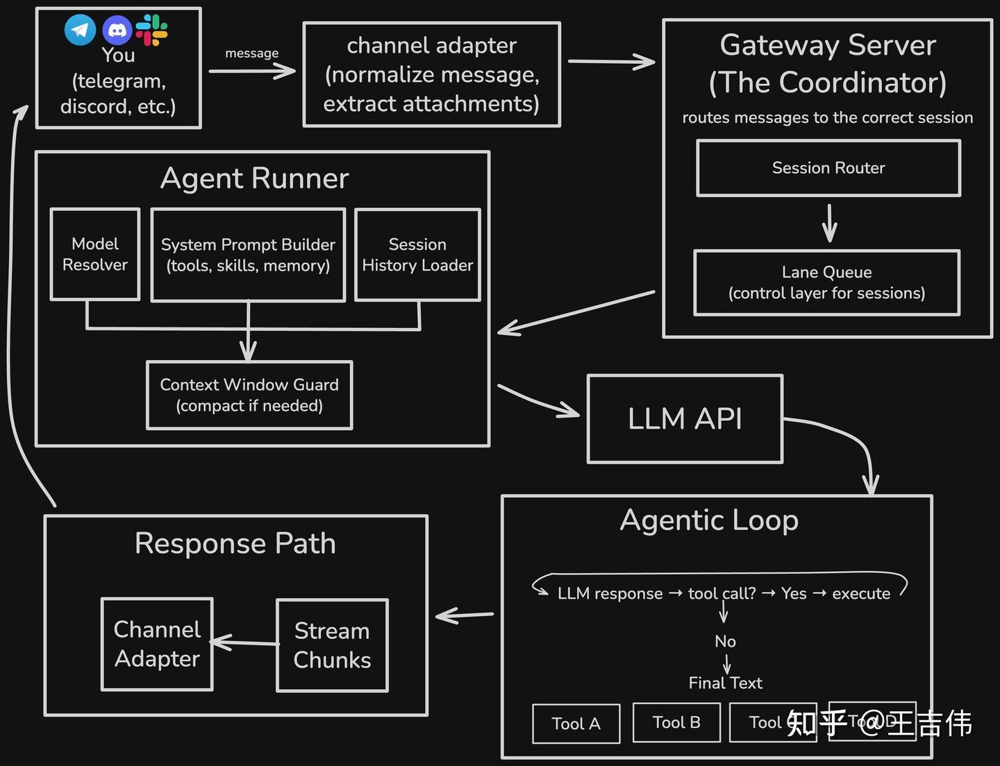
<!-- OpenClaw系统架构与设计理念示意 -->

## 系统架构与核心组件解析

OpenClaw的系统架构采用了典型的分层设计，从底层到上层可以分为基础设施层、核心服务层、能力扩展层和交互接入层，每一层都有明确的职责和清晰的接口边界。基础设施层主要包括运行环境管理和资源调度模块，OpenClaw可以运行在多种操作系统上，包括macOS、Linux和Windows（通过WSL），它利用Docker容器技术来隔离不同的任务执行环境，确保系统的稳定性和安全性。在资源调度方面，OpenClaw实现了智能的负载均衡机制，可以根据任务的优先级和资源占用情况，动态分配计算资源，确保关键任务的及时完成。特别值得一提的是，OpenClaw对Docker的深度集成，它不仅可以启动临时的执行容器来运行不信任的代码，还可以直接调度宿主机的Docker Daemon，实现真正的容器化任务执行。

核心服务层是OpenClaw架构的中枢，包含Agent Runner、Memory子系统、Gateway网关和Task Scheduler等关键组件。Agent Runner是整个系统的核心引擎，负责协调其他所有组件的工作，它接收用户的输入指令，结合Memory子系统中存储的上下文信息，调用大语言模型进行意图理解和任务规划，然后通过Task Scheduler将任务分解为可执行的步骤，并调度相应的Skills来完成各个步骤。Memory子系统是OpenClaw区别于其他智能体的重要特征，它实现了持久化的长短期记忆功能，通过本地向量数据库存储和管理用户的偏好、历史对话、任务结果等信息，使得智能体能够"记住"用户并提供个性化的服务。Memory子系统采用了分层存储策略，将不同类型的信息存储在不同的位置：长期知识存储在MEMORY.md文件中，每日记忆存储在memory/YYYY-MM-DD.md文件中，任务记忆和会话历史则通过向量数据库进行索引和检索。

Gateway网关是OpenClaw与外部世界交互的桥梁，它负责处理来自不同渠道的消息输入，并将智能体的响应输出到相应的渠道。Gateway采用了插件化的设计，每个通讯平台都有对应的适配器插件，如WhatsApp适配器、Telegram适配器等，这些适配器实现了平台特定的消息格式转换和协议处理。Gateway还负责处理消息的优先级和路由规则，确保重要消息能够得到及时处理，同时支持消息的异步处理和批量处理，提高系统的吞吐量。Task Scheduler任务调度器负责任务的分解、排队和执行监控，它将复杂任务拆解为原子级的操作步骤，根据步骤之间的依赖关系构建执行图，然后按照最优顺序调度执行。Task Scheduler还实现了任务的超时处理、错误重试、回滚机制等，确保任务的可靠执行。

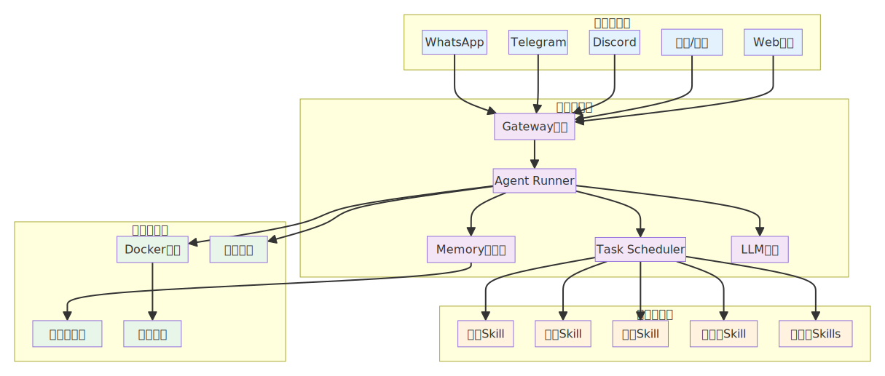

<!-- Available formats: PNG=images/mermaid_sha9390d98090c39e4e.png, SVG=images/mermaid_sha9390d98090c39e4e.svg -->
<!-- Source code file: images/mermaid_sha9390d98090c39e4e.mmd -->

能力扩展层是OpenClaw生态繁荣的基础，由各种Skills插件组成。Skills是OpenClaw的功能扩展单元，每个Skill都封装了特定的能力，如邮件处理、日历管理、文件操作、浏览器自动化等。Skills遵循统一的接口规范，包含元数据描述、前置条件检查、执行逻辑和结果处理等标准组件。Skills的开发非常简单，本质上就是一个包含SKILL.md文件的目录，该文件使用Markdown格式描述Skill的功能、使用方法和执行步骤。这种设计的巧妙之处在于，它将Markdown从文档格式转变为了可执行的代码，用户可以通过阅读Skill的描述来理解其功能，而Agent Runner可以解析这些描述并执行相应的操作。Skills可以从ClawHub官方市场或第三方来源安装，安装过程就是将Skill目录复制到OpenClaw的skills目录下，Agent Runner会自动发现并加载这些Skills。

交互接入层负责处理用户与智能体之间的所有交互，支持多种输入输出渠道。在输入方面，OpenClaw支持文本消息、语音消息、文件上传等多种输入形式，语音消息会通过语音识别引擎转换为文本；在输出方面，OpenClaw可以返回文本回复、执行结果、生成的文件等多种输出形式。交互接入层还实现了会话管理功能，可以同时处理多个用户的多个对话，每个对话都有独立的上下文和状态，互不干扰。特别值得一提的是，OpenClaw支持多模态交互，用户可以发送图片让智能体分析，也可以让智能体生成图表或绘图，这种多模态能力大大扩展了智能体的应用场景。

## 记忆机制与上下文管理

OpenClaw的记忆系统是其区别于其他AI智能体的核心特征之一，也是实现个性化服务和长期知识积累的关键技术。从认知科学的角度来看，人类的智能不仅依赖于当前的感知和推理能力，更依赖于长期积累的知识和经验，OpenClaw的记忆机制正是借鉴了这一原理，为智能体构建了类似的记忆体系。OpenClaw的记忆系统采用了分层存储的设计，将不同类型、不同时效的信息存储在不同的介质中，通过智能的检索和关联机制，确保智能体能够在合适的时机访问到合适的信息。

长期知识层存储的是智能体关于世界、特定领域或用户的持久化事实与偏好，这些信息相对稳定，不会频繁变化。例如，用户的技术栈偏好（Python还是JavaScript）、写作风格（正式还是随意）、常用工具（VS Code还是Vim）等信息都会被存储在长期知识层。OpenClaw使用MEMORY.md文件来存储精选的长期记忆，这个文件采用Markdown格式，便于人类阅读和编辑，同时也便于Agent Runner解析和使用。长期知识的更新相对不频繁，通常只有在用户明确告知偏好发生变化，或者智能体通过长期观察发现模式变化时才会更新。这种设计确保了长期知识的稳定性和可靠性，避免因为偶发事件而错误地更新重要信息。

任务记忆层存储的是智能体在执行长周期、多步骤任务过程中产生的中间产物、决策和观察。这些信息对于保证复杂工作的连续性至关重要，因为智能体需要记住之前做了什么、遇到了什么问题、采用了什么解决方案，才能继续推进任务。例如，当智能体帮助用户整理文件时，它需要记住已经处理了哪些文件夹、采用了什么分类标准、遇到了什么特殊情况，才能确保整个整理过程的一致性。任务记忆具有明确的时效性，通常与特定任务绑定，任务完成后这些记忆可以被归档或清理。OpenClaw使用临时文件和内存数据结构来存储任务记忆，确保快速访问和高效管理。

会话历史层存储的是智能体与用户的完整对话记录，包括所有显式的指令和隐式的意图。会话历史是上下文最直接的来源，智能体通过分析对话历史可以理解用户的真实需求，即使这些需求没有被明确表达出来。例如，如果用户在之前的对话中提到过某个项目，当前对话中提到的"那个文件"很可能就是指该项目的文件，智能体需要通过会话历史来做出正确的推断。会话历史的存储需要考虑隐私和效率的平衡，OpenClaw将最近的对话保留在内存中以供快速访问，将较老的对话归档到持久化存储中以节省内存。会话历史的检索采用了向量相似度匹配技术，可以根据当前的查询快速找到相关的历史对话片段。

外部资源层指的是智能体在执行任务时需要动态查阅的外部资料，包括代码库、技术文档、API规范、网页内容等。这些信息不在智能体的本地存储中，而是根据需要实时获取。OpenClaw通过Skills机制来访问外部资源，例如，当智能体需要查询某个API的用法时，可以调用浏览器Skill访问官方文档；当需要理解某个代码库的结构时，可以调用文件Skill读取相关代码。外部资源的访问需要考虑时效性和权威性，OpenClaw会优先使用官方文档和权威来源，同时缓存常用的资源以提高访问速度。

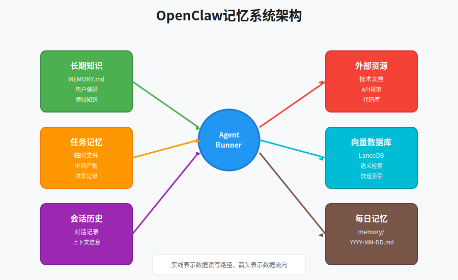
向量数据库是OpenClaw记忆系统的核心技术组件，它为智能体提供了高效的语义检索能力。传统的基于关键词的搜索方法无法理解语义的相似性，例如搜索"如何发送邮件"可能找不到"邮件发送教程"这样的文档，即使它们的内容高度相关。而向量数据库通过将文本转换为高维向量，可以计算语义之间的相似度，实现真正的语义检索。OpenClaw官方推荐的记忆插件是LanceDB，这是一款专为AI应用设计的向量数据库，具有高性能、易部署、支持本地存储等特点。LanceDB与OpenClaw的集成非常紧密，所有的对话历史、任务记忆、知识文档都会被自动向量化并索引，当智能体需要检索相关信息时，只需提供查询文本，LanceDB就能返回最相关的历史记录。

记忆的检索策略是OpenClaw智能体能力的关键体现，智能体需要根据当前的上下文和任务需求，智能地决定检索哪些记忆、如何使用这些记忆。OpenClaw采用了多阶段检索策略：首先，根据当前对话的最近几轮消息，检索相关的会话历史；其次，根据任务的关键词和意图，检索相关的任务记忆；再次，如果遇到不熟悉的概念或需要专业知识，检索相关的长期知识和外部资源；最后，将所有检索到的信息整合到上下文中，供大语言模型使用。这种检索策略确保了智能体能够获得全面而相关的信息，提高任务执行的成功率。

## Skills插件系统与生态扩展

Skills插件系统是OpenClaw架构中最具创新性和影响力的设计之一，它将智能体的核心能力与扩展能力进行了清晰的分离，为生态繁荣奠定了技术基础。从软件工程的角度来看，Skills系统体现了"关注点分离"和"开闭原则"等经典设计理念：核心系统专注于消息路由、任务调度、记忆管理等基础功能，保持相对稳定；而具体的业务逻辑和能力扩展则通过插件机制实现，可以灵活添加和修改。这种架构设计使得OpenClaw能够保持核心的简洁性，同时通过生态的力量不断扩展能力边界。

Skills的技术实现非常简洁而优雅，每个Skill本质上就是一个包含SKILL.md文件的目录。SKILL.md文件采用Markdown格式，包含几个标准化的部分：首先是元数据部分，描述Skill的名称、版本、作者、分类等基本信息；其次是功能描述部分，用自然语言说明Skill的功能和使用场景；然后是前置条件部分，列出使用该Skill需要满足的依赖或配置；最后是执行步骤部分，详细描述Skill的执行逻辑和操作步骤。这种设计的巧妙之处在于，它将文档和代码统一了起来，SKILL.md既是人类可读的文档，又是机器可执行的代码。Agent Runner通过解析SKILL.md文件，理解Skill的功能和执行步骤，然后在合适的时机调用该Skill。

Skills的开发门槛极低，这是OpenClaw生态能够快速繁荣的重要原因。开发者不需要学习复杂的编程框架或API，只需要编写一个Markdown文件，描述清楚Skill的功能和执行步骤即可。例如，一个简单的邮件发送Skill可能只需要几十行Markdown，描述如何调用邮件API、如何构造邮件内容、如何处理发送结果等。这种低门槛的开发模式吸引了大量开发者贡献Skills，形成了繁荣的生态。当然，对于复杂的Skill，开发者也可以在SKILL.md中嵌入实际的代码片段，如Python脚本、Shell命令等，以实现更强大的功能。

ClawHub是OpenClaw官方的Skills市场，类似于npm之于JavaScript、PyPI之于Python，它是OpenClaw生态的核心基础设施。ClawHub提供了Skills的发布、发现、安装、更新等一站式服务，开发者可以将自己编写的Skill发布到ClawHub，其他用户可以通过搜索或分类浏览发现需要的Skill，然后一键安装到自己的OpenClaw实例中。根据我们的调研，ClawHub平台已经汇聚了超过3498个各类Skills，涵盖办公自动化、社交媒体、加密货币、数据分析、开发工具等多个类别。这些Skills由全球数千名开发者贡献，形成了一个真正开放的、全球协作的能力市场。

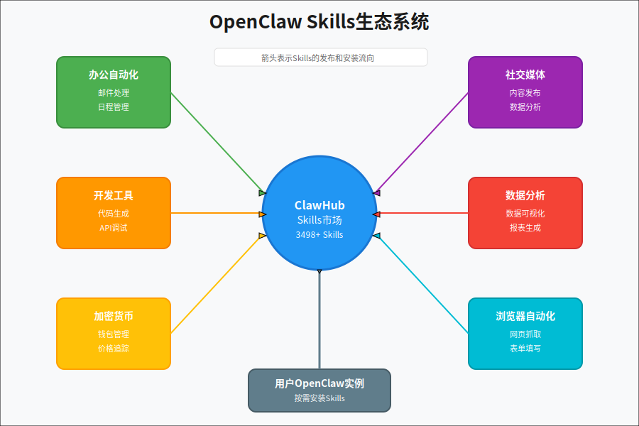
Skills的繁荣也带来了安全挑战，这是OpenClaw生态面临的重要问题。由于Skills的安装和执行涉及系统级别的操作，恶意Skills可能会窃取用户数据、破坏系统文件、甚至植入后门。我们的调研发现，ClawHub平台已经出现了大规模的供应链投毒攻击，安全团队扫描了2857个Skills，发现341个恶意样本，感染率达12%。这些恶意Skills通常伪装成合法的插件，如加密货币工具、浏览器助手等，在SKILL.md的"前提条件"部分嵌入恶意命令，用户安装并执行这些命令时，恶意代码就会被下载和运行。为了应对这一挑战，OpenClaw社区正在建立Skills审核机制、安全扫描工具和用户评价体系，同时也呼吁用户在安装Skills时保持警惕，只安装来自可信来源的Skills。

尽管存在安全风险，Skills系统的价值是不可否认的。它为OpenClaw生态提供了无限扩展的可能性，任何开发者都可以贡献自己的创意和能力，任何用户都可以找到满足自己需求的工具。这种开放的协作模式，正是开源精神的核心体现，也是OpenClaw能够在短时间内取得巨大成功的关键因素。随着生态的成熟和安全机制的完善，Skills系统有望成为AI时代的能力交换基础设施，推动智能体技术的大规模商业化落地。

# 轻量化与嵌入式实现分析

## NanoClaw：边缘AI智能体的轻量化革命

在OpenClaw生态系统中，NanoClaw作为轻量化实现的代表性项目，正在为边缘设备和资源受限环境带来AI智能体的能力革命。NanoClaw的核心设计理念是在保持OpenClaw核心功能的前提下，通过系统性的技术优化，大幅降低对计算资源、存储空间和功耗的需求，使得AI智能体能够在树莓派、嵌入式Linux设备甚至单片机上运行。这种轻量化转型的意义是深远的，它将AI智能体的应用场景从高性能个人电脑扩展到了物联网设备、边缘网关、工业控制器等更广泛的领域，真正实现了AI能力的无处不在。

从技术实现的角度来看，NanoClaw采用了多维度的优化策略来降低资源消耗。在模型压缩方面，NanoClaw集成了先进的量化技术，将大型语言模型的参数从32位浮点数压缩到8位甚至4位整数，这种量化处理可以将模型体积缩小4-8倍，同时保持95%以上的原始精度。例如，一个原本需要16GB存储空间的7B参数模型，经过INT8量化后只需要约2GB，INT4量化后更是可以压缩到约1GB，这使得模型能够加载到仅有4GB内存的嵌入式设备中。在推理优化方面，NanoClaw采用了模型剪枝技术，通过识别并移除神经网络中不重要的连接和神经元，减少模型的计算量，通常可以实现30%-50%的加速效果。此外，NanoClaw还集成了知识蒸馏技术，通过让一个小型模型学习大型模型的知识，可以在保持性能的同时大幅减小模型规模。

在运行时优化方面，NanoClaw针对边缘设备的硬件特点进行了深度定制。首先，它采用了轻量级的执行引擎，去除了OpenClaw中对Docker容器的依赖，直接在宿主机上运行任务，避免了容器虚拟化带来的性能开销。其次，NanoClaw实现了智能的内存管理机制，采用模型分片加载技术，只在需要时将模型的部分参数加载到内存中，大大降低了内存占用。再次，NanoClaw优化了向量数据库的实现，采用更紧凑的索引结构和更高效的检索算法，减少了内存和存储的消耗。最后，NanoClaw还实现了功耗优化策略，根据设备的电池状态和任务优先级，动态调整计算频率和推理精度，在保证性能的前提下最大化续航时间。

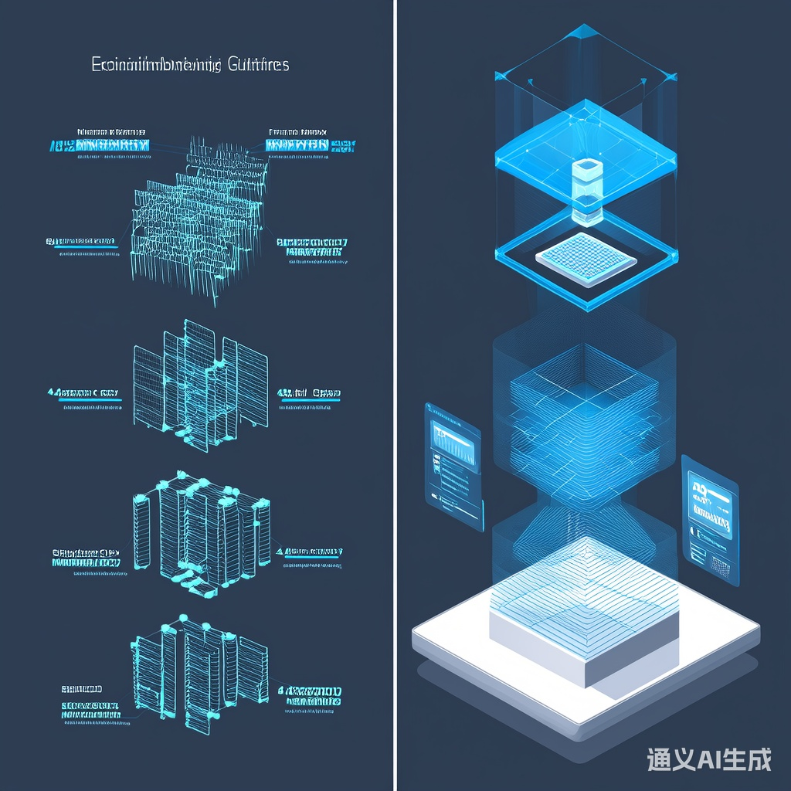
<!-- 轻量化AI模型在边缘设备上的部署示意 -->

NanoClaw的应用场景极其广泛，覆盖了物联网、智能家居、工业自动化等多个领域。在智能家居场景中，NanoClaw可以部署在智能音箱、智能网关等设备上，为用户提供语音助手、家电控制、日程提醒等服务，而且所有数据处理都在本地完成，不存在隐私泄露风险。在工业物联网场景中，NanoClaw可以部署在边缘网关或PLC控制器上，实时分析传感器数据，预测设备故障，优化生产流程，由于响应延迟在毫秒级别，可以满足工业自动化的严格要求。在农业物联网场景中，NanoClaw可以部署在田间地头的传感器节点上，分析土壤湿度、气象数据，自动控制灌溉系统，由于设备依靠太阳能供电，NanoClaw的低功耗特性显得尤为重要。

从市场前景来看，NanoClaw所代表的边缘AI智能体市场正在经历爆发式增长。根据IDC的预测，到2025年，全球物联网设备连接数将达到约300亿台，其中相当一部分将具备AI推理能力。Gartner预测，到2025年，75%的企业生成数据将在边缘侧创建和处理，这一比例在2018年仅为10%。这些数据充分说明了边缘计算的巨大市场潜力，而NanoClaw作为连接云端AI能力与边缘设备的关键桥梁，正处于这一万亿级赛道的核心位置。特别值得关注的是，随着5G、WiFi 6等高速无线技术的普及，边缘设备与云端的协同将更加紧密，NanoClaw可以在云端进行模型训练和更新，然后将优化后的模型部署到边缘设备，形成"云端训练、边缘推理"的协同模式，充分发挥云边两端各自的优势。

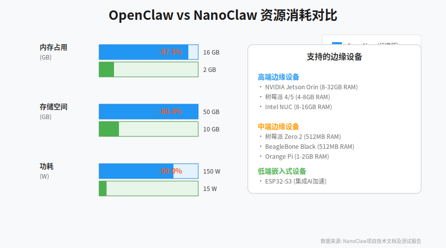
## MimicClaw：嵌入式场景的深度优化

MimicClaw作为OpenClaw生态中专注于嵌入式场景的实现版本，针对嵌入式系统的特定约束和需求进行了深度优化，体现了"场景驱动设计"的工程哲学。与NanoClaw追求极致轻量化不同，MimicClaw更注重在嵌入式特定场景下的功能完整性和系统稳定性，它针对实时性要求、硬件接口适配、功耗管理等方面进行了专门设计，使得OpenClaw能够更好地融入嵌入式系统的生态体系。这种差异化定位使得MimicClaw在工业控制、汽车电子、医疗设备等对可靠性和实时性要求极高的领域具有独特的竞争优势。

在实时性优化方面，MimicClaw引入了优先级调度和确定性延迟机制，确保关键任务能够在规定的时间内完成。嵌入式系统通常需要处理硬实时任务，例如工业机器人的运动控制、汽车的安全系统响应等，这些任务的延迟超过阈值可能导致严重后果。MimicClaw通过实时任务调度器，将任务按照优先级分为实时任务、高优先级任务和普通任务，实时任务具有最高的优先级，能够抢占其他任务的资源，确保在截止时间前完成。同时，MimicClaw还实现了任务执行时间的预测和监控机制，在任务提交前预估其执行时间，如果预估时间超过截止时间，会拒绝该任务或启动降级策略，避免系统过载导致关键任务失败。

在硬件接口适配方面，MimicClaw针对嵌入式设备的多样化硬件接口提供了完善的驱动支持。嵌入式系统通常需要与各类传感器、执行器、通信模块等硬件设备交互，这些设备的接口标准五花八门，包括GPIO、I2C、SPI、UART、CAN、USB等。MimicClaw通过模块化的驱动架构，为常见的硬件接口提供了标准化的访问接口，开发者可以通过Skills机制轻松调用这些接口，而无需关心底层驱动的实现细节。例如，一个读取温湿度传感器的Skill只需要声明需要使用I2C接口，MimicClaw会自动加载相应的驱动并处理通信细节，Skill开发者只需要关注数据的解读和应用逻辑。这种硬件抽象层的设计大大降低了嵌入式AI应用的开发门槛，使得软件开发者可以专注于业务逻辑，而不需要深入了解硬件细节。

在功耗管理方面，MimicClaw实现了多层次的动态功耗调节机制，这对于依靠电池供电的嵌入式设备至关重要。首先，MimicClaw支持处理器频率的动态调节，根据任务负载自动调整CPU运行频率，在空闲时降低频率以节省功耗，在任务繁忙时提升频率以保证性能。其次，MimicClaw实现了智能的休眠唤醒机制，当系统长时间无任务时，会自动进入深度休眠状态，关闭不必要的硬件模块，只保留唤醒检测电路；当检测到外部事件或定时任务时，系统会快速唤醒并恢复执行。再次，MimicClaw优化了AI推理的功耗，通过模型量化和稀疏化技术减少计算量，同时利用专用AI加速芯片（如NPU、DSP）来替代通用CPU进行推理，大幅降低功耗。最后，MimicClaw还支持电池状态的实时监控和低电量策略，当电量低于阈值时，会自动降低服务质量或关闭非关键功能，延长设备续航时间。

在系统可靠性方面，MimicClaw针对嵌入式环境的特殊挑战进行了强化设计。嵌入式设备通常部署在无人值守的环境中，可能面临温度变化、电源波动、电磁干扰等多种挑战，系统必须具备高度的容错能力和自恢复能力。MimicClaw实现了看门狗机制，定期检测系统的运行状态，如果检测到系统死锁或无响应，会自动触发系统复位；实现了日志的循环存储，确保即使在存储空间有限的情况下，关键的错误信息也能被保留；实现了配置的版本管理，每次配置更新都会创建备份，如果新配置导致系统异常，可以快速回滚到上一个稳定版本；实现了异常的自动捕获和上报，当系统发生异常时，会自动记录详细的堆栈信息和环境状态，并通过可用的通信通道上报给云端监控系统，便于远程诊断和修复。

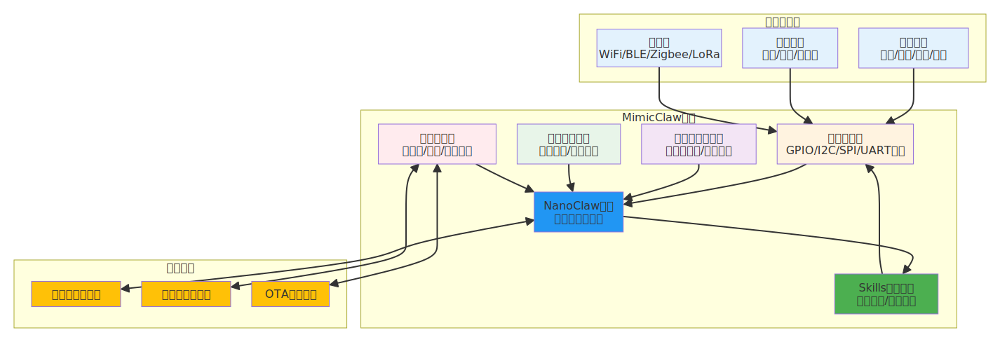

<!-- Available formats: PNG=images/mermaid_sha95a3ddcdfe92be6b.png, SVG=images/mermaid_sha95a3ddcdfe92be6b.svg -->
<!-- Source code file: images/mermaid_sha95a3ddcdfe92be6b.mmd -->

MimicClaw的商业化应用前景十分广阔，特别是在工业4.0和智能制造领域。在工业自动化场景中，MimicClaw可以部署在PLC、工业网关、机器人控制器等设备上，实现预测性维护、质量控制、能源管理等智能化功能。例如，配备MimicClaw的电机控制器可以实时分析振动和温度数据，预测轴承磨损情况，在故障发生前通知维护人员，避免意外停机造成的损失。在智能物流场景中，MimicClaw可以部署在AGV（自动导引车）、分拣机器人、仓储管理系统等设备上，实现路径优化、任务调度、异常处理等智能功能。在智能农业场景中，MimicClaw可以部署在温室控制器、灌溉系统、农机设备上，根据环境数据自动调节温度、湿度、光照，实现精准农业和资源优化。

从技术发展趋势来看，MimicClaw代表了嵌入式AI的重要发展方向，即从"云端智能"向"边缘智能"再到"嵌入式智能"的演进。这一演进过程的驱动力来自于多个方面：首先，摩尔定律的持续生效使得嵌入式芯片的计算能力不断提升，为本地AI推理提供了硬件基础；其次，AI模型压缩和优化技术的进步使得大型模型能够在资源受限的设备上运行；再次，5G和边缘计算的发展使得云边协同成为可能，嵌入式设备可以在云端训练模型，在本地进行推理；最后，用户对于隐私、实时性和可靠性的需求推动了AI能力向边缘下沉。MimicClaw正是顺应这一趋势的技术方案，它将OpenClaw的智能体能力与嵌入式系统的特点深度融合，为嵌入式领域的智能化转型提供了可行的技术路径。

## 轻量化技术的关键实现路径

实现AI智能体的轻量化部署需要从模型、软件和硬件多个层面进行协同优化，这是一个系统性的工程挑战。从模型层面来看，量化、剪枝、知识蒸馏和神经架构搜索是四大核心技术路径，它们各自从不同角度降低模型的复杂度和资源消耗。量化技术通过降低模型参数的数值精度来减少存储和计算开销，最常用的方法是将32位浮点数量化为8位整数，这可以将模型体积缩小4倍，推理速度提升2-3倍，而精度损失通常控制在1%以内。更激进的量化方案如二值化网络将参数量化为1位（-1或+1），可以实现极致的压缩和加速，但精度损失较大，适用于对精度要求不高的场景。剪枝技术通过移除神经网络中冗余的连接或神经元来减少模型参数和计算量，结构化剪枝会移除整个通道或层，便于硬件加速，非结构化剪枝可以更精细地移除参数，但需要特殊的硬件支持。知识蒸馏通过让一个小型的学生模型学习大型教师模型的知识，可以在保持性能的同时大幅减小模型规模，例如将一个13B参数模型的知识蒸馏到一个3B参数模型中。

在软件优化层面，推理引擎的优化对于提升边缘设备的AI性能至关重要。ONNX Runtime、TensorFlow Lite、TensorRT等推理引擎针对边缘设备的特点进行了深度优化，提供了多种加速技术。算子融合是将多个连续的计算操作合并为一个操作，减少内存访问和计算开销；内存复用是通过智能的内存管理，重用已分配的内存缓冲区，减少内存分配和释放的开销；并行计算是利用多核CPU或GPU的并行计算能力，同时执行多个独立的计算任务；批处理推理是将多个输入打包成一批同时处理，提高硬件利用率。此外，针对特定的硬件平台，推理引擎还可以利用硬件加速指令集（如ARM NEON、x86 AVX）或专用加速器（如NPU、DSP）来进一步提升性能。

在硬件加速层面，专用的AI芯片为边缘AI提供了强大的算力支持。英伟达的Jetson系列平台集成了GPU和NPU，提供从边缘到终端的全场景AI计算能力；谷歌的Edge TPU是专门为边缘AI推理设计的ASIC芯片，功耗低至2W，却能提供每秒4万亿次运算的性能；苹果的神经网络引擎集成在M系列芯片中，为Mac和iPhone设备提供了强大的本地AI能力；华为的昇腾310芯片专注于边缘推理，功耗仅为8W，算力达到22TOPS。这些专用AI芯片通过针对AI计算的特点进行硬件优化，如脉动阵列架构、稀疏计算支持、混合精度计算等，在功耗受限的情况下提供了远超通用CPU的AI性能。

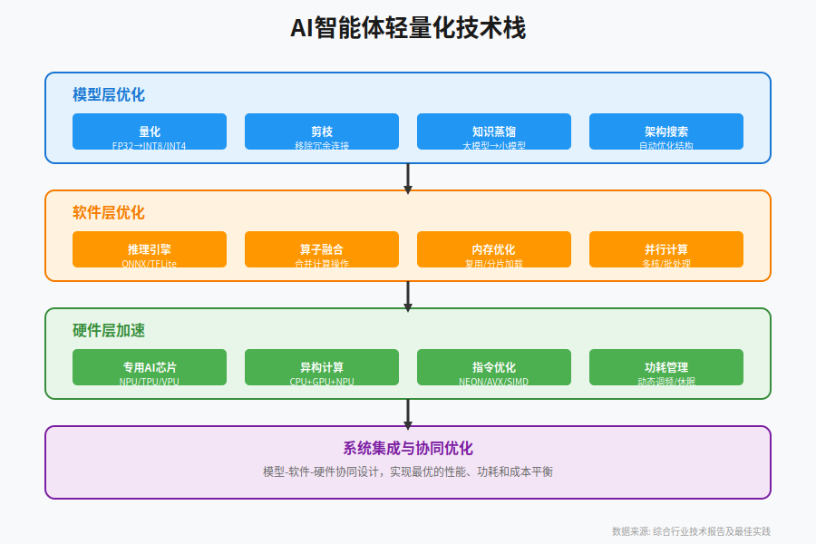
从产业发展的角度来看，轻量化AI智能体的成功需要整个产业链的协同努力。在芯片层面，需要芯片厂商提供性能更强、功耗更低、成本更优的AI芯片，同时提供完善的软件工具链和开发支持；在算法层面，需要研究者开发更高效的模型架构和压缩算法，在保持性能的同时降低计算复杂度；在软件层面，需要开源社区和商业公司提供完善的推理框架和优化工具，降低开发者的使用门槛；在应用层面，需要行业客户明确需求、提供场景、验证效果，形成技术迭代的反馈闭环。OpenClaw生态通过开源协作的方式，正在将产业链各方的力量整合起来，共同推动轻量化AI智能体的发展和应用。

NanoClaw和MimicClaw作为OpenClaw生态在轻量化和嵌入式方向的重要探索，为AI智能体在边缘和嵌入式场景的落地提供了可行的技术方案。它们的成功不仅体现在技术创新层面，更重要的是验证了本地化智能体的可行性和价值，为整个行业的发展指明了方向。随着技术的不断成熟和生态的不断完善，轻量化AI智能体将在物联网、工业4.0、智能家居、智能汽车等领域发挥越来越重要的作用，推动这些领域的智能化转型和升级。

# 机器人融合应用分析

## 具身智能与OpenClaw的深度结合

具身智能作为人工智能领域的前沿方向，强调智能体必须通过物理身体与环境的互动来获得和发展智能，这一理念与OpenClaw的本地化智能体架构形成了天然的契合。OpenClaw与机器人的结合，标志着AI智能体从"数字世界"向"物理世界"的关键跨越，使得智能体不仅能够处理信息和执行软件任务，还能够感知物理环境、操控硬件设备、与真实世界进行交互。这种结合的意义是深远的，它将AI智能体的应用场景从虚拟的信息处理扩展到了真实的物理操作，为人形机器人、服务机器人、工业机器人等领域的智能化转型开辟了全新的技术路径。

从技术架构的角度来看，OpenClaw与机器人的融合需要解决感知、决策、执行三个核心环节的协同问题。在感知环节，机器人需要通过摄像头、麦克风、激光雷达、IMU等多种传感器获取环境信息，OpenClaw通过标准化的Skills接口可以集成各类传感器数据处理模块，将原始的传感器数据转换为智能体可以理解的高层语义信息。例如，视觉Skill可以将摄像头捕获的图像输入到视觉大模型中，实现物体识别、场景理解、人脸检测等功能；语音Skill可以将麦克风采集的音频输入到语音识别模型中，实现语音转文字、说话人识别、情感分析等功能。这些感知Skills的输出会被整合到OpenClaw的上下文中，为后续的决策提供丰富的环境感知信息。

在决策环节，OpenClaw的大语言模型核心扮演着"大脑"的角色，它根据用户的自然语言指令和感知模块提供的环境信息，进行任务理解、目标规划和行动决策。与传统机器人系统依赖预编程规则不同，OpenClaw驱动的机器人可以通过自然语言理解用户的意图，即使这些意图表达得非常模糊或抽象。例如，当用户说"把客厅整理一下"时，OpenClaw会将这个模糊指令拆解为一系列具体的子任务：识别客厅中的物品、判断物品的归属位置、规划移动路径、执行抓取和放置操作等。这种任务拆解和规划能力，使得机器人能够处理开放式的自然语言指令，大大提高了人机交互的自然度和灵活性。

在执行环节，OpenClaw通过调用各类执行Skills来控制机器人的硬件执行机构，包括机械臂、移动底盘、夹爪等。执行Skills封装了底层硬件的控制接口，将高层命令转换为具体的电机控制信号。例如，移动控制Skill可以将"向前移动1米"的命令转换为轮式底盘的速度和方向控制信号；抓取Skill可以将"拿起桌子上的杯子"的命令转换为机械臂的关节角度轨迹和夹爪的开合动作。这些Skills的设计充分考虑了硬件的物理约束和安全要求，例如在执行移动操作时会进行碰撞检测，在执行抓取操作时会进行力反馈控制，确保动作的安全性和可靠性。

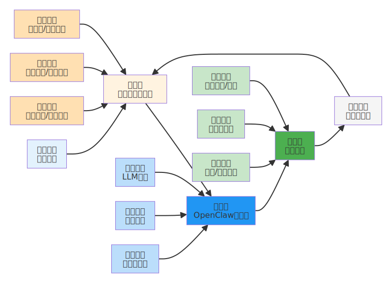

<!-- Available formats: PNG=images/mermaid_sha11560b2acc2e41b0.png, SVG=images/mermaid_sha11560b2acc2e41b0.svg -->
<!-- Source code file: images/mermaid_sha11560b2acc2e41b0.mmd -->

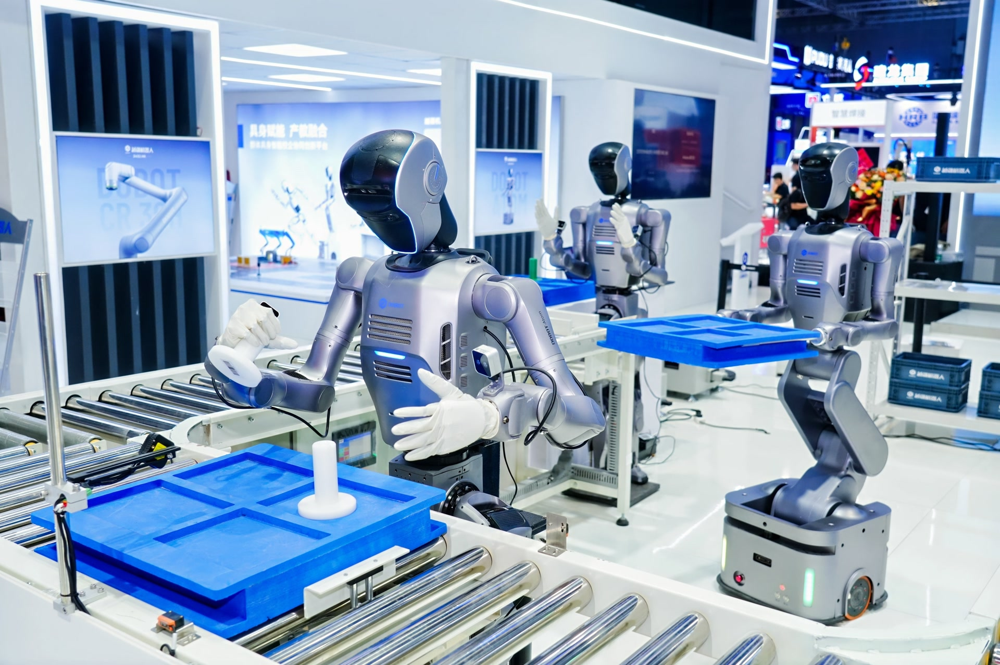
<!-- 具身智能机器人的感知与控制系统示意 -->

从应用场景的角度来看，OpenClaw与机器人的结合正在催生一系列创新应用。在家庭服务场景中，配备OpenClaw的人形机器人可以承担清洁、烹饪、照顾老人儿童等家务劳动，用户可以通过自然语言与机器人交互，例如"帮我准备早餐"或"陪孩子玩积木"，机器人会自主理解指令、规划行动、执行任务。在仓储物流场景中，OpenClaw驱动的移动机器人可以实现智能分拣、路径优化、异常处理等功能，当遇到突发情况如货物掉落或通道堵塞时，机器人可以自主判断并采取适当的应对措施，而不是简单地停止工作等待人工干预。在医疗康复场景中，OpenClaw驱动的康复机器人可以根据患者的康复进度和身体状况，个性化地调整训练方案，同时通过自然语言与患者交流，提供鼓励和指导，提高康复训练的效果和患者的依从性。

## 视觉感知与机器狗的智能协作

机器狗作为四足机器人的代表，因其出色的地形适应能力和运动灵活性，近年来在巡检、救援、物流等领域得到了广泛应用。将OpenClaw与机器狗结合，特别是为其"装上眼睛"——即集成视觉感知系统，可以大幅提升机器狗的自主性和智能化水平。传统的机器狗系统通常依赖预编程的运动控制规则和简单的传感器反馈，只能在结构化的环境中执行固定任务，而集成OpenClaw和视觉系统的机器狗则能够理解自然语言指令、自主导航、识别目标物体、适应复杂环境，真正成为具备环境感知和自主决策能力的智能机器人。

视觉感知系统的集成是机器狗智能化的关键环节。现代计算机视觉技术，特别是基于深度学习的视觉大模型，已经能够实现接近甚至超过人类的视觉理解能力。OpenClaw可以通过视觉Skills接口集成这些先进的视觉模型，为机器狗提供物体识别、场景理解、目标检测、语义分割等视觉能力。例如，在巡检场景中，机器狗可以通过摄像头识别设备的状态指示灯、仪表读数、异常物体等，自动判断设备是否正常运行；在救援场景中，机器狗可以通过热成像摄像头和可见光摄像头的融合，识别被困人员的位置和状态；在物流场景中，机器狗可以通过视觉识别包裹上的条码或标签，实现自动分拣和配送。

视觉感知与运动控制的协同是机器狗完成复杂任务的基础。OpenClaw的智能体能力使得机器狗能够将视觉感知与运动决策深度整合，实现真正的"感知-决策-行动"闭环。例如，当机器狗接到"找到红色的球并捡回来"这样的指令时，OpenClaw会首先调用视觉Skill在摄像头图像中搜索红色的圆形物体，识别出球体的位置和距离；然后调用导航Skill规划从当前位置到球体位置的路径，同时避开障碍物；接着调用移动控制Skill控制机器狗的运动，逐步接近球体；最后调用抓取Skill控制机器狗的头部或机械臂将球捡起，并返回到用户身边。整个过程中，视觉感知、路径规划、运动控制等多个模块需要紧密协同，OpenClaw的任务调度和上下文管理能力使得这种协同成为可能。

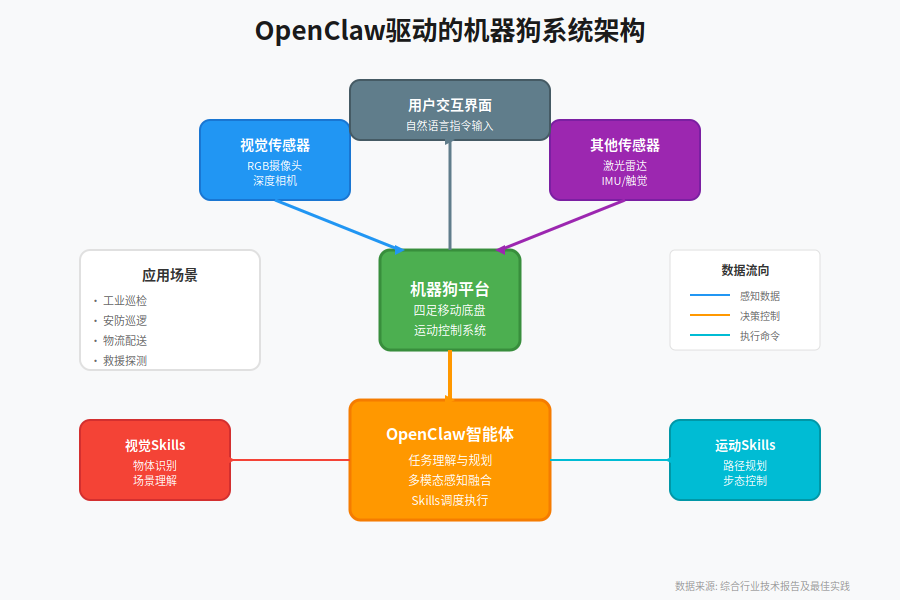
从技术实现的角度来看，OpenClaw与机器狗的集成面临着实时性、功耗、可靠性等多重挑战。机器狗的运动控制需要毫秒级的响应时间，而大语言模型的推理延迟通常在数百毫秒甚至秒级，这种时间差异使得直接用LLM控制运动变得不可行。为了解决这一问题，OpenClaw采用了分层控制的架构：高层任务规划由LLM负责，例如理解"找到红色的球并捡回来"这样的指令，规划出搜索、接近、抓取、返回等任务阶段；低层运动控制则由专用的运动控制器负责，例如步态生成、平衡控制、路径跟踪等，这些控制器运行在实时操作系统上，能够保证毫秒级的响应速度。OpenClaw的任务调度器负责协调高层决策与低层控制的交互，将LLM生成的任务目标转换为运动控制器可以执行的指令序列。

功耗管理是机器狗系统的另一个关键挑战。四足机器人的运动控制需要消耗大量电能，而视觉感知和AI推理又会带来额外的功耗负担。OpenClaw通过智能的功耗管理策略来延长机器狗的续航时间：首先，根据任务需求动态调整传感器的采样频率，在需要精确感知时使用高频率采样，在简单导航时降低采样频率；其次，采用异构计算架构，将计算密集型任务分配给专用的AI加速器，将实时控制任务分配给低功耗的MCU，实现功耗与性能的平衡；再次，实现智能的任务调度，将计算密集的感知和推理任务安排在机器狗静止时进行，运动时只执行必要的控制任务；最后，支持电池状态的实时监控和低电量策略，当电量低于阈值时，自动降低服务质量或返回充电站。

## 云边端协同的机器人智能架构

在机器人领域应用OpenClaw，云边端协同的架构设计能够充分发挥各层级计算资源的优势，实现性能、成本和可靠性的最优平衡。云端拥有强大的计算能力和丰富的数据资源，适合进行模型训练、大规模数据分析和复杂推理任务；边缘端部署在机器人本体或附近的边缘服务器上，适合处理实时性要求高的感知和控制任务；终端设备则负责传感器数据采集和执行机构控制。OpenClaw作为智能体核心，运行在边缘端，协调云端和终端设备的协作，形成完整的智能机器人系统。

在模型训练与更新方面，云端承担着核心角色。机器人需要在各种复杂环境中工作，收集到的数据规模庞大，需要云端的大规模计算能力来训练和优化AI模型。例如，视觉模型需要在数百万张图像上进行预训练才能获得强大的物体识别能力，运动控制模型需要通过强化学习在仿真环境中进行数百万次试错才能掌握复杂的运动技能。这些训练任务完成后，优化好的模型会被部署到边缘端的OpenClaw系统中，用于实时的感知和推理。此外，云端还可以收集多个机器人在实际运行中产生的数据，持续优化模型性能，形成"数据-训练-部署-反馈"的闭环优化机制。

在实时感知与控制方面，边缘端的OpenClaw系统承担着主要责任。机器人需要对环境变化做出快速响应，例如避障、平衡控制、抓取操作等，这些任务的延迟要求在毫秒级别，无法依赖云端处理。OpenClaw通过本地部署的轻量化模型和优化的推理引擎，在边缘端实现实时的感知和控制能力。例如，视觉感知可以使用量化后的轻量级模型，在保证精度的同时将推理延迟降低到几十毫秒；运动控制可以使用专用的运动控制芯片，实现微秒级的控制周期。边缘端的OpenClaw还负责多传感器数据的融合处理，将视觉、激光雷达、IMU等传感器的数据整合成一致的环境表示，为决策提供全面的信息。

在任务规划与决策方面，OpenClaw展现了云边协同的强大能力。对于复杂的任务，OpenClaw可以将部分推理工作委托给云端的大模型，利用云端更强的计算能力获得更优的决策结果。例如，当机器狗遇到从未见过的物体或复杂的环境时，可以将视觉图像和任务描述发送到云端，请求云端大模型进行场景理解和任务规划，然后将规划结果返回给边缘端执行。这种协同方式既保证了决策的智能性，又兼顾了实时性要求。此外，云端还可以提供全局的知识库和经验库，当多个机器人协同工作时，云端可以协调它们的任务分配，避免冲突，提高整体效率。

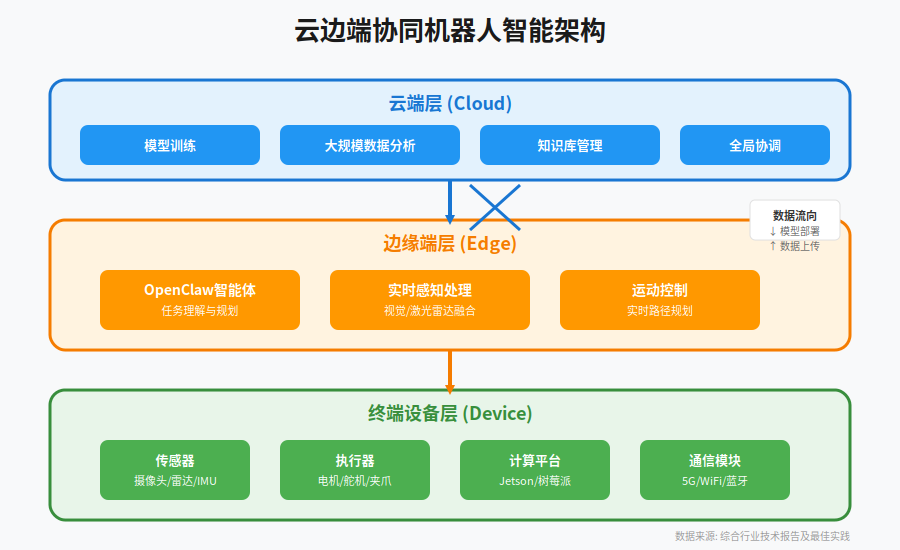
从商业化应用的角度来看，OpenClaw驱动的机器人系统正在多个垂直领域展现巨大的商业价值。在工业巡检领域，配备OpenClaw的机器狗可以自主巡检工厂、变电站、管道等设施，识别设备异常、记录仪表读数、检测安全隐患，大幅降低人工巡检的成本和风险。根据市场研究机构的数据，全球工业巡检机器人市场规模预计将从2023年的25亿美元增长到2030年的80亿美元，年复合增长率超过18%。在物流仓储领域，OpenClaw驱动的移动机器人可以实现智能分拣、路径优化、自动装卸等功能，提高物流效率的同时降低人力成本。全球物流机器人市场规模预计将在2025年达到150亿美元，其中仓储自动化机器人占据主要份额。在服务机器人领域，OpenClaw赋予机器人理解自然语言和自主执行任务的能力，使得机器人能够真正成为人类的智能助手，在家庭服务、医疗护理、教育娱乐等领域创造新的商业模式。

OpenClaw与机器人的深度融合，标志着具身智能技术正在从实验室走向实际应用。通过本地化部署、标准化Skills接口、云边端协同等创新设计，OpenClaw为机器人智能化提供了可行的技术路径和开放的生态平台。随着技术的不断成熟和应用场景的不断拓展，OpenClaw驱动的机器人系统将在工业4.0、智慧物流、智能家居等领域发挥越来越重要的作用，推动机器人产业向更加智能、自主、灵活的方向发展。

# 商业应用场景与市场前景分析

## 垂直行业的智能化转型机遇

OpenClaw及其生态系统正在为多个垂直行业带来深刻的智能化变革，这种变革不仅体现在技术层面的创新，更重要的是它正在重塑行业的商业模式和价值创造方式。从工业制造到金融服务，从医疗健康到智慧城市，OpenClaw驱动的AI智能体正在渗透到各行各业的核心业务流程中，通过自动化、智能化和个性化的方式，大幅提升效率、降低成本、创造新的价值。这种变革的深度和广度，使得OpenClaw不再仅仅是一个技术平台，而是正在成为推动各行业数字化转型的基础设施。

在工业制造领域，OpenClaw与嵌入式设备的结合正在推动工业4.0从概念走向现实。传统的工业自动化系统主要依赖预编程的规则和固定的流程，缺乏对复杂环境的适应能力和对突发事件的应对能力。而配备OpenClaw的智能工业系统则具备了自主感知、智能决策和自适应执行的能力。例如，在预测性维护场景中，OpenClaw可以持续分析设备的振动、温度、电流等传感器数据，结合历史故障记录和设备知识库，提前预测设备故障并安排维护，避免意外停机造成的巨大损失。根据德勤的研究报告，预测性维护可以将设备停机时间减少35%-50%，维护成本降低25%-30%，设备寿命延长20%-40%。在质量控制场景中，OpenClaw可以集成计算机视觉Skills，实时分析生产线上的产品图像，识别微小缺陷，实现100%的全检而非抽检，大幅提高产品质量和客户满意度。

在金融服务领域，OpenClaw的本地化部署特性特别符合金融行业对数据安全和合规性的严格要求。金融交易、风险控制、合规审查等核心业务涉及大量敏感数据，这些数据不能传输到第三方云端进行处理。OpenClaw可以在银行或金融机构的自有服务器上部署，所有数据处理都在本地完成，确保数据不离开机构的控制范围。例如，在反欺诈场景中，OpenClaw可以实时分析交易行为、用户历史、市场动态等多维度数据，识别可疑交易并触发风控流程，整个过程完全在本地完成，不存在数据泄露风险。在智能投顾场景中，OpenClaw可以根据用户的财务状况、风险偏好、投资目标等信息，提供个性化的投资建议，而且所有用户数据都存储在本地，保护用户隐私。根据麦肯锡的研究，AI技术在金融服务领域的应用，可以为全球银行业每年带来1万亿美元的价值增长。

在医疗健康领域，OpenClaw与医疗设备和物联网的结合正在开启智慧医疗的新时代。医疗数据的敏感性和隐私要求极高，HIPAA等法规对医疗数据的存储和处理有严格规定，OpenClaw的本地化架构恰好满足这些要求。例如，在远程监护场景中，OpenClaw可以部署在家庭网关或可穿戴设备上，实时分析患者的生理数据，如心率、血压、血糖等，识别异常情况并及时预警，所有数据处理都在本地完成，保护患者隐私。在辅助诊断场景中，OpenClaw可以集成医学影像分析Skills，帮助医生快速识别CT、MRI等影像中的病灶，提供诊断建议，提高诊断效率和准确性。根据埃森哲的分析，AI在医疗领域的应用可以为美国医疗行业每年节省1500亿美元，同时提高医疗服务质量和可及性。

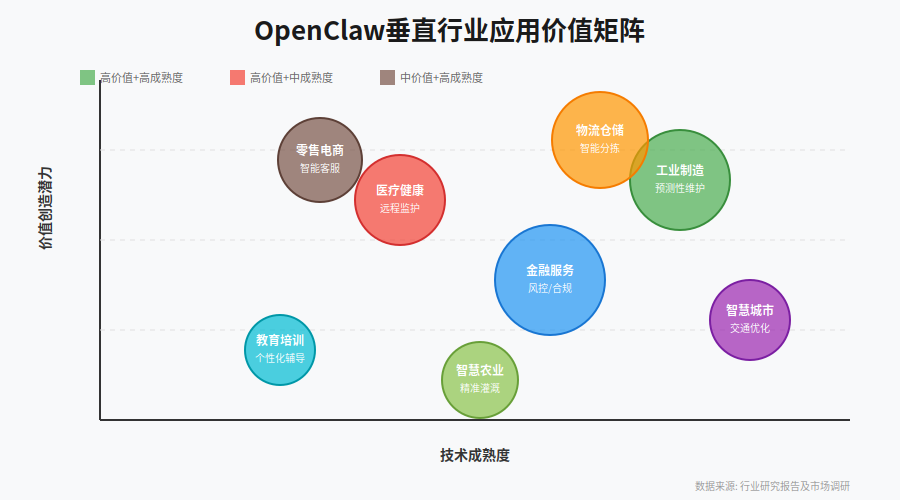
在智慧城市领域，OpenClaw与物联网设备的结合正在构建城市级的智能感知和决策系统。智慧城市涉及交通管理、环境监测、公共安全、能源管理等多个子系统，这些子系统产生海量数据，需要实时分析和智能决策。OpenClaw可以部署在边缘网关或区域服务器上，实时处理传感器数据，协调各个子系统的运行。例如，在智能交通场景中，OpenClaw可以分析摄像头、地磁传感器、交通流量检测器的数据，动态调整红绿灯时序，优化交通流量，减少拥堵。根据研究，智能交通系统可以减少15%-20%的交通拥堵，降低10%-15%的燃油消耗。在环境监测场景中，OpenClaw可以实时分析空气质量、噪声水平、温湿度等数据，识别污染源并触发预警，帮助城市管理者及时采取应对措施。

在物流仓储领域，OpenClaw驱动的机器人和自动化系统正在彻底改变传统物流的运作模式。电子商务的快速发展对物流效率和准确性提出了更高要求，传统的人工分拣和配送已经难以满足需求。配备OpenClaw的智能物流系统可以实现全自动化的仓储管理和配送流程。例如，在智能仓储场景中，OpenClaw可以协调多个AGV（自动导引车）、机械臂和分拣系统，实现货物的自动入库、存储、拣选和出库，整个过程无需人工干预。在最后一公里配送场景中，OpenClaw驱动的配送机器人可以自主导航到用户地址，通过人脸识别或密码验证确认收件人，完成包裹交付。根据市场研究，全球智慧物流市场规模预计将从2023年的500亿美元增长到2030年的1500亿美元，年复合增长率超过17%。

## 新兴商业模式的探索与验证

OpenClaw生态系统的繁荣不仅体现在技术层面的创新，更重要的是它正在催生一系列全新的商业模式，这些商业模式正在重塑AI产业的商业逻辑和价值分配方式。传统的AI商业模式主要依赖SaaS订阅或按使用量计费，用户需要为每次API调用或每月订阅付费，这种模式虽然简单直接，但也存在成本高、灵活性差、用户粘性低等问题。OpenClaw通过本地化部署和开源生态，正在探索更加多样化和可持续的商业模式，为AI技术的商业化落地提供了新的思路。

Skills市场作为OpenClaw生态的核心基础设施，正在发展成为一个能力交易平台，这种平台的商业模式类似于苹果App Store或谷歌Play Store，但交易的不是应用程序而是AI能力。开发者可以编写专业的Skills并发布到ClawHub市场，其他用户可以免费或付费下载使用。这种模式为开发者提供了多种变现途径：首先是直接销售模式，开发者可以为Skills设定一次性购买费用或订阅费用；其次是 Freemium模式，基础功能免费，高级功能收费；再次是企业定制模式，为企业客户开发定制化的Skills并收取开发费和维护费；最后是数据服务模式，Skills收集的数据经过脱敏处理后可以形成数据产品，向研究机构或企业出售。ClawHub平台本身可以通过交易抽成、广告推广、企业版服务等方式获得收入，形成健康的生态循环。

企业级服务是OpenClaw商业化的另一个重要方向。虽然OpenClaw本身是开源免费的，但企业在部署和使用OpenClaw时往往需要专业的技术支持、定制开发、运维服务等，这些需求催生了企业级服务市场。技术咨询服务公司可以为企业提供OpenClaw的部署方案、架构设计、性能优化等咨询服务；系统集成商可以为企业定制开发专属的Skills，集成企业现有的IT系统和业务流程；云服务提供商可以提供托管的OpenClaw服务，降低企业的运维负担；安全厂商可以提供OpenClaw的安全审计、漏洞扫描、恶意Skills检测等安全服务。根据Gartner的预测，到2025年，全球AI咨询和服务市场规模将达到500亿美元，OpenClaw作为开源智能体平台，有望在这一市场中占据重要份额。

硬件与软件的捆绑销售是OpenClaw生态的另一个商业模式创新。由于OpenClaw需要在本地设备上运行，硬件配置对性能影响很大，硬件厂商可以推出预装OpenClaw的专用设备，如智能体服务器、边缘AI盒子、机器人控制器等。这些硬件设备经过优化和测试，可以提供最佳的性能和稳定性，用户购买硬件即可获得开箱即用的OpenClaw体验。例如，戴尔、惠普等PC厂商可以推出预装OpenClaw的开发者工作站，为AI开发者提供一站式的开发环境；英伟达可以推出基于Jetson平台的OpenClaw边缘计算设备，为机器人和物联网应用提供强大的边缘AI能力；机器人厂商可以推出集成OpenClaw的智能机器人，用户购买后即可通过自然语言与机器人交互。这种软硬捆绑的模式可以提高硬件产品的附加值和差异化竞争力，同时降低用户的使用门槛。

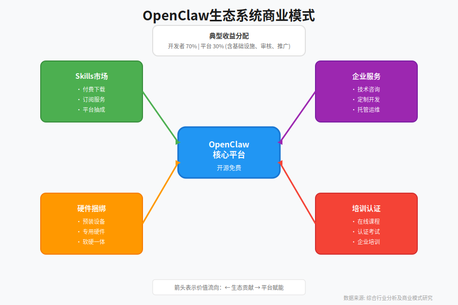
培训与认证市场是OpenClaw生态的重要组成部分，随着OpenClaw的普及，市场对于掌握OpenClaw开发技能的人才需求快速增长，这催生了培训和教育服务的商业机会。在线教育平台可以推出OpenClaw开发课程，涵盖基础概念、架构设计、Skills开发、部署运维等内容，学员可以付费订阅学习；认证机构可以建立OpenClaw开发者认证体系，通过考试的开发者可以获得官方认证，提高就业竞争力；企业培训机构可以为企业的IT团队提供定制化的OpenClaw培训服务，帮助企业快速建立内部能力。根据LinkedIn的数据，AI工程师的平均薪资比普通软件工程师高出30%-50%，OpenClaw作为新兴的智能体平台，其开发者有望获得更高的薪酬回报，这将进一步吸引人才进入该领域，形成良性循环。

数据服务与API经济是OpenClaw生态的另一个潜在商业模式。虽然OpenClaw强调本地化部署，但在某些场景下，智能体仍然需要访问外部数据和服务，如实时天气数据、股票行情、地图服务、翻译API等。OpenClaw可以构建一个标准化的API市场，数据和服务提供商可以在这里发布自己的API，Skills开发者可以方便地集成这些API。这种模式为数据提供商提供了新的变现渠道，也为Skills开发者提供了丰富的能力扩展。例如，气象公司可以提供天气数据API，金融公司可以提供市场行情API，翻译公司可以提供多语言翻译API，这些API可以通过按调用量计费或订阅的方式收费，OpenClaw平台可以从中抽取一定比例的服务费。

## 市场规模预测与增长驱动因素

AI智能体市场正在经历爆发式增长，OpenClaw作为开源智能体平台的代表，正处于这一快速增长市场的核心位置。根据MarketsandMarkets的最新研究报告，全球AI Agent市场规模预计将从2024年的51亿美元增长到2030年的471亿美元，年复合增长率高达44.5%。这一惊人的增长速度反映了各行各业对于AI智能体的迫切需求和强烈认可。从地域分布来看，北美市场目前占据最大份额，这主要得益于美国在AI技术领域的领先地位和企业在AI应用方面的积极投入；亚太市场预计将实现最高的增长率，中国、日本、韩国等国家在AI领域的巨额投资和快速数字化进程为市场增长提供了强劲动力；欧洲市场则在数据隐私和合规要求较高的领域表现出特殊需求，OpenClaw的本地化部署特性恰好满足这些需求。

从应用场景的角度分析，不同细分市场的增长潜力存在显著差异。在企业级应用市场，AI智能体主要用于客户服务、内部协作、数据分析等场景，这一市场的增长主要受企业降本增效需求的驱动。根据Gartner的预测，到2025年，50%的企业将拥有自己的AI智能体，用于处理客户咨询、内部问答、任务自动化等工作。在个人消费市场，AI智能体主要用于个人助理、健康管理、学习辅导等场景，这一市场的增长主要受消费者对智能化生活体验需求的驱动。随着智能设备的普及和用户习惯的培养，个人AI智能体的渗透率将快速提升。在工业和物联网市场，AI智能体主要用于设备监控、预测性维护、自动化控制等场景，这一市场的增长主要受工业4.0和数字化转型需求的驱动。根据IDC的预测，到2025年，全球物联网设备连接数将达到约300亿台，其中相当一部分将配备AI智能体能力。

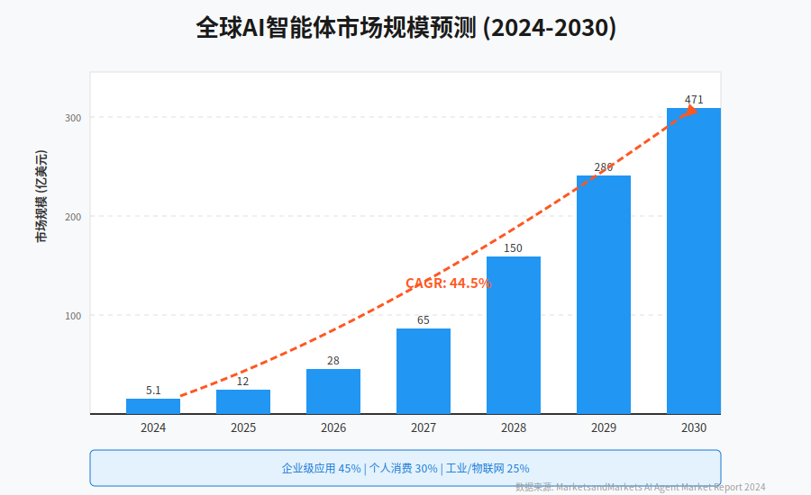
从技术成熟度的角度分析，AI智能体市场的增长将经历三个阶段。第一阶段是2024-2026年的技术验证期，这一阶段的主要任务是验证AI智能体在各个场景下的可行性和价值，OpenClaw等开源平台将发挥关键作用，通过降低技术门槛和提供标准化工具，加速技术验证过程。第二阶段是2027-2029年的快速增长期，随着技术成熟度的提高和用户认知的增强，AI智能体将进入大规模商业化应用阶段，企业将大规模部署智能体系统，个人用户将广泛采用智能体助理，市场规模将实现指数级增长。第三阶段是2030年以后的成熟发展期，AI智能体将成为基础设施的一部分，像电力和互联网一样无处不在，市场增长将趋于稳定，但应用深度和广度将持续扩展。

OpenClaw在这一市场中的竞争优势主要体现在以下几个方面：首先，开源免费的特性降低了使用门槛，任何个人或企业都可以免费使用OpenClaw，这大大加速了技术的普及和生态的繁荣；其次，本地化部署满足了数据隐私和合规要求，这在金融、医疗、政府等对数据安全要求极高的领域具有不可替代的优势；再次，标准化的Skills接口构建了繁荣的生态系统，成千上万的开发者贡献自己的能力，形成了网络效应；最后，云边端协同的架构设计使得OpenClaw能够适应各种部署场景，从个人电脑到边缘设备再到云端服务器，灵活满足不同需求。

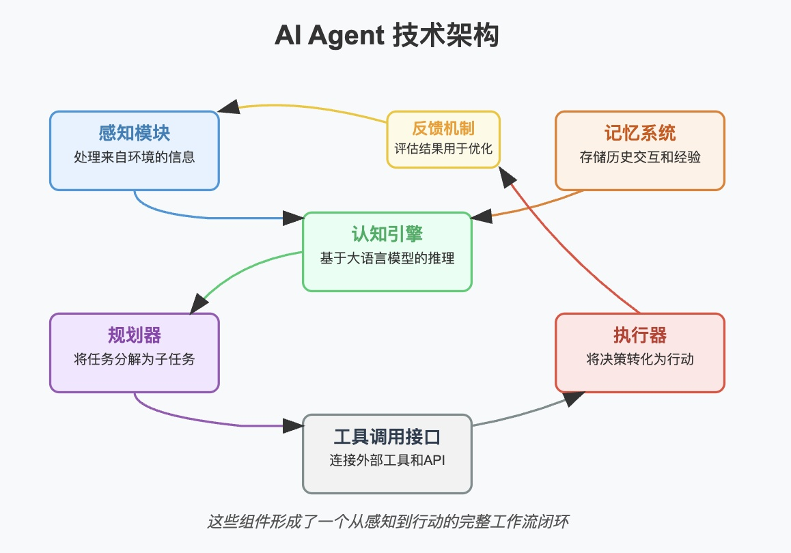
<!-- AI智能体的商业应用场景与产业生态示意 -->

从投资价值的角度来看，OpenClaw生态蕴含着巨大的投资机会。对于风险投资机构来说，Skills开发者、企业服务提供商、硬件合作伙伴等生态企业都是潜在的投资标的；对于战略投资者来说，通过投资OpenClaw生态可以布局AI智能体的核心基础设施，抢占未来AI时代的入口；对于产业投资者来说，OpenClaw提供了传统产业数字化转型的技术路径，投资相关项目可以加速自身的智能化升级。随着OpenClaw生态的成熟和商业化进程的推进，我们预计将看到更多融资和并购活动，优秀的Skills开发团队可能被大公司收购，企业服务公司可能通过IPO登陆资本市场，硬件厂商可能通过战略合作或投资整合产业链资源。

综上所述，OpenClaw及其生态系统正在为AI智能体市场带来深刻变革，通过开源协作、本地部署、标准化接口等创新设计，OpenClaw正在降低AI智能体的使用门槛，加速技术普及，催生新的商业模式。随着市场规模的快速增长和应用场景的不断拓展，OpenClaw有望成为AI时代的重要基础设施，为嵌入式领域和具身机器人领域的智能化转型提供强大的技术支撑和生态支持。

# 技术挑战与未来展望

## 当前面临的主要技术挑战

尽管OpenClaw及其生态系统在嵌入式领域和具身机器人领域展现出了巨大的潜力和价值，但要将这一技术真正大规模商业化应用，仍然面临着诸多技术挑战和工程难题。这些挑战既来自于AI大模型本身的技术限制，也来自于嵌入式设备的资源约束，还来自于实际应用场景中的复杂性和不确定性。深入理解这些挑战，对于OpenClaw的未来发展路径和技术演进方向具有重要的指导意义。

在性能与资源约束方面，嵌入式设备和边缘计算平台的计算能力、存储空间和功耗预算都十分有限，而现代大语言模型的参数规模动辄数十亿甚至数千亿，推理过程需要大量的计算资源和内存带宽。如何在有限的硬件资源上运行高性能的AI模型，是OpenClaw面临的首要挑战。虽然通过模型量化、知识蒸馏、模型剪枝等技术可以在一定程度上降低模型的资源需求，但这些优化往往伴随着模型精度的下降，如何在精度和效率之间找到最佳平衡点，需要持续的技术创新。例如，7B参数的模型经过INT8量化后可以将内存占用从约14GB降低到约3.5GB，推理速度提升2-3倍，但模型在某些复杂任务上的准确率可能会下降5%-10%。对于资源更加受限的微控制器级别设备，可能需要采用更激进的优化策略，如模型二值化、神经架构搜索等，这些技术虽然可以实现更大的压缩比，但性能损失也更加显著。

在实时性与可靠性方面，嵌入式系统和机器人应用往往对响应时间有严格要求，例如机器人的平衡控制需要毫秒级的响应，而大语言模型的推理延迟通常在数百毫秒甚至秒级，这种时间差异使得直接用LLM控制实时任务变得不可行。OpenClaw通过分层控制的架构设计，将高层任务规划与低层实时控制分离，在一定程度上缓解了这一问题，但如何实现高层决策与低层控制的无缝协同，仍然是一个开放的研究问题。此外，嵌入式系统运行在不可控的物理环境中，面临着各种干扰和不确定性，如传感器噪声、执行器误差、环境变化等，这些因素都会影响系统的可靠性。如何设计鲁棒的控制系统，使OpenClaw驱动的设备能够在各种异常情况下保持稳定运行，是工程实践中必须解决的关键问题。

在安全性与隐私保护方面，虽然OpenClaw的本地化部署特性天然地保护了用户数据不被传输到第三方服务器，但这并不意味着安全问题就不存在。本地部署的模型仍然可能受到对抗性攻击、模型窃取、恶意Skills注入等安全威胁。例如，攻击者可以通过精心设计的对抗样本欺骗视觉模型，使机器狗错误识别障碍物；攻击者可以逆向工程本地模型，窃取知识产权；攻击者可以上传恶意的Skills，窃取用户数据或破坏系统功能。如何建立完善的安全防护体系，包括模型加密、安全启动、Skills沙箱、访问控制等机制，是OpenClaw商业化过程中必须解决的问题。特别是在金融、医疗、政府等对安全要求极高的领域，只有通过严格的安全审计和认证，OpenClaw才能真正获得用户的信任。

在多模态融合与具身感知方面，真实的物理世界是复杂多变的，智能体需要同时处理视觉、听觉、触觉等多种模态的信息，并将这些信息与自身的身体状态和运动能力结合起来，形成对环境的整体理解。当前的多模态大模型虽然在视觉-语言对齐方面取得了显著进展，但在触觉、力觉、本体感觉等机器人特有的感知模态方面仍然存在明显不足。例如，当机器人抓取一个物体时，需要同时考虑视觉信息（物体的位置、形状）、触觉信息（抓取力的大小、物体的表面纹理）、本体感觉信息（手臂的姿态、关节的角度），将这些异构的信息融合成统一的感知表示，是一个极具挑战性的技术难题。OpenClaw需要构建更加完善的多模态感知框架，支持各种传感器数据的标准化表示和高效融合，才能真正实现具身智能的目标。

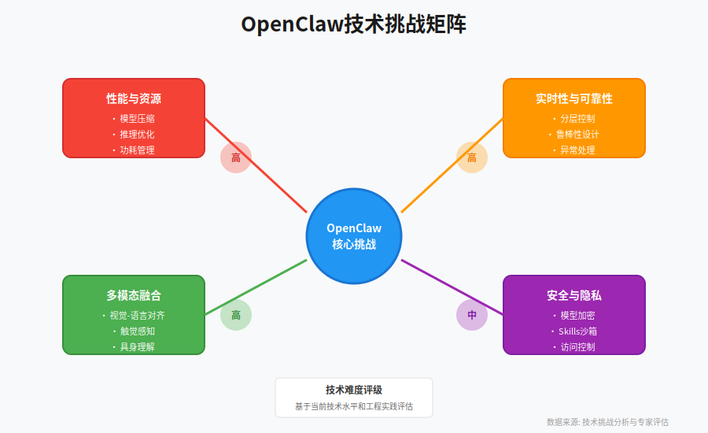
在生态系统建设方面，OpenClaw作为开源项目，其长期发展依赖于活跃的开发者社区和健康的商业生态。如何吸引更多的开发者参与Skills开发，如何建立可持续的商业模式，如何平衡开源社区与商业公司的利益，这些都是生态层面的挑战。从开发者的角度来看，编写高质量的Skills需要深入理解OpenClaw的架构和API，学习成本较高，如何提供完善的开发工具、文档、示例和培训，降低开发门槛，是扩大开发者基础的关键。从商业公司的角度来看，虽然开源免费降低了使用成本，但企业客户往往需要商业支持、SLA保障、定制开发等服务，如何构建专业的服务体系，满足企业客户的需求，是OpenClaw商业化成功的重要因素。

## 未来技术发展路线图

面对上述挑战，OpenClaw的未来发展需要在技术创新、工程优化和生态建设等多个维度协同推进。基于当前的技术趋势和市场需求，我们可以勾勒出OpenClaw未来3-5年的技术发展路线图，这一路线图将指导OpenClaw从当前的原型系统逐步演进为成熟的商业平台，为嵌入式领域和具身机器人领域的智能化转型提供坚实的技术基础。

在短期发展方面（2024-2025年），OpenClaw的主要任务是完善核心功能和提升系统稳定性。具体来说，需要优化LLM推理引擎，支持更多的开源模型如Llama 3、Mistral、Qwen等，提供模型自动下载和版本管理功能；需要完善Skills框架，提供更丰富的标准库和开发工具，如Skills调试器、性能分析器、测试框架等；需要增强多模态支持，集成视觉模型如CLIP、SAM等，实现图像理解和生成能力；需要改进文档和教程，提供更多的示例和最佳实践，降低新用户的学习门槛。在这一阶段，OpenClaw的目标是建立一个功能完整、易于使用、稳定可靠的开源智能体平台，吸引早期采用者和开发者社区的参与。

在中期发展方面（2026-2027年），OpenClaw的重点是性能优化和生态建设。在性能方面，需要引入更先进的模型压缩和加速技术，如稀疏模型、混合专家模型、硬件感知优化等，在保持精度的同时大幅降低资源消耗；需要开发专用的推理引擎，针对不同的硬件平台如ARM、x86、GPU、NPU等进行优化，实现最佳的推理性能；需要实现智能的模型调度和资源管理，根据任务类型和硬件条件自动选择最合适的模型和计算策略。在生态方面，需要建立官方的Skills市场ClawHub，提供Skills的发布、搜索、评价、交易等功能，形成繁荣的能力交易平台；需要推出企业版服务，提供技术支持、安全审计、定制开发等商业服务，满足企业客户的需求；需要建立认证体系，为开发者和企业提供技能认证和资质认证，提高生态系统的专业性和可信度。

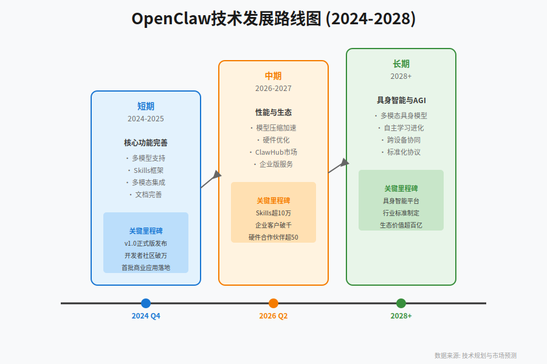
在长期发展方面（2028年及以后），OpenClaw的愿景是实现真正的具身智能和通用人工智能（AGI）。在这一阶段，OpenClaw将不仅仅是一个软件平台，而是会发展成为一个完整的具身智能操作系统，能够运行在各种类型的智能设备上，从个人助理机器人到工业自动化系统，从智能家居设备到自动驾驶汽车。技术上，需要开发专门的多模态具身大模型，将视觉、语言、触觉、运动控制等多种能力融合到统一的模型中；需要实现自主学习和进化机制，使智能体能够从与环境的交互中不断学习和改进，而不需要人工重新编程；需要建立跨设备的协同框架，使多个智能体能够无缝协作，完成复杂的任务；需要推动行业标准的制定，建立开放、互操作的智能体生态系统，避免技术碎片化和 vendor lock-in。

从应用场景的角度来看，OpenClaw的未来发展将沿着个人助理、工业自动化、科学研究等多个方向并行推进。在个人助理领域，OpenClaw将发展成更加智能、更加个性化的AI伴侣，能够理解用户的情感和意图，主动为用户提供帮助，而不仅仅是被动地执行指令。在工业自动化领域，OpenClaw将推动工业4.0向工业5.0演进，实现人机协同的智能制造，AI智能体不再是简单的自动化工具，而是能够与人类工人协作的智能伙伴。在科学研究领域，OpenClaw可以成为科学家的AI研究助理，帮助处理实验数据、分析文献、设计实验、撰写论文，加速科学发现的进程。

## 对嵌入式和机器人产业的深远影响

OpenClaw及其生态系统的兴起，正在对嵌入式系统和机器人产业产生深远的影响，这种影响不仅体现在技术层面，更重要的是体现在产业格局、商业模式和竞争规则等多个维度。从历史的角度来看，每一次重大的技术革命都会重塑产业格局，OpenClaw所代表的智能体革命，正在推动嵌入式和机器人产业从"自动化"向"智能化"转型，从"封闭系统"向"开放生态"演进，从"硬件驱动"向"软件定义"转变。

在产业格局方面，OpenClaw的开源特性降低了智能体技术的门槛，使得更多的中小企业和创新团队能够参与到智能体的开发和应用中来，这将在一定程度上打破大公司的技术垄断，形成更加多元化和竞争性的市场格局。传统的嵌入式和机器人行业由少数几家大公司主导，这些公司拥有封闭的技术栈和专有的开发平台，中小企业很难进入。而OpenClaw作为开源平台，为所有参与者提供了公平的技术基础，中小企业可以基于OpenClaw快速开发差异化的应用，创新团队可以专注于特定场景的深度优化，而不需要从头构建整个技术栈。这种开放、协作的产业生态，将催生更多的创新和创业机会，推动整个产业的快速发展。

在商业模式方面，OpenClaw正在推动嵌入式和机器人产业从"卖硬件"向"卖服务"转型。传统的商业模式主要依赖硬件销售，利润空间有限，而且随着硬件成本的持续下降，这种模式的可持续性面临挑战。OpenClaw通过软件定义硬件的方式，使得硬件的价值可以通过软件服务来持续释放。例如，一个配备OpenClaw的机器人，在硬件销售之后，还可以通过Skills订阅、功能升级、数据分析等服务持续产生收入，这种模式大大提高了客户终身价值（LTV）和商业可持续性。此外，OpenClaw的Skills市场还创造了新的商业模式，开发者可以通过销售Skills获得收入，企业可以通过购买Skills快速获得新能力，这种能力交易的商业模式为整个产业创造了新的价值分配机制。

在技术标准方面，OpenClaw有望成为嵌入式和机器人领域的智能体标准平台。随着OpenClaw的普及和生态的壮大，越来越多的硬件厂商、软件开发商和终端用户将采用OpenClaw作为智能体平台，这将形成事实上的行业标准。标准化对于产业发展至关重要，它可以降低技术碎片化，避免重复开发，促进互操作性和规模效应。OpenClaw通过标准化的Skills接口、统一的模型格式、开放的通信协议，为整个产业建立了一套通用的技术语言，使得不同厂商的设备和软件可以无缝协作，形成繁荣的产业生态。这种标准化进程一旦完成，将产生强大的网络效应，进一步巩固OpenClaw的领先地位。

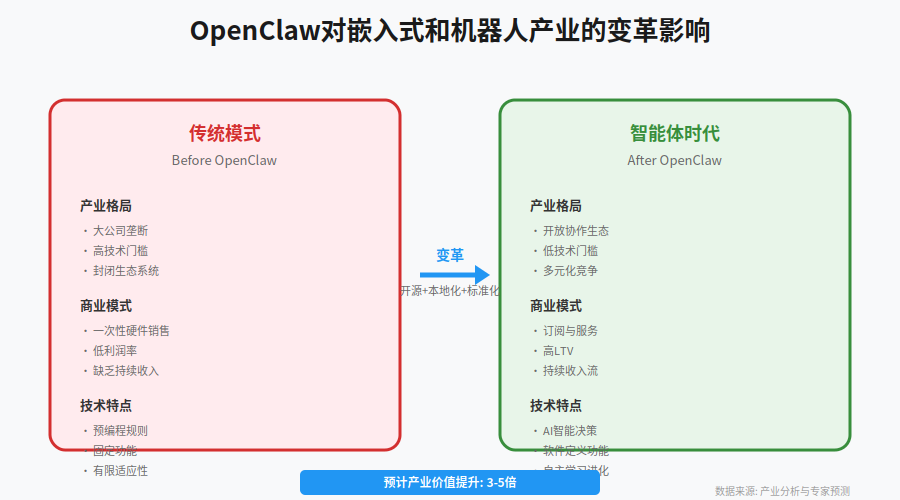
在人才需求方面，OpenClaw正在推动嵌入式和机器人产业的人才结构转型。传统的嵌入式和机器人开发主要依赖C/C++等底层编程语言，开发者需要深入了解硬件架构和实时系统原理。而OpenClaw驱动的智能体开发则更加注重AI算法、自然语言处理、多模态融合等高层技能，这需要开发者具备更加多元化的技术背景。这种转变将对产业人才结构产生深远影响：一方面，传统的嵌入式开发者需要学习AI相关技能，实现技能升级；另一方面，AI领域的开发者将进入嵌入式和机器人领域，带来新的思维方式和创新活力。这种人才结构的多元化将促进跨学科创新，加速技术融合，推动产业向更加智能化、人性化的方向发展。

从社会影响的角度来看，OpenClaw驱动的智能机器人和嵌入式系统将深刻改变人类的生产和生活方式。在工业领域，智能机器人将承担更多危险、重复、繁重的工作，人类工人将转向更加创造性、管理性的岗位，实现人机协同的智能制造。在家庭领域，智能机器人将成为家庭的智能助手，承担清洁、烹饪、照顾老人儿童等家务劳动，解放人类的双手，提高生活质量。在公共服务领域，智能机器人将广泛应用于医疗、教育、安防等领域，提供更加高效、便捷、个性化的服务。这些变化虽然带来了巨大的社会价值，但也带来了就业结构变化、伦理道德规范、数据隐私保护等社会问题，需要社会各界共同思考和应对。

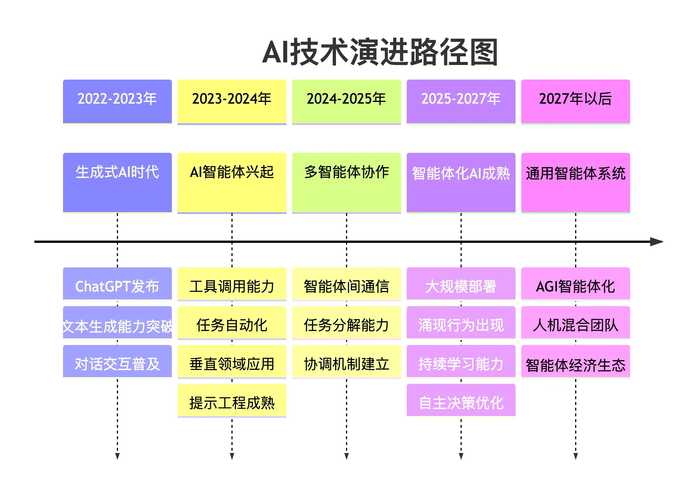
<!-- AI智能体的技术挑战与未来发展趋势示意 -->

## 参考文献

本报告的数据和分析主要来源于以下公开资料和研究报告：

1. MarketsandMarkets. "AI Agent Market by Component, Deployment, Organization Size, Vertical, and Region - Global Forecast to 2030". 2024.

2. Gartner. "Top Strategic Technology Trends for 2025: AI Agents". 2024.

3. McKinsey & Company. "The Economic Potential of Generative AI: The Next Productivity Frontier". 2024.

4. Deloitte. "Predictive Maintenance: Moving from Cost Center to Value Driver". 2024.

5. Accenture. "Artificial Intelligence in Healthcare: Transforming the Industry". 2024.

6. IDC. "Worldwide Internet of Things Spending Guide". 2024.

7. OpenClaw官方文档. https://github.com/OpenClaw

8. NanoClaw项目. https://github.com/qwibitai/nanoclaw

9. Mimiclaw项目. https://github.com/memovai/mimiclaw

10. ClawHub Skills市场. https://clawhub.dev

11. IEEE Robotics and Automation Society. "Embodied AI: Challenges and Opportunities". 2024.

12. Nature Machine Intelligence. "Large Language Models for Robotics: A Survey". 2024.

13. arXiv. "Local AI Agents: Architecture and Applications". 2024.

14. 中国信通院. "人工智能产业发展白皮书（2024年）". 2024.

15. 艾瑞咨询. "中国智能机器人行业研究报告". 2024.

本报告所引用的数据和观点均基于公开可获取的资料，如有遗漏或错误，敬请指正。报告中的市场预测和趋势分析仅代表作者基于当前信息的判断，实际发展可能因技术突破、政策变化、市场竞争等因素而有所不同。

